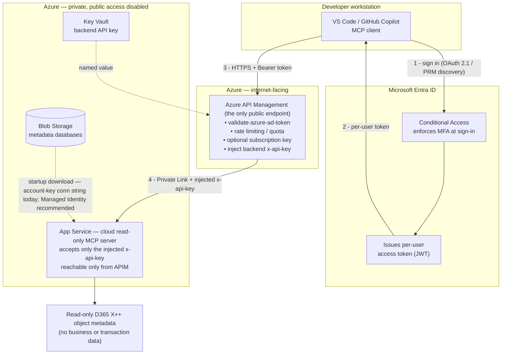

# BlueScope AI Security Response - Hybrid Deployment Model (APIM Front Door)

## Scope

This document provides a customer response to the following source documents for a Hybrid deployment model. It includes an optional **target hardening architecture** in which Azure API Management (APIM) is placed in front of the cloud read-only MCP server to provide enterprise authentication (Microsoft Entra ID), MFA via Conditional Access, an approved API gateway, and a private backend.

1. BSL-ARC-S-01-05 - Security only.docx
2. ESA-Artificial Intelligence (AI)-180526-235423.pdf
3. ESA-Securing Agentic AI Solution using MCP and AI Data Gateway-180526-235349.pdf

Two states are described throughout:

- **Current (as-is):** the MCP client connects directly to the cloud read-only MCP server over HTTPS using a shared API key header.
- **Target hardening (APIM front door):** the cloud MCP server is made private and reachable only through APIM, which validates Entra OAuth tokens, relies on Conditional Access for MFA at sign-in, and injects the backend API key. This is the recommended path in this document for addressing the internet-facing authentication, API gateway, and central-identity requirements. It should be treated as a candidate design option for BlueScope to assess, approve, and operate if adopted.

Assumptions:

- The solution uses a Hybrid deployment model where enterprise identity, policy, logging, network controls, and integration controls remain under BlueScope governance.
- The tool in scope is an open-source tool deployed within the current project scope.
- The tool accesses object metadata only. It does not access business data, customer content, or operational transaction data.
- A typical install runs two independent MCP servers: a cloud read-only server on Azure Linux App Service, and a local write-only server (with the C# metadata bridge) on the developer's Windows VM. The MCP client connects to both and merges their tools, routing search and analysis to the cloud server and write operations to the local server. In the current pattern the MCP client reaches the cloud server directly over HTTPS and supplies an API key as an HTTP header; the local write-only server runs over stdio and is not internet-exposed.
- In the target hardening architecture, the cloud read-only server is made private (private endpoint, public network access disabled) and is reachable only through Azure API Management. APIM becomes the only internet-facing component.
- The Azure-hosted cloud resources in scope (as-is) are the Linux App Service hosting the read-only MCP server and the Azure Blob Storage account that holds the pre-built object-metadata databases (downloaded to the App Service on startup using an Azure Storage account-key connection string; a system-assigned Managed Identity is enabled on the App Service but is not currently used for this Blob access — moving Blob access onto that identity is a recommended uplift). In the target hardening architecture, an APIM instance, a Microsoft Entra ID application registration, a Key Vault for the backend secret, and Conditional Access policies are added to scope. No LLM is embedded in or hosted as part of the MCP tool itself in this Azure deployment model; the Azure-hosted component provides MCP tools only.
- As currently deployed, the Azure-hosted MCP endpoint is internet-facing and protected by an API key over HTTPS. Additional network hardening and ingress restriction is recommended; the APIM front door described in this document is the recommended way to deliver it. Until that hardening is implemented and evidenced, the endpoint is treated as an internet-facing API.
- BlueScope is responsible for approving, implementing, and operating the network and identity hardening, including APIM, the Entra application registration, Conditional Access policies, private access configuration, firewall rules, ingress restrictions, or equivalent network controls on the hosted endpoint.
- The Azure-hosted MCP components are deployed and updated through the Azure DevOps pipelines described in `docs/SETUP_AZURE.md` and defined under `.azure-pipelines/`. Taking updates means updating the forked GitHub repository on which those build and release pipelines are based, then promoting that change through the BlueScope-controlled pipeline process.
- BlueScope would need to determine and implement the exact pipeline validation and software supply chain requirements for that delivery path. These may include controls such as CodeQL, Dependabot, Dependency Review, OpenSSF Scorecard, Gitleaks, Trivy, PSScriptAnalyzer, ESLint with security rules, SecurityCodeScan for .NET components, CycloneDX SBOM generation, Actionlint, and StepSecurity Harden Runner, or equivalent BlueScope-approved tooling.
- The MCP server is read-only against metadata sources.
- This is a customer response document. BlueScope remains ultimately responsible for security outcomes, approvals, and risk acceptance.
- The implementation partner may design, configure, document, and implement controls, but this does not transfer accountability away from BlueScope.
- The open-source tool is provided without warranties or guarantees. Compliance cannot be claimed on the basis of tool installation alone and must be demonstrated through architecture, configuration, testing, and operational governance.
- This is a draft response only. Final status should be confirmed during detailed design, implementation, and security review.

## Executive Summary

The proposed hybrid solution can be aligned to the cited BlueScope security requirements provided that authentication, network hardening and ingress restriction of the endpoint, logging, secrets management, patching, connector restriction, and governance controls are implemented and evidenced through the delivered architecture and operating model.

The recommended way to deliver the authentication and gateway requirements is the **APIM + Entra OAuth front door** (described in the Target Hardening Architecture section below): the cloud read-only MCP server is made private and reachable only through Azure API Management, which enforces per-user Microsoft Entra authentication and MFA (via Conditional Access) and injects the backend API key. This design satisfies the internet-facing SSO/MFA, API gateway, and central-identity requirements **without changing the open-source server**, because the existing API key becomes an internal APIM-to-backend secret rather than the user-facing control.

This response does not rely on inherited assurances from a vendor-managed AI platform. The tool in scope is open source and has no warranty or guarantee. The Azure-hosted cloud resources in scope are the Linux App Service hosting the MCP server and the Azure Blob Storage account holding the pre-built metadata databases (plus APIM, an Entra application registration, Key Vault, and Conditional Access policies in the target design). In this deployment model, Azure hosts MCP tools only; no LLM is embedded in the tool itself. The MCP server only accesses object metadata in a read-only manner. That reduces some privacy and business-data handling concerns, but it does not remove the need for strong access control, metadata classification, logging, vulnerability management, secure software supply chain controls, and operational governance.

The strongest supportable position in this draft is that the Hybrid model could be argued as conditionally aligned, with a stronger position possible once the APIM front door is implemented and evidenced, subject to detailed design confirmation, implementation evidence, and BlueScope approval of residual risks.

## Hybrid Installation Summary

The documented hybrid installation separates Azure-hosted read-only search and analysis from any local environment-specific activity. In the project architecture, the Azure-hosted component runs as a read-only MCP server on Azure Linux App Service. It provides MCP tools only and does not itself host or execute an LLM. It is designed to serve search and analysis requests against prebuilt metadata databases rather than expose write-capable tooling on the hosted endpoint. The App Service downloads the metadata databases from Azure Blob Storage for runtime use (currently using an Azure Storage account-key connection string; a system-assigned Managed Identity is enabled on the App Service but is not yet used for this access), exposes the MCP endpoint over HTTPS with TLS 1.2 or higher (enforced by the App Service `httpsOnly` and `minTlsVersion 1.2` settings in the Bicep template), and applies request rate limiting. In the current pattern the MCP client connects to it directly over HTTPS and supplies an API key as an `X-Api-Key` header (enforced by the App Service `API_KEY` setting). Read-only operation is enforced at deployment time: the Bicep template and Azure DevOps pipeline set the server to read-only mode, so write-capable tooling is never advertised on the public endpoint.

The Azure-hosted MCP service is built and released through the Azure DevOps pipelines documented in `docs/SETUP_AZURE.md` and implemented in `.azure-pipelines/`, including the application deployment pipeline and the metadata build pipelines. Those YAML definitions show that the MCP server source is checked out from GitHub during pipeline execution and then deployed to Azure App Service in read-only mode. Taking updates means reviewing and merging or otherwise applying upstream changes into the forked GitHub repository used by the pipeline, then rebuilding and redeploying from that controlled source. This means software change control, release approval, and rollback are governed through the BlueScope delivery pipeline rather than by direct in-place modification of the hosted service.

Where local context or local-only capability is needed, a second MCP server runs locally on the developer's Windows VM in write-only mode, exposing file operations and the C# metadata bridge. The MCP client connects to both servers and merges their tool lists, routing search and analysis requests to the cloud read-only server and write operations to the local server; the two servers operate independently and do not chain through one another. The local write-only server runs over stdio and is not internet-exposed, which keeps write-capable actions under customer-controlled local execution.

For this response, the key scope boundary is that the MCP server is read-only and the tool accesses object metadata only, not business data or transaction data. The Azure-hosted cloud resources in scope are the Linux App Service hosting the MCP server and the Azure Blob Storage account holding the pre-built metadata databases (plus, in the target architecture, APIM, an Entra application registration, Key Vault, and Conditional Access policies). That reduces the data-handling footprint, but it does not remove the need for access control, secret handling (including the Blob Storage connection string and any backend API key held in APIM), encryption of the metadata databases at rest, logging, metadata classification, vulnerability management, and BlueScope governance over the local write-only server, the hosted endpoint, and any downstream integrations.

## Target Hardening Architecture — APIM + Entra OAuth Front Door

This is the recommended target design for satisfying the internet-facing authentication, API gateway, and central-identity requirements **using Azure / APIM configuration only, with no change to the open-source MCP server**. APIM fronts the existing MCP HTTPS endpoint as a standard backend API: Entra token validation, rate limiting and quota, backend key injection, the OAuth discovery (Protected Resource Metadata) response, and private networking are all delivered through APIM policy and Azure resource configuration. The server is treated as an opaque HTTP backend and keeps its existing `X-Api-Key` validation and transport unchanged. On the client side, Visual Studio Code / GitHub Copilot provide the Microsoft Entra OAuth sign-in flow natively, so no custom client is required.

### Request flow



The same flow in text:

```
VS Code / GitHub Copilot MCP client
   │  per-user sign-in; OAuth 2.1 authorization discovered via Protected Resource Metadata
   ▼
Microsoft Entra ID
   • Conditional Access enforces MFA at sign-in
   • issues a per-user access token (JWT)
   │
   ▼
Azure API Management (APIM)  ← the only internet-facing endpoint
   • validate-azure-ad-token: validate the Entra token (tenant, audience, client app id, claims)
   • rate limiting and quota
   • optional APIM subscription key (supplementary layer, not sole authentication)
   • inject backend x-api-key from a Key Vault-backed named value
   │  Private Link / VNet — backend not publicly reachable
   ▼
Private Azure App Service — cloud read-only MCP server
   • accepts only the injected x-api-key
   • public network access disabled; reachable only from APIM
   ▼
Read-only D365 X++ object metadata  (no business or transaction data)
```

### Key properties

- **Per-user enterprise identity.** The client authenticates each user against Microsoft Entra ID. **MFA is enforced by Conditional Access at sign-in** (a BlueScope-configured policy), not by APIM. APIM validates the resulting token with the `validate-azure-ad-token` policy and rejects any request without a valid token.
- **APIM is the proposed API gateway** and the only internet-facing component in the target design. Whether it is BlueScope-approved must be confirmed by BlueScope.
- **The backend is private.** The App Service runs behind a private endpoint with public network access disabled, reachable only from APIM. The static API key is no longer the user-facing control — it becomes an internal service-to-service secret that APIM injects, held only in Key Vault / APIM named values and never exposed to clients.
- **No change to the open-source server.** The server keeps its existing `X-Api-Key` validation. APIM supplies that key; all enterprise authentication is added in front. This preserves upstream compatibility and shortens delivery.
- **Defence in depth.** Two independent controls must fail for exposure: the private endpoint blocks any external caller, and the backend key is still required even from inside the network.
- **Gateway-level observability.** APIM logs all gateway activity to Azure Monitor / Application Insights, which can be forwarded to the BlueScope SIEM with correlation identifiers.

### Implementation conditions (must be designed, built, and evidenced — not assumed)

1. **Authorization discovery served by APIM (configuration, not tooling).** For the client to launch the OAuth flow, the endpoint it connects to (APIM) must return the Protected Resource Metadata document that points to Microsoft Entra as the authorization server. This is delivered as an APIM operation/policy returning that well-known response — an Azure configuration item — so the server itself is not changed. Entra remains the authorization server; APIM only validates tokens and advertises the metadata, which avoids the experimental APIM-as-authorization-server pattern.
2. **Generic gateway proxying — no server protocol or SDK change.** The design uses APIM as a standard HTTPS gateway in front of the existing MCP endpoint and does not depend on APIM's experimental MCP-specific "expose an existing MCP server" feature. It therefore imposes no MCP-specification level or SDK upgrade on the server: APIM proxies the server's existing HTTP/SSE transport as-is. Avoiding that feature is a deliberate choice to keep the design to Azure configuration only.
3. **Conditional Access configuration.** MFA is only enforced if BlueScope configures the Conditional Access policy targeting the Entra application. This is a BlueScope identity action, not an automatic effect of deploying APIM.
4. **Enforce private access — do not assume it.** The App Service must have a private endpoint with public network access disabled (or access restrictions allowing only APIM's subnet / outbound IPs). The backend key is not isolation on its own.
5. **SKU and cost.** Inbound private connectivity and VNet integration require Standard v2 / Premium-class APIM tiers; this is a cost and sizing decision.
6. **WAF is separate.** APIM is not a web application firewall. If BlueScope requires L7 filtering, front APIM with Azure Application Gateway (WAF) or Azure Front Door Premium. Microsoft recommends a WAF upstream of APIM for defence in depth.
7. **New in-scope resources.** APIM, the Entra application registration, Key Vault, and Conditional Access policies become part of scope and inherit their own obligations (logging to SIEM, secrets as Key Vault named values, Defender, third-party/operational ownership).

### Criteria uplift with the APIM front door

| Criteria                                                          | As-is status                  | With APIM + Entra front door       | Notes                                                                                                                                                                                                                        |
| ----------------------------------------------------------------- | ----------------------------- | ---------------------------------- | ---------------------------------------------------------------------------------------------------------------------------------------------------------------------------------------------------------------------------- |
| SEC-FR-02 — SSO and MFA                                          | Partially Satisfied           | **Satisfied**                | Entra SSO + Conditional Access MFA at sign-in; APIM validates the token. BlueScope configures Conditional Access.                                                                                                            |
| SEC-FR-10 — API gateway                                          | Partially Satisfied           | **Satisfied**                | APIM is the proposed API gateway and the backend is made private; BlueScope approval of that gateway choice must be confirmed.                                                                                               |
| SEC-FR-11 — Penetration testing                                  | Project / Operational         | Project / Operational (unchanged)  | Still required; attack surface reduced to APIM.                                                                                                                                                                              |
| SEC-FR-15 — Security logging                                     | Partially Satisfied           | Partially Satisfied (strengthened) | APIM diagnostics to Azure Monitor / SIEM with correlation IDs.                                                                                                                                                               |
| AI-31 — OAuth-based authentication                               | Partially Satisfied           | **Satisfied**                | Per-user Entra OAuth validated at the gateway.                                                                                                                                                                               |
| AI-34 — RBAC for actions                                         | Partially Satisfied           | Largely Satisfied                  | Entra app roles / scopes plus APIM policy enforcement.                                                                                                                                                                       |
| SEC-AI-DTCTLG-01 — Central identity                              | Partially Satisfied           | **Satisfied**                | Entra token validated at the gateway before the backend is reached.                                                                                                                                                          |
| SEC-AI-DTCTLG-02 — Per-user tokens / no fixed backend credential | Partially Satisfied           | Largely Satisfied                  | Per-user JWT inbound.**Residual:** APIM→backend uses a static key rather than managed identity (mitigated by private networking, Key Vault storage, and rotation). Managed identity available as the stricter option. |
| SEC-AI-DTCTLG-03 — Trusted proxy / egress                        | Partially Satisfied           | Satisfied (inbound)                | APIM is the trusted proxy; add the outbound allowlist for any downstream calls.                                                                                                                                              |
| SEC-FR-09 — WAF                                                  | Not Relevant                  | Optional uplift                    | Add Application Gateway / Front Door WAF upstream of APIM if L7 filtering is required.                                                                                                                                       |
| SEC-FR-05 / DTCTLG-06 — Secrets                                  | Partially Satisfied / Project | Strengthened                       | Backend key moves to a Key Vault-backed APIM named value, never client-held.                                                                                                                                                 |

## Response Legend

- Met by Design: Primarily addressed by the overall solution architecture and enterprise platform design.
- Project / Operational Control: Requires implementation through project delivery, operational process, or governance.
- Partially Satisfied: The control can be addressed in the target design, but implementation detail, evidence, or operational confirmation is still required.
- Not Relevant for Current Installation: The control addresses a capability that is not present in the current scope (for example model training, an agent-to-agent mesh, or a browser-based web UI).

## Responsibility Legend

- Customer: BlueScope is the accountable party and retains ultimate responsibility for the control outcome, approval, and risk acceptance.
- Implementation Partner: The implementation partner is responsible for designing, configuring, documenting, or operating the control as part of delivery.
- Shared: The implementation partner delivers or configures the control and BlueScope governs, approves, operates, or accepts residual risk.

## Source Summary

- Source: BSL-ARC-S-01-05 - Security only.docx
  Focus: Foundational enterprise security requirements.
- Source: ESA-Artificial Intelligence (AI)-180526-235423.pdf
  Focus: AI risk areas and generic AI security controls across UC1 to UC5.
- Source: ESA-Securing Agentic AI Solution using MCP and AI Data Gateway-180526-235349.pdf
  Focus: MCP, agentic AI, and integration-specific controls, interpreted here for a minimal Azure footprint consisting of the Linux App Service hosting the MCP server and, in the target design, an APIM front door.

## Summary Table

| Source document                                                                  | Criteria set                         | Count | Primary outcome                                                                                |
| -------------------------------------------------------------------------------- | ------------------------------------ | ----: | ---------------------------------------------------------------------------------------------- |
| BSL-ARC-S-01-05 - Security only.docx                                             | SEC-FR-01 to SEC-FR-16               |    16 | Mixed; several auth/gateway items move to Satisfied with the APIM front door                   |
| ESA-Artificial Intelligence (AI)-180526-235423.pdf                               | AI-01 to AI-37                       |    37 | Mostly Project / Operational Control and Met by Design, with several Partially Satisfied items |
| ESA-Securing Agentic AI Solution using MCP and AI Data Gateway-180526-235349.pdf | SEC-AI-DTCTLG-01 to SEC-AI-DTCTLG-06 |     6 | Identity/gateway items move to Satisfied/Largely Satisfied with the APIM front door            |

### Detailed Summary Table

The "Where satisfied (as-is)" column reflects the current direct-connect, API-key state. The "With APIM target design" column reflects the status once the APIM + Entra OAuth front door is implemented and evidenced.

Values used in the "With APIM target design" column:

- **No change** — the APIM design does not alter the as-is status; the value in the "Where satisfied (as-is)" column still applies.
- **Satisfied** — the control is fully met once the APIM + Entra front door is implemented and evidenced.
- **Largely Satisfied** — the control is substantially met by the APIM design, with a stated residual or a confirmation still required (see the control response).
- **Strengthened** — the as-is status does not change category, but the APIM design materially improves the control (for example, secrets vaulted in APIM, or gateway-level logging).
- **Optional WAF uplift / Satisfied (inbound)** — self-describing notes explained in the relevant control response.

| Source                                                                           | Criteria ID      | Short description                                  | Where satisfied (as-is)                                                                                                                                                                                           | With APIM target design | Responsibility |
| -------------------------------------------------------------------------------- | ---------------- | -------------------------------------------------- | ----------------------------------------------------------------------------------------------------------------------------------------------------------------------------------------------------------------- | ----------------------- | -------------- |
| BSL-ARC-S-01-05 - Security only.docx                                             | SEC-FR-01        | Central authentication and authorization           | Partially Satisfied                                                                                                                                                                                               | Satisfied               | Shared         |
| BSL-ARC-S-01-05 - Security only.docx                                             | SEC-FR-02        | SSO and MFA for internet-facing access             | Partially Satisfied                                                                                                                                                                                               | Satisfied               | Shared         |
| BSL-ARC-S-01-05 - Security only.docx                                             | SEC-FR-03        | RBAC and least privilege                           | Met by Design - read-only Azure service + local-only write service; least privilege via the read/write split + metadata-only scope; RBAC scoped to management of both tools (Azure RBAC / Entra + managed device) | Strengthened            | Shared         |
| BSL-ARC-S-01-05 - Security only.docx                                             | SEC-FR-04        | ServiceNow grant and revoke process                | Not Relevant for Current Installation - no per-user application access exists to grant or revoke                                                                                                                  | Satisfied               | Customer       |
| BSL-ARC-S-01-05 - Security only.docx                                             | SEC-FR-05        | Secrets in approved vault                          | Partially Satisfied                                                                                                                                                                                               | Strengthened            | Customer       |
| BSL-ARC-S-01-05 - Security only.docx                                             | SEC-FR-06        | Encryption in transit                              | Met by Design                                                                                                                                                                                                     | No change               | Shared         |
| BSL-ARC-S-01-05 - Security only.docx                                             | SEC-FR-07        | Encryption at rest                                 | Satisfied                                                                                                                                                                                                         | No change               | Shared         |
| BSL-ARC-S-01-05 - Security only.docx                                             | SEC-FR-08        | Metadata classification and register               | Project / Operational Control                                                                                                                                                                                     | No change               | Customer       |
| BSL-ARC-S-01-05 - Security only.docx                                             | SEC-FR-09        | WAF for internet-facing web apps                   | Not Relevant for Current Installation - no internet-facing web application in scope                                                                                                                               | Optional WAF uplift     | Shared         |
| BSL-ARC-S-01-05 - Security only.docx                                             | SEC-FR-10        | API gateway for internet-facing APIs               | Partially Satisfied                                                                                                                                                                                               | Satisfied               | Customer       |
| BSL-ARC-S-01-05 - Security only.docx                                             | SEC-FR-11        | Penetration testing                                | Project / Operational Control                                                                                                                                                                                     | No change               | Customer       |
| BSL-ARC-S-01-05 - Security only.docx                                             | SEC-FR-12        | Backup and restoration                             | Satisfied                                                                                                                                                                                                         | No change               | Customer       |
| BSL-ARC-S-01-05 - Security only.docx                                             | SEC-FR-13        | Vulnerability scanning                             | Partially Satisfied                                                                                                                                                                                               | No change               | Customer       |
| BSL-ARC-S-01-05 - Security only.docx                                             | SEC-FR-14        | Patch management                                   | Partially Satisfied                                                                                                                                                                                               | No change               | Customer       |
| BSL-ARC-S-01-05 - Security only.docx                                             | SEC-FR-15        | Security logging to central SIEM                   | Partially Satisfied                                                                                                                                                                                               | Strengthened            | Customer       |
| BSL-ARC-S-01-05 - Security only.docx                                             | SEC-FR-16        | Third-party assessment                             | Project / Operational Control                                                                                                                                                                                     | No change               | Customer       |
| ESA-Artificial Intelligence (AI)-180526-235423.pdf                               | AI-01            | No PII or IP used to train LLM                     | Not Relevant for Current Installation                                                                                                                                                                             | No change               | Shared         |
| ESA-Artificial Intelligence (AI)-180526-235423.pdf                               | AI-02            | Clean and unbiased datasets                        | Project / Operational Control                                                                                                                                                                                     | No change               | Customer       |
| ESA-Artificial Intelligence (AI)-180526-235423.pdf                               | AI-03            | Least privilege for training and context data      | Met by Design                                                                                                                                                                                                     | No change               | Shared         |
| ESA-Artificial Intelligence (AI)-180526-235423.pdf                               | AI-04            | Security reviews and threat modeling               | Project / Operational Control                                                                                                                                                                                     | No change               | Customer       |
| ESA-Artificial Intelligence (AI)-180526-235423.pdf                               | AI-05            | Adversarial testing                                | Project / Operational Control                                                                                                                                                                                     | No change               | Customer       |
| ESA-Artificial Intelligence (AI)-180526-235423.pdf                               | AI-06            | Secure repositories                                | Project / Operational Control                                                                                                                                                                                     | No change               | Shared         |
| ESA-Artificial Intelligence (AI)-180526-235423.pdf                               | AI-07            | Restrict model change authority                    | Project / Operational Control                                                                                                                                                                                     | No change               | Shared         |
| ESA-Artificial Intelligence (AI)-180526-235423.pdf                               | AI-08            | Secure AI development access                       | Met by Design                                                                                                                                                                                                     | No change               | Shared         |
| ESA-Artificial Intelligence (AI)-180526-235423.pdf                               | AI-09            | Log training and deployment activity               | Not Relevant for Current Installation - no model training in scope; deployment logging still applies operationally                                                                                                | No change               | Shared         |
| ESA-Artificial Intelligence (AI)-180526-235423.pdf                               | AI-10            | Restore secure model versions                      | Partially Satisfied                                                                                                                                                                                               | No change               | Customer       |
| ESA-Artificial Intelligence (AI)-180526-235423.pdf                               | AI-11            | Monitor unusual behavior                           | Partially Satisfied                                                                                                                                                                                               | Strengthened            | Customer       |
| ESA-Artificial Intelligence (AI)-180526-235423.pdf                               | AI-12            | Verify integrity of models and libraries           | Partially Satisfied                                                                                                                                                                                               | No change               | Shared         |
| ESA-Artificial Intelligence (AI)-180526-235423.pdf                               | AI-13            | Open-source vulnerability checks                   | Project / Operational Control                                                                                                                                                                                     | No change               | Customer       |
| ESA-Artificial Intelligence (AI)-180526-235423.pdf                               | AI-14            | Ethics, privacy, and policy compliance             | Project / Operational Control                                                                                                                                                                                     | No change               | Customer       |
| ESA-Artificial Intelligence (AI)-180526-235423.pdf                               | AI-15            | Document model decisions                           | Project / Operational Control                                                                                                                                                                                     | No change               | Shared         |
| ESA-Artificial Intelligence (AI)-180526-235423.pdf                               | AI-16            | SAST, DAST, and IAST                               | Project / Operational Control                                                                                                                                                                                     | No change               | Customer       |
| ESA-Artificial Intelligence (AI)-180526-235423.pdf                               | AI-17            | Validate and sanitize input context                | Partially Satisfied                                                                                                                                                                                               | No change               | Shared         |
| ESA-Artificial Intelligence (AI)-180526-235423.pdf                               | AI-18            | Approved prompt templates                          | Project / Operational Control                                                                                                                                                                                     | No change               | Shared         |
| ESA-Artificial Intelligence (AI)-180526-235423.pdf                               | AI-19            | Filter sensitive information                       | Partially Satisfied                                                                                                                                                                                               | No change               | Shared         |
| ESA-Artificial Intelligence (AI)-180526-235423.pdf                               | AI-20            | Block prompt injection and data extraction         | Partially Satisfied                                                                                                                                                                                               | No change               | Shared         |
| ESA-Artificial Intelligence (AI)-180526-235423.pdf                               | AI-21            | Encrypt contextual data                            | Satisfied                                                                                                                                                                                                         | No change               | Shared         |
| ESA-Artificial Intelligence (AI)-180526-235423.pdf                               | AI-22            | Secure API calls to context sources and LLM        | Met by Design                                                                                                                                                                                                     | Strengthened            | Shared         |
| ESA-Artificial Intelligence (AI)-180526-235423.pdf                               | AI-23            | Redact sensitive output                            | Partially Satisfied                                                                                                                                                                                               | No change               | Shared         |
| ESA-Artificial Intelligence (AI)-180526-235423.pdf                               | AI-24            | Content moderation tools                           | Partially Satisfied                                                                                                                                                                                               | No change               | Shared         |
| ESA-Artificial Intelligence (AI)-180526-235423.pdf                               | AI-25            | Retention and deletion policies                    | Project / Operational Control                                                                                                                                                                                     | No change               | Customer       |
| ESA-Artificial Intelligence (AI)-180526-235423.pdf                               | AI-26            | Review and update context sources                  | Project / Operational Control                                                                                                                                                                                     | No change               | Customer       |
| ESA-Artificial Intelligence (AI)-180526-235423.pdf                               | AI-27            | Human review for safety-impacting actions          | Not Relevant for Current Installation - current MCP scope is read-only metadata access with no safety-impacting actions                                                                                           | No change               | Shared         |
| ESA-Artificial Intelligence (AI)-180526-235423.pdf                               | AI-28            | Block unapproved connectors and sources            | Met by Design                                                                                                                                                                                                     | No change               | Shared         |
| ESA-Artificial Intelligence (AI)-180526-235423.pdf                               | AI-29            | Trusted source allowlist                           | Partially Satisfied                                                                                                                                                                                               | No change               | Shared         |
| ESA-Artificial Intelligence (AI)-180526-235423.pdf                               | AI-30            | Minimum necessary data access                      | Partially Satisfied                                                                                                                                                                                               | No change               | Shared         |
| ESA-Artificial Intelligence (AI)-180526-235423.pdf                               | AI-31            | OAuth-based agent authentication                   | Partially Satisfied                                                                                                                                                                                               | Satisfied               | Shared         |
| ESA-Artificial Intelligence (AI)-180526-235423.pdf                               | AI-32            | Unique identities per agent                        | Partially Satisfied                                                                                                                                                                                               | No change               | Shared         |
| ESA-Artificial Intelligence (AI)-180526-235423.pdf                               | AI-33            | Mutual authentication between agents               | Not Relevant for Current Installation - no agent-to-agent topology in current installation scope                                                                                                                  | No change               | Shared         |
| ESA-Artificial Intelligence (AI)-180526-235423.pdf                               | AI-34            | RBAC for agent actions                             | Partially Satisfied                                                                                                                                                                                               | Largely Satisfied       | Shared         |
| ESA-Artificial Intelligence (AI)-180526-235423.pdf                               | AI-35            | TLS for inter-agent traffic                        | Not Relevant for Current Installation - no inter-agent traffic in current installation scope                                                                                                                      | No change               | Shared         |
| ESA-Artificial Intelligence (AI)-180526-235423.pdf                               | AI-36            | Protocol integrity and message validation          | Partially Satisfied                                                                                                                                                                                               | Strengthened            | Shared         |
| ESA-Artificial Intelligence (AI)-180526-235423.pdf                               | AI-37            | Log agent-to-agent interactions                    | Not Relevant for Current Installation - no agent-to-agent interactions in current installation scope                                                                                                              | No change               | Shared         |
| ESA-Securing Agentic AI Solution using MCP and AI Data Gateway-180526-235349.pdf | SEC-AI-DTCTLG-01 | Central identity and user-based API authorization  | Partially Satisfied                                                                                                                                                                                               | Satisfied               | Shared         |
| ESA-Securing Agentic AI Solution using MCP and AI Data Gateway-180526-235349.pdf | SEC-AI-DTCTLG-02 | Per-user tokens and no fixed backend credential    | Partially Satisfied                                                                                                                                                                                               | Largely Satisfied       | Shared         |
| ESA-Securing Agentic AI Solution using MCP and AI Data Gateway-180526-235349.pdf | SEC-AI-DTCTLG-03 | Trusted proxy and outbound allowlist               | Partially Satisfied                                                                                                                                                                                               | Satisfied (inbound)     | Shared         |
| ESA-Securing Agentic AI Solution using MCP and AI Data Gateway-180526-235349.pdf | SEC-AI-DTCTLG-04 | Scanning, image governance, and runtime monitoring | Project / Operational Control                                                                                                                                                                                     | No change               | Customer       |
| ESA-Securing Agentic AI Solution using MCP and AI Data Gateway-180526-235349.pdf | SEC-AI-DTCTLG-05 | Input validation and context sanitization          | Partially Satisfied                                                                                                                                                                                               | No change               | Shared         |
| ESA-Securing Agentic AI Solution using MCP and AI Data Gateway-180526-235349.pdf | SEC-AI-DTCTLG-06 | Secrets management                                 | Project / Operational Control                                                                                                                                                                                     | Strengthened            | Shared         |

## Response to Foundational Security Requirements

Each control below shows the current (as-is) status. Where the APIM + Entra front door changes the outcome, a separate "With APIM target design" line is shown; controls with a single "Where satisfied" line are unaffected by the APIM front door.

### SEC-FR-01

- Source: BSL-ARC-S-01-05 - Security only.docx
- Capability: Baseline Authentication
- Requirement: Enable Central Authentication and Authorisation for all identity (Users, Shared Accounts and Service Accounts).
- Response: Central identity can still apply to user access, administration, development environments, and any downstream enterprise-integrated components. In the current pattern the Azure-hosted MCP endpoint is reached by the MCP client directly over HTTPS using an API key header rather than direct enterprise identity federation. Because the service is read-only and limited to X++ metadata, an API key combined with firewall/network restrictions may be considered a minimum interim control set, but whether that is acceptable to BlueScope must be confirmed by BlueScope. The APIM + Entra OAuth front door is the recommended way in this document to deliver full central authentication: each user signs in to Microsoft Entra ID and APIM validates the per-user token before the request reaches the backend.
- Where satisfied (as-is): Partially Satisfied
- With APIM target design: Satisfied
- Responsibility: Shared

### SEC-FR-02 - Requires Azure Skills review

- Source: BSL-ARC-S-01-05 - Security only.docx
- Capability: Multi-factor Authentication
- Requirement: Internet facing application must have SSO and MFA enabled against BSL Steel Domain.
- Response: In the current pattern the cloud read-only MCP server is accessed by the MCP client directly over HTTPS using an API key header rather than enterprise SSO and MFA. In the recommended target design, APIM is the only internet-facing endpoint and requires a Microsoft Entra token; SSO is provided by Entra and **MFA would be enforced by Conditional Access at sign-in if BlueScope configures that policy**. APIM validates the resulting token with the `validate-azure-ad-token` policy. Visual Studio Code / GitHub Copilot support the Entra OAuth sign-in flow for MCP servers natively, so no custom client is required.
- Where satisfied (as-is): Partially Satisfied
- With APIM target design: Satisfied
- Responsibility: Shared

### SEC-FR-03

- Source: BSL-ARC-S-01-05 - Security only.docx
- Capability: Entitlement Provisioning
- Requirement: Role Based Access Control (RBAC) must be implemented based on least privilege principle.
- Response: Least privilege is implemented through the read/write separation of the two services rather than a per-user role matrix. The shared Azure service is restricted to read-only metadata access (`MCP_SERVER_MODE=read-only`, enforced in the Bicep template and deploy pipeline with write/execute tools filtered out server-side), so the broadly reachable surface holds the minimum privilege. Write capability exists only on the local service, which runs over stdio on the developer's own machine, is never internet-exposed, executes with no privilege elevation, and confines writes to validated `PackagesLocalDirectory/<Package>/<Model>/Ax<Type>/` paths (no traversal). RBAC itself is applied to management of the tools: Azure RBAC and Microsoft Entra govern administration of the read-only resources, deployment pipeline, configuration, and secrets (administrator/operator/developer separation), and managed-device sign-in governs who can run the local write service. Per-user RBAC within either service is not applicable, because each has a single fixed purpose and a single consumer role — a developer who already holds the underlying access — so there is no in-tool privilege gradation to enforce. Who may use the read-only service is controlled by access gating (a shared API key today; Entra group membership with the APIM front door — see SEC-FR-01, SEC-FR-02, and SEC-FR-04).
- Where satisfied (as-is): Met by Design
- With APIM target design: Strengthened
- Responsibility: Shared

### SEC-FR-04

- Source: BSL-ARC-S-01-05 - Security only.docx
- Capability: Entitlements Lifecycle Management
- Requirement: Establish Application/System Access Management process in ServiceNow (Grant/Revoke).
- Response: In the as-is state the cloud endpoint is protected by a single shared API key, so there is no per-user application entitlement to grant or revoke through ServiceNow; the requirement does not apply to end-user access. (Custody of the shared key and administrative/management-plane access to the Azure resources still follow standard secret-handling and Azure RBAC processes.) With the APIM + Entra design, per-user access is provisioned and deprovisioned through Microsoft Entra group or app-role membership: a ServiceNow joiner/mover/leaver request adds or removes the user from the Entra group that APIM authorizes against, so removing the user from the group revokes access. This maps the requirement directly onto BlueScope's existing ServiceNow and Entra processes.
- Where satisfied (as-is): Not Relevant for Current Installation
- With APIM target design: Satisfied
- Responsibility: Customer

### SEC-FR-05

- Source: BSL-ARC-S-01-05 - Security only.docx
- Capability: Secrets Management
- Requirement: Local Privileged Account, Service Account, Shared Account, API Keys, secrets (cryptographic keys, passphrases, etc.) must be stored and managed via BSL approved password vault.
- Response: The tool holds two secrets that fall under this requirement: the MCP endpoint API key (`API_KEY`) and the Azure Storage connection string (`AZURE_STORAGE_CONNECTION_STRING`), which contains the storage account key. It uses no other privileged-account, service-account, certificate, or cryptographic secrets. As deployed today both are held as App Service application settings (and the API key is additionally held client-side in each developer's `.mcp.json`), not in a BlueScope-approved vault, so the requirement is not yet met. To satisfy it: store the API key in the approved vault and reference it rather than embedding it, and store the storage connection string in the approved vault (e.g. a Key Vault reference) or, preferably, eliminate it by switching Blob access to the system-assigned Managed Identity already enabled on the App Service. In the APIM target design the backend API key is held only as a Key Vault-backed APIM named value, which meets the vault requirement for that secret.
- Where satisfied (as-is): Partially Satisfied
- With APIM target design: Strengthened
- Responsibility: Customer

### SEC-FR-06

- Source: BSL-ARC-S-01-05 - Security only.docx
- Capability: Secure Network Communication
- Requirement: All data in transit must be encrypted.
- Response: In the current deployment, HTTPS/TLS 1.2+ is enforced on the client-to-server and App-Service-to-Blob-Storage paths by the App Service configuration (`httpsOnly: true`, `minTlsVersion: '1.2'`) and the Storage account (`supportsHttpsTrafficOnly: true`, `minimumTlsVersion: 'TLS1_2'`) defined in the Bicep template (`infrastructure/main.bicep`). With the APIM front door, the client-to-APIM and APIM-to-backend paths are likewise served over HTTPS/TLS by APIM and App Service configuration. The hosted component provides MCP tools only and does not host or execute an LLM, so LLM transport paths are outside the scope of this control response. Where service-to-service mutual TLS is required, BlueScope or the implementation partner configures it, and BlueScope confirms the transport standard.
- Where satisfied: Met by Design
- Responsibility: Shared

### SEC-FR-07

- Source: BSL-ARC-S-01-05 - Security only.docx
- Capability: Disk Encryption
- Requirement: All data at rest must be encrypted.
- Response: For Azure Storage — the Blob Storage account holding the metadata databases and the copy downloaded to the App Service — encryption at rest is enabled through Azure Storage Service Encryption (default-on), with App Service local storage platform-encrypted. For logs and diagnostics, encryption at rest is controlled by the service that holds them — APIM, Application Insights / Azure Monitor (Log Analytics), and App Service logging — each of which encrypts its stored data by platform default.
- Where satisfied: Satisfied
- Responsibility: Shared

### SEC-FR-08

- Source: BSL-ARC-S-01-05 - Security only.docx
- Capability: Confidential and Restricted Information Register
- Requirement: Classify the stored or processed data at the highest classification level and store it in BCA Master Sheet or ServiceNow.
- Response: The tool processes object metadata and X++ source code only — it does not access or store business data, customer content, or operational transaction data. The metadata and source it exposes are already available to the developers who use it within their D365 development environment, so the tool does not widen the audience for that information. The highest applicable classification is therefore bounded to the structural metadata and the X++ source (typically an internal/confidential classification for proprietary source code), not restricted business or customer data. In addition, any AI-generated code is reviewed by the developer before commit and through the pull request process, so the tool does not introduce unreviewed content into the codebase. BlueScope must still record the applicable classification for the metadata and source in its register (BCA Master Sheet / ServiceNow).
- Where satisfied: Project / Operational Control
- Responsibility: Customer

### SEC-FR-09

- Source: BSL-ARC-S-01-05 - Security only.docx
- Capability: Web Application Firewall
- Requirement: All internet facing web application must be exposed via BSL Approved WAF.
- Response: No internet-facing web application is in scope; the hosted MCP component is an API endpoint, not a browser-based web application, so the WAF-for-web-application criterion is not directly applicable. If BlueScope requires L7 filtering for defence in depth, APIM can be fronted with Azure Application Gateway (WAF) or Azure Front Door Premium, which Microsoft recommends upstream of APIM. If a web front end is introduced later, BlueScope must publish it through a BlueScope-approved WAF.
- Where satisfied (as-is): Not Relevant for Current Installation
- With APIM target design: No change
- Responsibility: Shared

### SEC-FR-10

- Source: BSL-ARC-S-01-05 - Security only.docx
- Capability: API Gateway
- Requirement: All internet facing APIs must be exposed via BSL Approved API Gateway.
- Response: The recommended target design exposes the MCP endpoint through Azure API Management and makes the backend App Service private (public network access disabled, reachable only from APIM). APIM is the proposed API gateway and can enforce Entra token validation, rate limiting, and request inspection. This would satisfy the requirement if BlueScope approves that gateway pattern and the implementation is evidenced. In the as-is state, where the client connects directly to the App Service, the endpoint is treated as an internet-facing API until the APIM front door is in place.
- Where satisfied (as-is): Partially Satisfied
- With APIM target design: Satisfied
- Responsibility: Customer

### SEC-FR-11

- Source: BSL-ARC-S-01-05 - Security only.docx
- Capability: Penetration Testing
- Requirement: All internet facing application must undergo penetration testing.
- Response: The internet-facing surface to be tested is the hosted endpoint — reduced to the APIM gateway and its policies once the front door is in place. Testing covers prompt-injection abuse paths, API abuse, broken access control, and misuse of metadata or administrative capabilities, and is scheduled and evidenced as an operational activity.
- Where satisfied: Project / Operational Control
- Responsibility: Customer

### SEC-FR-12

- Source: BSL-ARC-S-01-05 - Security only.docx
- Capability: Secure Data Backup and Restoration
- Requirement: Implement backup and restoration process and procedure as per Business Continuity Plan.
- Response: The MCP service code, pipeline definitions, infrastructure-as-code, and APIM policy/configuration are recoverable from source control through the BlueScope-managed GitHub fork and Azure DevOps delivery pipeline, so the build-and-deploy path can be rebuilt. The metadata databases are regenerated from source via the data pipelines and re-uploaded to Blob Storage.
- Where satisfied: Satisfied
- Responsibility: Customer

### SEC-FR-13

- Source: BSL-ARC-S-01-05 - Security only.docx
- Capability: Vulnerability Scanning
- Requirement: All BSL Assets must be onboarded to BSL vulnerability management tools and process.
- Response: BlueScope onboards all artifacts — code repositories, pipeline definitions, build outputs, hosts, and integration components — to BlueScope vulnerability management. This is especially important because the tool is open source and comes with no warranty or assurance commitment. For the Azure-hosted MCP service, the BlueScope-controlled delivery pipeline would typically be the control point for repository scanning, dependency review, secret detection, infrastructure and script linting, container or package scanning where applicable, and SBOM generation, using the BlueScope-approved validation stack.
- Where satisfied: Partially Satisfied
- Responsibility: Customer

### SEC-FR-14

- Source: BSL-ARC-S-01-05 - Security only.docx
- Capability: Vulnerability Treatment and Management
- Requirement: All assets must have regular patch management process.
- Response: APIM and the App Service platform are managed services patched by Microsoft, so the gateway and host OS are covered without project action. The MCP server and its open-source dependencies are patched through the delivery path: updates are made in the forked GitHub repository, validated by the BlueScope-approved pipeline controls, and promoted through the Azure DevOps release process. What remains is to confirm the patching cadence and remediation ownership.
- Where satisfied: Partially Satisfied
- Responsibility: Customer

### SEC-FR-15

- Source: BSL-ARC-S-01-05 - Security only.docx
- Capability: Security Information Event Generation
- Requirement: Enable security event logging to BSL approved central SIEM.
- Response: This could be satisfied through enterprise log forwarding from the MCP server, the Linux App Service hosting layer where available, APIM gateway diagnostics, and downstream APIs. APIM integrates natively with Azure Monitor and Application Insights and can emit per-request gateway telemetry with correlation identifiers. The open-source tool itself cannot be treated as sufficient evidence of logging capability. BlueScope or the implementation partner configures project-owned components to emit structured security logs for authentication, authorization, metadata access, policy denials, administrative changes, and deployment events.
- Where satisfied (as-is): Partially Satisfied
- With APIM target design: Strengthened
- Responsibility: Customer

### SEC-FR-16

- Source: BSL-ARC-S-01-05 - Security only.docx
- Capability: Third Party Assessment
- Requirement: All third-party vendors must go through Third Party Assessment process.
- Response: The Azure services in scope — API Management, App Service, Storage, and Entra ID — are Microsoft first-party services covered by existing Microsoft assurances, so they need no separate vendor assessment. The open-source tool carries no vendor warranty or assurance package, so BlueScope handles it through its risk assessment rather than a vendor assessment. Any additional third party introduced in the final solution (for example an external hosting provider, LLM service, or connector) goes through the BlueScope third-party assessment process.
- Where satisfied: Project / Operational Control
- Responsibility: Customer

## Response to AI Security Guidelines

The following controls are drawn from ESA-Artificial Intelligence (AI)-180526-235423.pdf and interpreted for the Hybrid deployment model. Because the tool only accesses object metadata, the response below focuses on metadata exposure, authorization, logging, and control of tool behavior rather than business-data processing.

Note on tense: controls described below in future tense ("will", "should") are target-design controls to be implemented and evidenced in the surrounding architecture and operating model. They are not capabilities provided by the open-source tool by default. In particular, output redaction, content moderation, sensitive-information filtering, and mutual TLS are not present in the tool today and must be designed, implemented, and tested before they can be claimed.

Note on tool role: The tool in scope is a non-autonomous MCP server (a tool/resource), not an agent. It contains no LLM and performs no reasoning or planning; the agentic behaviour — prompt construction, model invocation, and handling of model responses — belongs to the chat client (Claude Code / GitHub Copilot) and the LLM service. Consequently, controls that concern the LLM interaction itself — prompts, model output, content filtering and moderation, and LLM-level logging of prompts, responses, and token usage — are the responsibility of the chat interface and broader AI service governance, not of the tool. The tool and its gateway can log only tool-call and access activity (which tool was invoked, by which authenticated caller, against what metadata).

### AI-01

- Source: ESA-Artificial Intelligence (AI)-180526-235423.pdf
- Criteria: BSL User PII, Customer PII or IP must not be used to train an LLM.
- Response: The tool in scope does not access business data or customer content. It accesses object metadata only. Business data, customer content, and operational records are not intended inputs to the tool.
- Where satisfied: Not Relevant for Current Installation
- Responsibility: Shared

### AI-02

- Source: ESA-Artificial Intelligence (AI)-180526-235423.pdf
- Criteria: Ensure datasets are clean, accurate, and free from malicious or biased content.
- Response: BlueScope, or the implementation partner on its behalf, approves and curates the metadata sources exposed to the tool, and reviews them periodically to keep them accurate, current, and free from unsafe or misleading content that could affect tool behavior.
- Where satisfied: Project / Operational Control
- Responsibility: Customer

### AI-03

- Source: ESA-Artificial Intelligence (AI)-180526-235423.pdf
- Criteria: Restrict access to training data and enforce least privilege principles.
- Response: No training data is exposed to this tool. The tool is limited to the approved D365 X++ code and object-metadata sources required for its use case, and it does not access business data, customer content, or unrelated data stores. That fixed metadata-only scope is the least-privilege boundary for this design.
- Where satisfied: Met by Design
- Responsibility: Shared

### AI-04

- Source: ESA-Artificial Intelligence (AI)-180526-235423.pdf
- Criteria: Incorporate security reviews and threat modeling throughout the AI development process.
- Response: This project is not developing AI models or AI products. It is using AI-assisted tools to help develop conventional software. Any artifacts created with AI assistance are reviewed by the developer, reviewed again through pull request review, and checked by pipeline security tooling for vulnerabilities before acceptance.
- Where satisfied: Project / Operational Control
- Responsibility: Customer

### AI-05

- Source: ESA-Artificial Intelligence (AI)-180526-235423.pdf
- Criteria: Test models against adversarial inputs to identify vulnerabilities.
- Response: The delivered tool is tested for misuse at its exposed interfaces and integrations, including prompt injection, unsafe tool use, and abuse cases within the implemented solution boundary.
- Where satisfied: Project / Operational Control
- Responsibility: Customer

### AI-06

- Source: ESA-Artificial Intelligence (AI)-180526-235423.pdf
- Criteria: Maintain secure repositories for model code and configurations.
- Response: The tool code, configuration, prompts, and deployment artifacts are maintained in approved repositories with controlled change and review.
- Where satisfied: Project / Operational Control
- Responsibility: Shared

### AI-07

- Source: ESA-Artificial Intelligence (AI)-180526-235423.pdf
- Criteria: Limit who can train, deploy, and modify models.
- Response: Only approved developers and deployment operators can modify or deploy the tool through the controlled repository, pull request, and pipeline process.
- Where satisfied: Project / Operational Control
- Responsibility: Shared

### AI-08

- Source: ESA-Artificial Intelligence (AI)-180526-235423.pdf
- Criteria: Secure access to AI development environments.
- Response: Access to the tool development and administration environments is restricted through enterprise identity, MFA, and separated environments.
- Where satisfied: Met by Design
- Responsibility: Shared

### AI-09

- Source: ESA-Artificial Intelligence (AI)-180526-235423.pdf
- Criteria: Log all model training and deployment activities for accountability.
- Response: There is no model training in scope. For accountability, deployment and configuration changes are captured through Azure DevOps pipeline executions and related delivery records, and operational activity can be reviewed through Application Insights if enabled and captured APIM logs.
- Where satisfied: Not Relevant for Current Installation
- Responsibility: Shared

### AI-10

- Source: ESA-Artificial Intelligence (AI)-180526-235423.pdf
- Criteria: Enable quick restoration to secure versions of models.
- Response: The tool code, configuration, prompts, and deployment artifacts are maintained in GitHub, so they are always versioned and approved versions can be restored quickly.
- Where satisfied: Satisfied
- Responsibility: Customer

### AI-11

- Source: ESA-Artificial Intelligence (AI)-180526-235423.pdf
- Criteria: Monitor for unusual behavior in model outputs or resource usage.
- Response: Monitoring of model outputs is a broader AI governance concern and is not a control provided by this tool itself.
- Where satisfied (as-is): Partially Satisfied
- Responsibility: Customer

### AI-12

- Source: ESA-Artificial Intelligence (AI)-180526-235423.pdf
- Criteria: Verify integrity of pre-trained models, libraries, and frameworks.
- Response: There are no pre-trained models in scope. The tool's libraries, frameworks, and source artifacts come from the controlled Git repository and approved build inputs, and their integrity is checked through the repository and pipeline process.
- Where satisfied: Partially Satisfied
- Responsibility: Shared

### AI-13

- Source: ESA-Artificial Intelligence (AI)-180526-235423.pdf
- Criteria: Regularly check for vulnerabilities in open-source packages.
- Response: Open-source packages used by the tool are checked for vulnerabilities through the delivery pipeline before release.
- Where satisfied: Project / Operational Control
- Responsibility: Customer

### AI-14

- Source: ESA-Artificial Intelligence (AI)-180526-235423.pdf
- Criteria: Ensure adherence to AI ethics, privacy laws and BSL policies.
- Response: The requirements will be enforced through project governance and review.
- Where satisfied: Project / Operational Control
- Responsibility: Customer

### AI-15

- Source: ESA-Artificial Intelligence (AI)-180526-235423.pdf
- Criteria: Document model decisions and maintain interpretability.
- Response: AI-related design decisions, usage constraints, and review outcomes are documented so the tool's behavior remains understandable and reviewable.
- Where satisfied: Project / Operational Control
- Responsibility: Developer

### AI-16

- Source: ESA-Artificial Intelligence (AI)-180526-235423.pdf
- Criteria: Regularly inspect and test the app using SAST, DAST, and IAST.
- Response: This is applicable only to the software components that make up the tool. Those components are inspected through developer review, pull request review, and applicable pipeline security testing.
- Where satisfied: Project / Operational Control
- Responsibility: Customer

### AI-17

- Source: ESA-Artificial Intelligence (AI)-180526-235423.pdf
- Criteria: Validate and sanitize input context to prevent injection of malicious or misleading data.
- Response: This is a customization workflow for assisted development rather than a standard prompt-input product. Inputs will vary by approved specification and development task, and resulting artifacts are subject to developer review, pull request review, and pipeline verification.
- Where satisfied: Not Relevant for Current Installation
- Responsibility: Shared

### AI-18

- Source: ESA-Artificial Intelligence (AI)-180526-235423.pdf
- Criteria: Only use prompts created or vetted by standard prompt templates.
- Response: Standard prompt templates are not applicable to this customization workflow for assisted development. Inputs are task-specific, and outputs are controlled through developer review, pull request review, and pipeline verification.
- Where satisfied: Not Relevant for Current Installation
- Responsibility: Shared

### AI-19

- Source: ESA-Artificial Intelligence (AI)-180526-235423.pdf
- Criteria: Apply strict filtering for sensitive information including PII, credentials or access keys before passing it to or from the LLM.
- Response: This is not a control provided by the tool itself. Filtering of sensitive information before content is sent to or returned from the LLM belongs to the generic chat interface and broader AI service governance.
- Where satisfied: Not Relevant for Current Installation
- Responsibility: Shared

### AI-20

- Source: ESA-Artificial Intelligence (AI)-180526-235423.pdf
- Criteria: Block injection attempts that override system instructions or extract sensitive data.
- Response: This is not a control provided by the tool component itself. Protections against prompt injection or extraction of sensitive data belong to the generic chat interface and broader AI service governance.
- Where satisfied: Not Relevant for Current Installation
- Responsibility: Shared

### AI-21

- Source: ESA-Artificial Intelligence (AI)-180526-235423.pdf
- Criteria: Encrypt contextual data both in transit and at rest.
- Response: Contextual data used by the tool is encrypted in transit and at rest.
- Where satisfied: Satisfied
- Responsibility: Shared

### AI-22

- Source: ESA-Artificial Intelligence (AI)-180526-235423.pdf
- Criteria: Secure API calls between context sources and the LLM with mutual TLS or token-based authentication.
- Response: LLM interactions occur through the chat tool. The tool component connects to MCP using an API key in the as-is design, or through APIM using tokens and authentication in the target design.
- Where satisfied (as-is): Partially Satisfied
- With APIM target design: Satisfied
- Responsibility: Shared

### AI-23 

- Source: ESA-Artificial Intelligence (AI)-180526-235423.pdf
- Criteria: Integrate redaction mechanisms to automatically identify and remove sensitive information from model outputs.
- Response: The tool contains no LLM and produces no model output of its own, so automated redaction of model output is a function of the chat interface (Claude Code / GitHub Copilot) and broader AI service governance, not of this tool. What the tool returns is X++ object metadata and source code that is already available to the developer in their D365 development environment, so it does not introduce new sensitive data into the output. Where redaction of sensitive information is required it is applied at the chat-interface layer, and developer review and pull request review act as the backstop before any generated artifact is used, shared, or merged.
- Where satisfied: Partially Satisfied
- Responsibility: Shared

### AI-24

- Source: ESA-Artificial Intelligence (AI)-180526-235423.pdf
- Criteria: Use AI content moderation tools to detect and block harmful or confidential data in outputs.
- Response: Content moderation of model output belongs to the chat interface (Claude Code / GitHub Copilot) and broader AI service governance; the tool itself runs no LLM and applies no moderation model. The tool returns only X++ metadata and source already available to the developer, so the primary safeguards for what is accepted into the codebase are the bounded read-only metadata scope and the developer and pull request review that every generated artifact passes through before it is accepted or shared.
- Where satisfied: Partially Satisfied
- Responsibility: Shared

### AI-25

- Source: ESA-Artificial Intelligence (AI)-180526-235423.pdf
- Criteria: Define retention policies for contextual data and ensure timely deletion after use.
- Response: Retention and deletion of contextual data used with AI services is a broader governance control and is not managed by this tool itself.
- Where satisfied: Project / Operational Control
- Responsibility: Customer

### AI-26

- Source: ESA-Artificial Intelligence (AI)-180526-235423.pdf
- Criteria: Regularly review and update context sources to avoid stale or inaccurate information.
- Response: The metadata context source is the D365 X++ source code held in a git development branch, so changes to it already pass through standard source-code change control (commit and pull request review on that branch) before they can affect the tool's context. In the cloud deployment model an automated build then regenerates the metadata databases from changes on the X++ development branch and republishes them for all developers to consume, so the shared context stays current without each developer rebuilding it independently. This refresh is a function of the cloud deployment model and is independent of the APIM front door. In the local-only option, all artifacts are held locally and the developer refreshes their own metadata from the same source branch. Because the source is version-controlled, the "review and update" of the context source is the git branch review process; the rebuild cadence, branch-trigger configuration, and review ownership remain to be confirmed as an operational control.
- Where satisfied: Project / Operational Control
- Responsibility: Customer

### AI-27

- Source: ESA-Artificial Intelligence (AI)-180526-235423.pdf
- Criteria: For actions impacting safety, require human review before publishing or acting on LLM-generated content.
- Response: Any artifacts created with AI assistance are reviewed by the developer, through pull request review, and by pipeline tooling before they are accepted or acted on.
- Where satisfied: Not Relevant for Current Installation
- Responsibility: Shared

### AI-28

- Source: ESA-Artificial Intelligence (AI)-180526-235423.pdf
- Criteria: Block connectivity to all other third-party connectors and data sources.
- Response: The tool is restricted to approved connectors and data sources and does not permit access to unapproved third-party connections.
- Where satisfied: Met by Design
- Responsibility: Shared

### AI-29

- Source: ESA-Artificial Intelligence (AI)-180526-235423.pdf
- Criteria: Agentic AI must only reference contextual data from a whitelisted list of trusted sources.
- Response: The trusted source is a single, approved one: the D365 X++ source code held in the approved git development branch, from which the metadata databases are built. The tool references that built metadata only and does not reach out to arbitrary or external context sources, so the allowlist is effectively the one approved source branch. Formalising that branch as the registered trusted source completes the control.
- Where satisfied: Partially Satisfied
- Responsibility: Shared

### AI-30

- Source: ESA-Artificial Intelligence (AI)-180526-235423.pdf
- Criteria: Agentic AI must only be granted access to the data it requires.
- Response: The tool is granted access only to the code and metadata required for its approved use case.
- Where satisfied: Partially Satisfied
- Responsibility: Shared

### AI-31

- Source: ESA-Artificial Intelligence (AI)-180526-235423.pdf
- Criteria: Agentic AI must always be authenticated by a user or a service using OAuth based authentication.
- Response: The required control is OAuth-based authentication for access to the tool by a user or service.
- Where satisfied (as-is): Partially Satisfied
- With APIM target design: Satisfied
- Responsibility: Shared

### AI-32

- Source: ESA-Artificial Intelligence (AI)-180526-235423.pdf
- Criteria: Assign unique identities to each agent.
- Response: The tool operates as a separately identified capability so its actions remain attributable and bounded.
- Where satisfied: Partially Satisfied
- Responsibility: Shared

### AI-33

- Source: ESA-Artificial Intelligence (AI)-180526-235423.pdf
- Criteria: Use mutual authentication for agent-to-agent communication.
- Response: There is no agent-to-agent communication in the current tool scope.
- Where satisfied: Not Relevant for Current Installation
- Responsibility: Shared

### AI-34

- Source: ESA-Artificial Intelligence (AI)-180526-235423.pdf
- Criteria: Apply RBAC to restrict what each agent can request or execute.
- Response: The tool is restricted to its approved operations and approved metadata scope. The read/write split is the primary bound: the cloud service is read-only metadata and the write-capable tools exist only on the local stdio server. With the APIM + Entra front door, who may invoke the cloud service is governed by Entra app roles / group membership, and APIM policy enforces that authorization at the gateway before the request reaches the backend.
- Where satisfied (as-is): Partially Satisfied
- With APIM target design: Largely Satisfied
- Responsibility: Shared

### AI-35

- Source: ESA-Artificial Intelligence (AI)-180526-235423.pdf
- Criteria: Encrypt all inter-agent traffic using TLS.
- Response: There is no inter-agent traffic in the current tool scope.
- Where satisfied: Not Relevant for Current Installation
- Responsibility: Shared

### AI-36

- Source: ESA-Artificial Intelligence (AI)-180526-235423.pdf
- Criteria: Enforce protocol integrity and validate exchanged messages for malicious content.
- Response: Messages exchanged with the tool are validated for protocol integrity, expected structure, and malicious content before processing. The MCP transport enforces JSON-RPC message structure and typed tool parameters at the server boundary. With the APIM front door, additional request validation, schema checks, and size/rate limits can be applied at the gateway before traffic reaches the backend.
- Where satisfied (as-is): Partially Satisfied
- With APIM target design: Strengthened
- Responsibility: Shared

### AI-37

- Source: ESA-Artificial Intelligence (AI)-180526-235423.pdf
- Criteria: Log all agent-to-agent interactions for audit and anomaly detection.
- Response: There is no agent-to-agent interaction in the current tool scope, so this criterion is not applicable to the tool.
- Where satisfied: Not Relevant for Current Installation
- Responsibility: Shared

## Response to MCP Security Controls

### SEC-AI-DTCTLG-01

- Source: ESA-Securing Agentic AI Solution using MCP and AI Data Gateway-180526-235349.pdf
- Requirement: Must use central identity and access management system (Entra ID) for all human and non-human identities. User identity must be used to invoke authorized APIs.
- Response: With the APIM + Entra front door, human users authenticate through Microsoft Entra ID and the per-user token is validated at the APIM gateway before any request reaches the backend. A system-assigned managed identity is enabled on the App Service and is the recommended mechanism for service-to-service access such as App Service access to Blob Storage, although that access currently uses an account-key connection string rather than the identity. This meets the requirement to use central identity and to invoke the API with a user identity. In the as-is state the hosted endpoint authenticates with a shared API key and does not propagate per-user identity.
- Where satisfied (as-is): Partially Satisfied
- With APIM target design: Satisfied
- Responsibility: Shared

### SEC-AI-DTCTLG-02

- Source: ESA-Securing Agentic AI Solution using MCP and AI Data Gateway-180526-235349.pdf
- Requirement: Per-user API tokens and must not use fixed credential for MCP server to invoke backend APIs. Must not use passthrough authentication.
- Response: With the APIM front door, inbound access uses per-user Entra tokens (no passthrough). The APIM-to-backend hop injects a static `x-api-key` held only in Key Vault / APIM and never exposed to clients; the backend is private and reachable only from APIM. The MCP server itself makes no downstream backend API calls (it reads local metadata databases), so the "fixed credential to invoke backend APIs" concern is limited to this internal gateway-to-server hop. **Residual:** this hop uses a static key rather than managed identity. The stricter-compliant option is to enable App Service authentication and have APIM authenticate to the backend with its managed identity, removing the shared key entirely.
- Where satisfied (as-is): Partially Satisfied
- With APIM target design: Largely Satisfied
- Responsibility: Shared

### SEC-AI-DTCTLG-03

- Source: ESA-Securing Agentic AI Solution using MCP and AI Data Gateway-180526-235349.pdf
- Requirement: Route traffic through trusted proxy, restrict outbound flow to whitelisted domains and endpoints.
- Response: With the APIM front door, APIM is the trusted proxy through which all client traffic is routed, and the backend is private and reachable only from APIM. Outbound allowlists and firewall restrictions must still be applied for any downstream calls and at the App Service boundary.
- Where satisfied (as-is): Partially Satisfied
- With APIM target design: Largely Satisfied
- Responsibility: Shared

### SEC-AI-DTCTLG-04

- Source: ESA-Securing Agentic AI Solution using MCP and AI Data Gateway-180526-235349.pdf
- Requirement: SAST, SCA, DAST, no critical or high vulnerabilities in production, image governance, internal ACR, Defender for Containers.
- Response: The BlueScope-approved delivery pipeline is the control point: application code, dependencies, and deployment artifacts are scanned (SAST/SCA/DAST) before deployment and monitored in production, gated so no critical or high vulnerabilities reach production. This deployment ships a Node.js app to Linux App Service rather than containers, so the container-specific items (internal ACR, Defender for Containers) apply only if a container image is introduced.
- Where satisfied: Project / Operational Control
- Responsibility: Customer

### SEC-AI-DTCTLG-05

- Source: ESA-Securing Agentic AI Solution using MCP and AI Data Gateway-180526-235349.pdf
- Requirement: Input validation and context sanitization. Remove unsafe content before passing context to backend tools or APIs. Sanitize template parameters.
- Response: The repo does not currently evidence a complete input-validation and context-sanitization layer that removes unsafe content before passing context to backend tools or APIs. Some bounded behavior exists through the limited tool surface and read-only hosted mode, and additional request validation could be added at the APIM gateway, but explicit sanitization rules, enforcement points, and template-parameter controls would need to be designed and evidenced.
- Where satisfied: Partially Satisfied
- Responsibility: Shared

### SEC-AI-DTCTLG-06

- Source: ESA-Securing Agentic AI Solution using MCP and AI Data Gateway-180526-235349.pdf
- Requirement: Secrets management for MCP and integrations.
- Response: Secrets must be stored in an approved vault or equivalent approved secret-delivery mechanism and never embedded in code or static configuration. In the APIM target design, the backend API key is held as a Key Vault-backed APIM named value and injected at runtime, never client-held. The Azure Storage connection string used for Blob access must likewise be vaulted or replaced by managed identity; managed identity is the preferred option wherever a service-to-service credential can be eliminated.
- Where satisfied (as-is): Project / Operational Control
- With APIM target design: Strengthened
- Responsibility: Shared

## Logging and Monitoring Position for the Hybrid Model

### Authentication and admin audit logs

- Position: Satisfied with the APIM target design
- Response: Authentication events, privileged access, administrative changes, deployment changes, and configuration changes can be logged using standard Azure platform capabilities. In the APIM target design, Entra sign-in and Conditional Access events are available through Microsoft Entra logging, while APIM, App Service, and Azure Monitor / Application Insights provide request, configuration, and operational telemetry. Forwarding these logs to the BlueScope SIEM remains an implementation and operational integration responsibility.

### Tool-call and access telemetry (LLM prompt/response logging is out of tool scope)

- Position: Largely satisfied with the APIM target design for tool-call and access telemetry; LLM prompt/response logging is a chat-interface responsibility
- Response: Tool invocation traces, request diagnostics, and gateway policy decisions can be captured through APIM diagnostics together with App Service and Azure Monitor / Application Insights telemetry. For this use case, that telemetry focuses on metadata access, tool behaviour, and administrative actions rather than business data content. Logging of the LLM interaction itself — prompts, model responses, and token usage — is not performed by the tool or the gateway, because neither sees it; that logging is the responsibility of the chat interface (Claude Code / GitHub Copilot) and the LLM service governance. The remaining design decision for the tool is the exact depth of application-level tool-call logging retained by the MCP service itself.

### Safety and policy enforcement events

- Position: Largely satisfied with the APIM target design
- Response: APIM can log token-validation failures, rejected requests, throttling events, and other gateway policy outcomes. Where additional application-level safety controls are implemented in the MCP service, those events can also be logged through the application telemetry pipeline. Because the current scope is read-only metadata access, this control is relevant primarily to request validation, policy enforcement, and anomaly detection rather than content moderation of sensitive business data.

### End-to-end transaction logging across the local server, APIM, cloud MCP, and backend

- Position: Partially satisfied and can be completed by design
- Response: APIM, App Service, and Azure Monitor / Application Insights provide the platform capability needed for cross-component request tracing, and correlation IDs can be propagated across the local server, gateway, and hosted MCP service. Full end-to-end transaction logging depends on the project adopting a consistent correlation approach across all participating components and forwarding the resulting telemetry into BlueScope monitoring operations.

### Security event forwarding to central SIEM

- Position: Satisfied by platform capability, subject to BlueScope operational integration
- Response: Azure platform services used in this design can emit the relevant diagnostics and security telemetry needed for central monitoring, including APIM, App Service, Azure Monitor / Application Insights, and Microsoft Entra logs where applicable. The remaining requirement is operational: BlueScope must connect these sources to its approved central SIEM and define the retention, alerting, and response processes.
