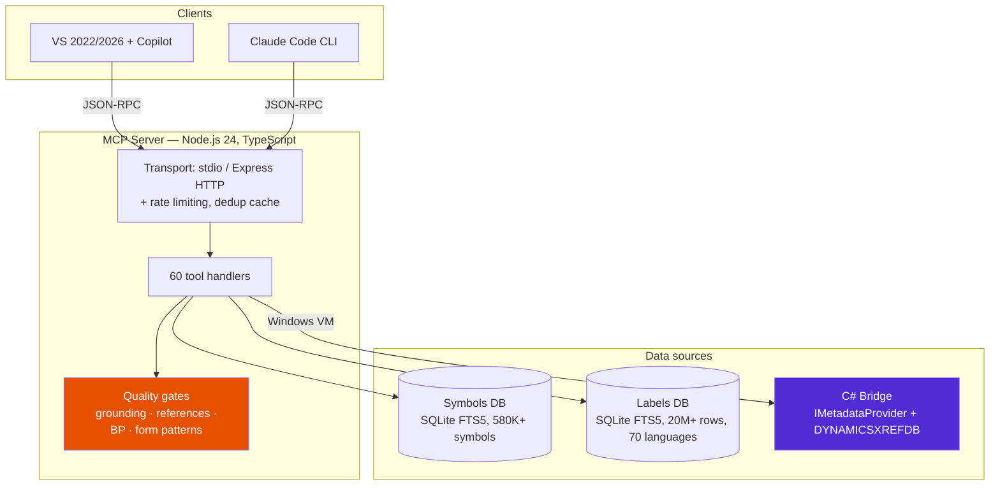
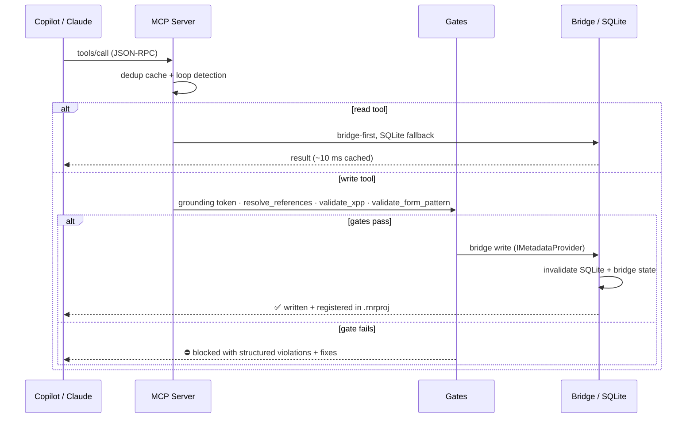
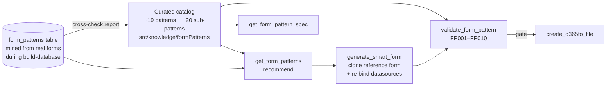
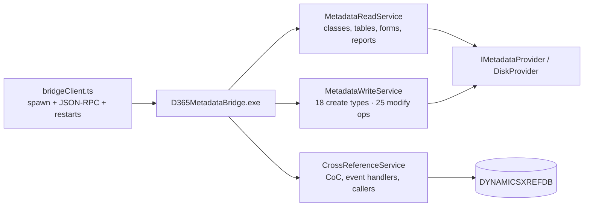
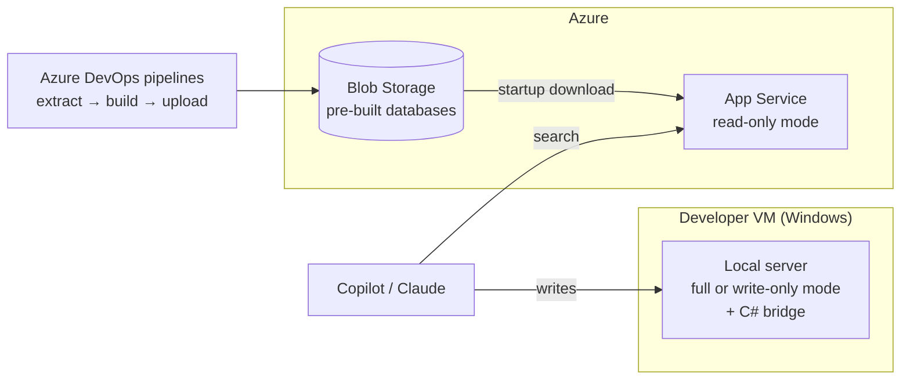

# Architecture

How the server turns a private D365FO codebase into grounded AI context — and keeps generated code honest.

---

## High-level view

Three complementary data sources, one rule: **bridge-first when live metadata matters, SQLite everywhere else.**

| Capability | SQLite + FTS5 | XML parser | C# bridge |
|-----------|--------------|------------|-----------|
| Available on | all platforms | all platforms | Windows VM only |
| Symbol search | ✅ < 10 ms | — | ✅ live |
| Method signatures / source | ✅ snapshot | ✅ on demand | ✅ live |
| Cross-references (callers) | ~ FTS approximation | — | ✅ exact (`DYNAMICSXREFDB`) |
| Labels (20M+ rows) | ✅ sole source | — | create/rename only |
| Create / modify objects | — | — | ✅ 18 create types, 25 modify ops |

Full tool-by-tool breakdown: [SQLITE_DEPENDENCY.md](SQLITE_DEPENDENCY.md)

---

## Request flow

---

## Quality gates — the grounding chain

Generated code must *prove* itself before touching disk. All gates are fail-closed and env-switchable.

| Gate | Tool / mechanism | Blocks when | Switch |
|------|------------------|-------------|--------|
| Provenance | `prepare_change` / `prepare_create` issue a SHA-256 grounding token (30 min TTL, object-bound) | write called without a valid token | `GROUNDING_ENFORCE` |
| References | `resolve_references` — every type, field, method (incl. arity), enum, label checked against the index | any identifier unresolved | `GROUNDING_ENFORCE` |
| Best practices | `validate_xpp` — 13 static rules + data-driven XML rules mined from standard models (`property_stats`) | error-severity violations | — (advisory in output) |
| Form patterns | `validate_form_pattern` — rules FP001–FP010 against the curated pattern catalog | structural violations (FP001–FP005, FP007) | `FORM_PATTERN_ENFORCE` |

Supporting reliability mechanisms:

| Mechanism | Purpose |
|-----------|---------|
| Duplicate-call dedup cache (60 s TTL) | identical read calls served from cache, agent told to reuse data |
| Agentic-loop detection | ≥3 identical calls in a 15-call window → corrective hint injected |
| Index staleness detector | `get_workspace_info` warns when workspace files are newer than the index |
| Structured xppc diagnostics | `build_d365fo_project` parses compiler output into actionable items with fix hints |

### Form pattern engine

The catalog encodes Microsoft's form patterns as data (required containers, ordering, allowed sub-patterns, versions); mining grounds it in the actual environment and reports drift after every index rebuild.

---

## C# Metadata Bridge

A .NET Framework 4.8 process (`D365MetadataBridge.exe`) spawned by the server, speaking JSON-RPC over stdin/stdout. It is the **sole write path** — no XML string manipulation ever touches metadata files.

Key implementation points:

- **DiskProvider discovery** — write methods hide behind internal interfaces; the bridge casts to reach `SaveObject()`.
- **ModelSaveInfo** — every write resolves the owning model from its descriptor, so files land in the right model.
- **Auto-invalidation** — after each write: bridge metadata cache + SQLite index are refreshed, so the next read sees the change.
- **Graceful degradation** — bridge missing (Azure/Linux) → read tools fall back to SQLite; `xrefAvailable: false` → xref tools fall back to FTS.

Protocol, error codes and troubleshooting: [BRIDGE.md](BRIDGE.md)

---

## Databases

Dual-database design — symbol searches never scan label rows (**10–30× faster**).

| Database | Content | Size | Key tables |
|----------|---------|------|-----------|
| `xpp-metadata.db` | symbols + analytics | ~2–3 GB | `symbols` (+FTS5), `form_datasources`, `form_patterns`, `table_relations`, `edt_metadata`, `security_*`, `menu_item_targets`, `property_stats` |
| `xpp-metadata-labels.db` | labels | ~0.5 GB (4 languages) – 8 GB (all 70) | `labels` (+FTS5 for en-US) |

Each `symbols` row carries enhanced metadata beyond name/type/path: description, semantic tags, source snippet, complexity, used types, extends chain, usage statistics — richer context for generation. Statistical tables (`property_stats`, `form_patterns`) power the data-driven validators and advisors.

Read concurrency: WAL mode, read-connection pool with per-connection prepared-statement caches, 256 MB mmap.

---

## Deployment

| Mode | `MCP_SERVER_MODE` | Tools exposed | Typical host |
|------|-------------------|---------------|--------------|
| Full | `full` (default) | all 60 | developer VM |
| Read-only | `read-only` | search/analysis | Azure App Service |
| Write-only | `write-only` | file ops + bridge reads | hybrid local companion |

Index refresh is automated via [Azure DevOps pipelines](PIPELINES.md); the App Service downloads updated databases from Blob Storage on restart.

---

## Performance & security

| Aspect | Implementation |
|--------|----------------|
| Search latency | FTS5 < 10 ms; active invalidation on writes |
| Rate limits | `/mcp` 500 req / 15 min · `/health` 1000 req / 15 min |
| Auth (HTTP) | API key / Bearer middleware; HTTPS + TLS 1.2+; Managed Identity for Blob access |
| Path safety | every write target validated against `PackagesLocalDirectory/<Package>/<Model>/Ax<Type>/` containment (no traversal) |
| Error format | JSON-RPC errors with structured `data.detail`; network retries ×3; DB fallbacks logged |

## Technology stack

| Layer | Technology |
|-------|-----------|
| Runtime | Node.js ≥ 24, TypeScript 6 (strict) |
| Transport | MCP SDK — stdio + Express 5 HTTP |
| Storage | better-sqlite3 (WAL, FTS5) |
| Bridge | .NET Framework 4.8, Microsoft.Dynamics.AX.Metadata DLLs |
| Tests | Vitest — 750+ tests, golden quality-gate suites |
| CI/CD | GitHub Actions (app), Azure DevOps (metadata pipelines) |
