# Architecture Overview

This document provides visual diagrams and detailed explanations of the D365 F&O MCP Server architecture.

## Table of Contents

1. [High-Level Architecture](#high-level-architecture)
2. [Request Flow](#request-flow)
3. [Component Architecture](#component-architecture)
4. [Data Flow](#data-flow)
5. [C# Bridge Architecture](#c-bridge-architecture)
6. [Deployment Architecture](#deployment-architecture)
7. [Database Schema](#database-schema)

---

## High-Level Architecture

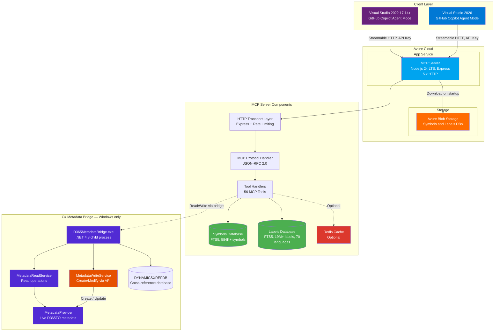

---

## Request Flow

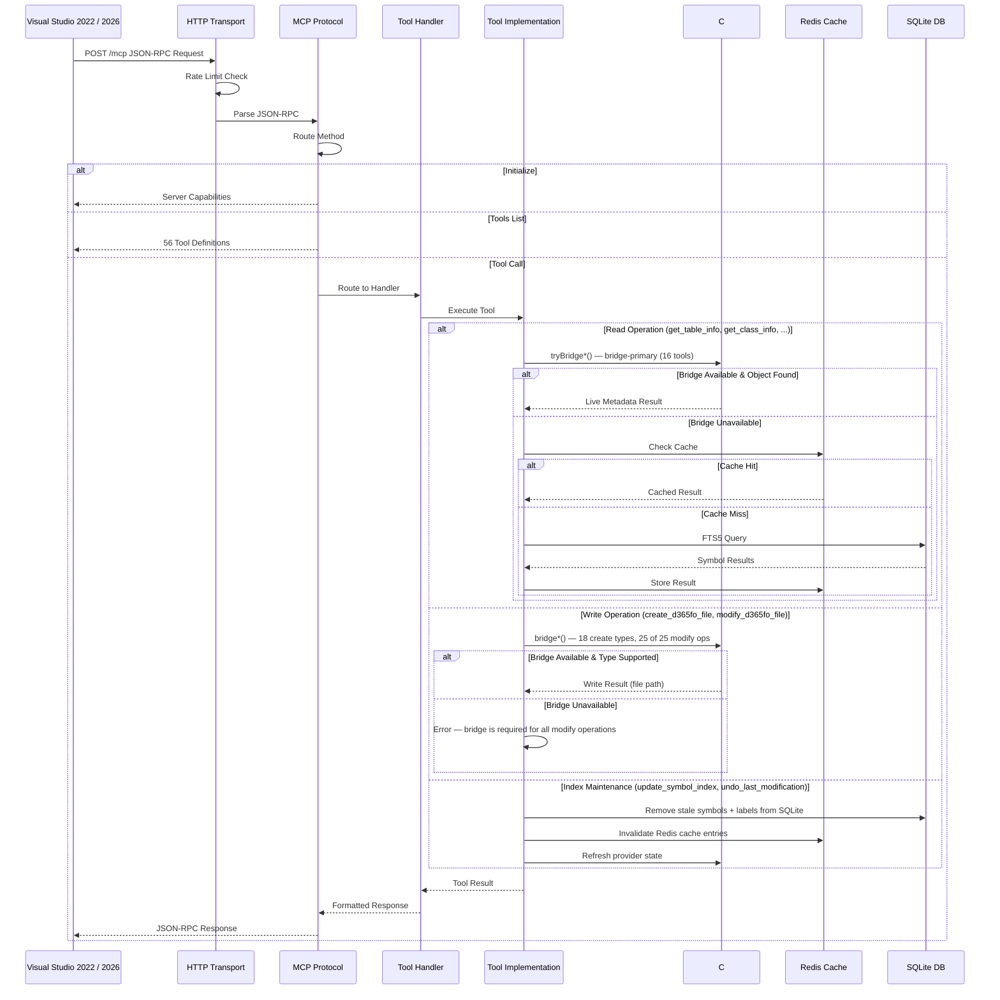

---

## Component Architecture

```mermaid
graph LR
    subgraph "Entry Point"
        INDEX[index.ts\n Main Entry]
    end

    subgraph "Server Layer"
        SERVER[mcpServer.ts\n MCP Server Config]
        TRANSPORT[transport.ts\n HTTP Transport]
        HANDLER[toolHandler.ts\n Tool Router]
    end

    subgraph "Tool Layer"
        subgraph "Search & Discovery"
            SEARCH[search.ts\n search]
            BATCH[batchSearch.ts\n batch_search]
            EXT[extensionSearch.ts\n search_extensions]
            REFS[findReferences.ts\n find_references]
            COMP[completion.ts\n code_completion]
        end
        subgraph "Object Info"
            CLASS[classInfo.ts\n get_class_info]
            TABLE[tableInfo.ts\n get_table_info]
            FORM[formInfo.ts\n get_form_info]
            QUERY[queryInfo.ts\n get_query_info]
            VIEW[viewInfo.ts\n get_view_info]
            ENUM[enumInfo.ts\n get_enum_info]
            EDT[edtInfo.ts\n get_edt_info]
            REPORT[reportInfo.ts\n get_report_info]
            ENTITY[dataEntityInfo.ts\n get_data_entity_info]
            SIGNATURE[methodSignature.ts\n get_method_signature]
            MSRC[getMethodSource.ts\n get_method_source]
        end
        subgraph "Extensions & Security"
            COCEXT[findCocExtensions.ts\n find_coc_extensions]
            EVTHDL[findEventHandlers.ts\n find_event_handlers]
            TBLEXT[tableExtensionInfo.ts\n get_table_extension_info]
            EXTPTS[analyzeExtensionPoints.ts\n analyze_extension_points]
            EXTSTRAT[extensionStrategyAdvisor.ts\n recommend_extension_strategy]
            SECART[securityArtifactInfo.ts\n get_security_artifact_info]
            SECCOV[securityCoverageInfo.ts\n get_security_coverage_for_object]
            MENU[menuItemInfo.ts\n get_menu_item_info]
        end
        subgraph "Code Generation"
            GEN[codeGen.ts\n generate_code]
            GENXML[generateD365Xml.ts\n generate_d365fo_xml]
            CREATE[createD365File.ts\n create_d365fo_file]
            MODIFY[modifyD365File.ts\n modify_d365fo_file]
            SMTABLE[generateSmartTable.ts\n generate_smart_table]
            SMFORM[generateSmartForm.ts\n generate_smart_form]
            SMRPT[generateSmartReport.ts\n generate_smart_report]
        end
        subgraph "Analysis & Patterns"
            PATTERN[analyzePatterns.ts\n analyze_code_patterns]
            SUGGEST[suggestImplementation.ts\n suggest_method_implementation]
            COMPLETE[analyzeCompleteness.ts\n analyze_class_completeness]
            API[apiUsagePatterns.ts\n get_api_usage_patterns]
            KNOWLEDGE[xppKnowledge.ts\n get_xpp_knowledge]
            TPAT[getTablePatterns.ts\n get_table_patterns]
            FPAT[getFormPatterns.ts\n get_form_patterns]
            SEDT[suggestEdt.ts\n suggest_edt]
        end
        subgraph "Labels"
            SLABELS[searchLabels.ts\n search_labels]
            GLABEL[getLabelInfo.ts\n get_label_info]
            CLABEL[createLabel.ts\n create_label]
            RLABEL[renameLabel.ts\n rename_label]
        end
        subgraph "Workspace"
            WSINFO[xppTools.ts\n get_workspace_info]
            VERIFYD[verifyD365Project.ts\n verify_d365fo_project]
            VALNAME[validateObjectNaming.ts\n validate_object_naming]
        end
    end

    subgraph "Metadata Layer"
        SYMBOL[symbolIndex.ts\n SQLite + FTS5]
        PARSER[xmlParser.ts\n XML Metadata]
    end

    subgraph "Infrastructure"
        CACHE_SVC[redisCache.ts\n Cache Service]
        RATE[rateLimiter.ts\n Rate Limiting]
        DOWNLOAD[download.ts\n Azure Blob DL]
    end

    subgraph "C# Metadata Bridge — Windows only"
        BCLIENT[bridgeClient.ts\n JSON-RPC child process]
        BADAPT[bridgeAdapter.ts\n 12 tryBridge* read + 32 bridge* write]
        BTYPES[bridgeTypes.ts\n Response types incl. BridgeWriteResult, BridgeDeleteResult, BridgeCapabilities]
    end

    INDEX --> SERVER
    INDEX --> TRANSPORT
    INDEX --> SYMBOL
    INDEX --> PARSER
    INDEX --> CACHE_SVC
    INDEX --> DOWNLOAD
    INDEX --> BCLIENT

    SERVER --> HANDLER
    HANDLER --> SEARCH
    HANDLER --> BATCH
    HANDLER --> EXT
    HANDLER --> REFS
    HANDLER --> COMP
    HANDLER --> CLASS
    HANDLER --> TABLE
    HANDLER --> FORM
    HANDLER --> QUERY
    HANDLER --> VIEW
    HANDLER --> ENUM
    HANDLER --> EDT
    HANDLER --> REPORT
    HANDLER --> ENTITY
    HANDLER --> SIGNATURE
    HANDLER --> MSRC
    HANDLER --> COCEXT
    HANDLER --> EVTHDL
    HANDLER --> TBLEXT
    HANDLER --> EXTPTS
    HANDLER --> SECART
    HANDLER --> SECCOV
    HANDLER --> MENU
    HANDLER --> GEN
    HANDLER --> GENXML
    HANDLER --> CREATE
    HANDLER --> MODIFY
    HANDLER --> SMTABLE
    HANDLER --> SMFORM
    HANDLER --> SMRPT
    HANDLER --> PATTERN
    HANDLER --> SUGGEST
    HANDLER --> COMPLETE
    HANDLER --> API
    HANDLER --> TPAT
    HANDLER --> FPAT
    HANDLER --> SEDT
    HANDLER --> SLABELS
    HANDLER --> GLABEL
    HANDLER --> CLABEL
    HANDLER --> RLABEL
    HANDLER --> WSINFO
    HANDLER --> VERIFYD
    HANDLER --> VALNAME

    CLASS -.-> BADAPT
    TABLE -.-> BADAPT
    ENUM -.-> BADAPT
    EDT -.-> BADAPT
    FORM -.-> BADAPT
    QUERY -.-> BADAPT
    VIEW -.-> BADAPT
    REPORT -.-> BADAPT
    ENTITY -.-> BADAPT
    SEARCH -.-> BADAPT
    REFS -.-> BADAPT
    MSRC -.-> BADAPT
    BADAPT --> BCLIENT
    BCLIENT --> BTYPES

    SEARCH --> SYMBOL
    BATCH --> SYMBOL
    EXT --> SYMBOL
    REFS --> SYMBOL
    COMP --> SYMBOL
    CLASS --> SYMBOL
    CLASS --> PARSER
    TABLE --> SYMBOL
    TABLE --> PARSER
    FORM --> SYMBOL
    FORM --> PARSER
    QUERY --> SYMBOL
    QUERY --> PARSER
    VIEW --> SYMBOL
    VIEW --> PARSER
    ENUM --> SYMBOL
    ENUM --> PARSER
    EDT --> SYMBOL
    EDT --> PARSER
    REPORT --> SYMBOL
    REPORT --> PARSER
    ENTITY --> SYMBOL
    ENTITY --> PARSER
    SIGNATURE --> SYMBOL
    SIGNATURE --> PARSER
    MSRC --> SYMBOL
    MSRC --> PARSER
    COCEXT --> SYMBOL
    EVTHDL --> SYMBOL
    TBLEXT --> SYMBOL
    EXTPTS --> SYMBOL
    SECART --> SYMBOL
    SECART --> PARSER
    SECCOV --> SYMBOL
    MENU --> SYMBOL
    PATTERN --> SYMBOL
    SUGGEST --> SYMBOL
    COMPLETE --> SYMBOL
    API --> SYMBOL
    TPAT --> SYMBOL
    FPAT --> SYMBOL
    SMTABLE --> SYMBOL
    SMFORM --> SYMBOL
    SMRPT --> SYMBOL
    SEDT --> SYMBOL
    SLABELS --> SYMBOL
    GLABEL --> SYMBOL
    VALNAME --> SYMBOL

    SEARCH -.-> CACHE_SVC
    BATCH -.-> CACHE_SVC
    CLASS -.-> CACHE_SVC
    TABLE -.-> CACHE_SVC
    FORM -.-> CACHE_SVC
    QUERY -.-> CACHE_SVC
    VIEW -.-> CACHE_SVC
    ENUM -.-> CACHE_SVC
    COMP -.-> CACHE_SVC
    SIGNATURE -.-> CACHE_SVC
    REFS -.-> CACHE_SVC

    TRANSPORT --> RATE
    
    style INDEX fill:#FF6C00,color:#fff
    style SYMBOL fill:#4CAF50,color:#fff
    style CACHE_SVC fill:#DC382D,color:#fff
```

---

## Data Flow

### 1. Startup Flow

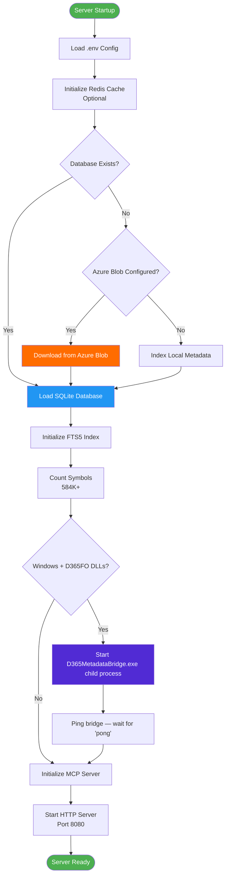

### 2. Search Query Flow

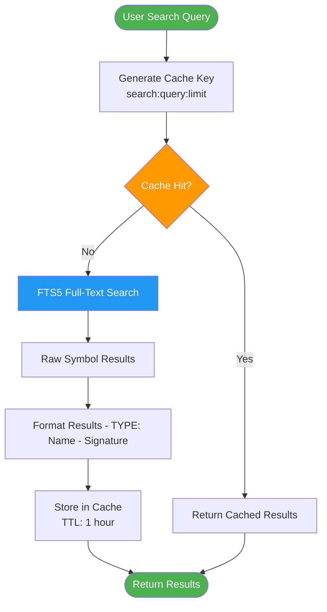

### 3. Class Info Query Flow

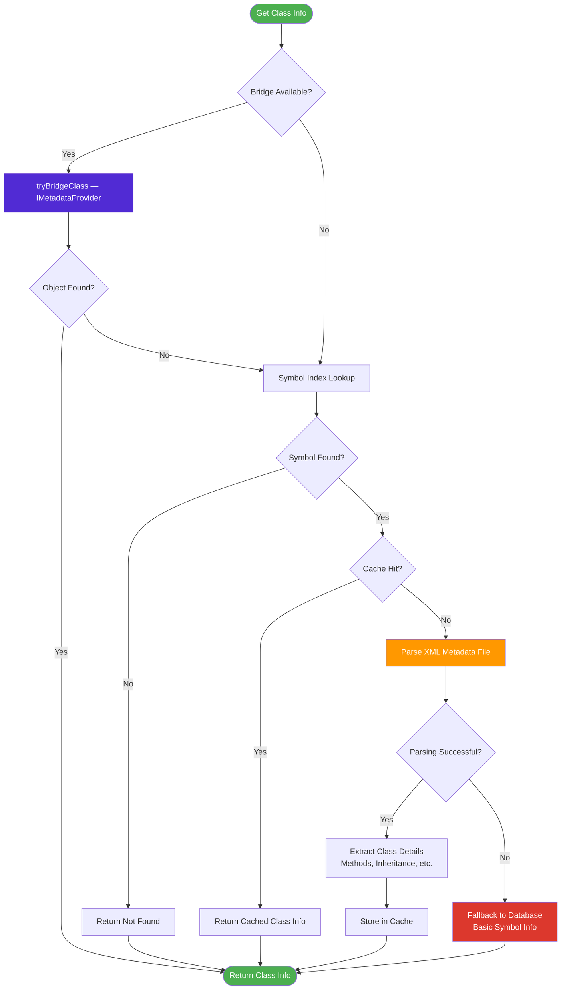

---

## C# Bridge Architecture

> **The C# bridge is mandatory on Windows D365FO development VMs.** All write operations
> (`create_d365fo_file`, `modify_d365fo_file`) require it. Read operations fall back to
> SQLite + XML parser when the bridge is unavailable (Azure deployment).
> See [BRIDGE.md](BRIDGE.md) for endpoint reference and [SETUP.md](SETUP.md) for build instructions.

### Process Lifecycle

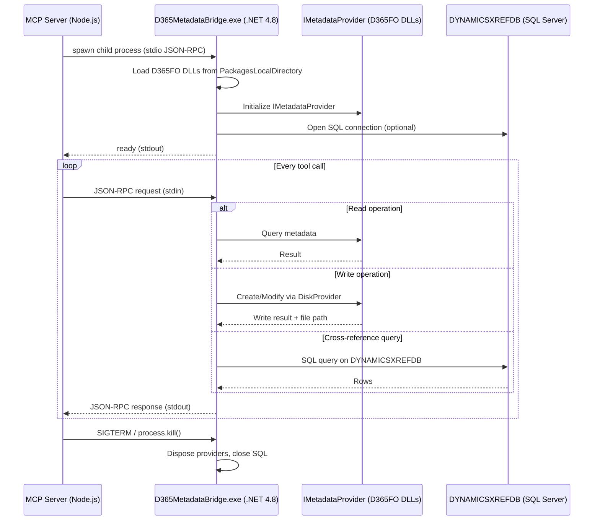

### Integration Pattern — Bridge → DB → Disk

Every read tool uses a strict three-tier lookup order:

```
Tool handler:
  1. Bridge (authoritative)  → C# IMetadataProvider via JSON-RPC (stdin/stdout)
     └─ Bridge available + object found → return live metadata
  2. SQLite symbol index     → FTS5 / structured queries on the pre-built DB
     └─ Used when the bridge is offline (Azure, write-only mode, build agents)
        or the object is not covered by the bridge for this call
  3. Disk parse              → xmlParser.parseXxxFile() on the AOT XML file
     └─ Last resort for objects created in the current session and not yet
        indexed. The extension scanner has a ~3 s budget and 30 s result cache
        and can be disabled entirely via D365FO_DISABLE_FS_FALLBACK=true.
  4. Cache (optional)        → Redis is off by default; when enabled it only
                               short-circuits the above for repeated queries.
```

Write tools (`create_d365fo_file`, `modify_d365fo_file`) have **no bridge fallback** — if the
bridge is unavailable they return an error. This is by design: only the C# `IMetadataProvider`
API can safely create/modify D365FO objects (correct XML encoding, AOT path, `.rnrproj`
registration).

**Write-path safety:** every write target is validated against the configured
`PackagesLocalDirectory` roots and the canonical `<Package>/<Model>/Ax<Type>/<Name>.xml`
layout. Paths outside the roots or with the wrong shape are rejected before any file I/O.

### C# Components

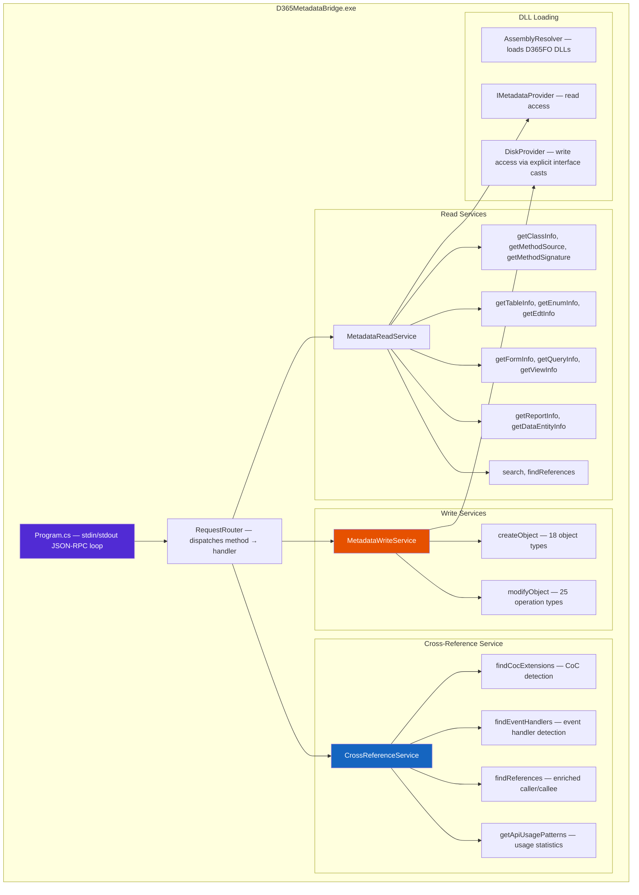

### TypeScript Components

| File | Role |
|------|------|
| `src/bridge/bridgeClient.ts` | Spawns `.exe`, manages stdin/stdout JSON-RPC, handles timeouts & restarts |
| `src/bridge/bridgeAdapter.ts` | 12 `tryBridge*()` read functions + 32 `bridge*()` write functions |
| `src/bridge/bridgeTypes.ts` | TypeScript interfaces for bridge responses (`BridgeClassInfo`, `BridgeWriteResult`, etc.) |

### Write Operations — DiskProvider Discovery

Creating and modifying D365FO objects through the official API requires several non-obvious steps
that the bridge handles internally:

1. **DiskProvider discovery** — `IMetadataProvider` does not expose write methods directly.
   The bridge casts to internal interfaces (`IMetadataProviderInternal`, `IDiskModelProvider`)
   to reach `DiskProvider` which has `SaveObject()`.

2. **ModelSaveInfo resolution** — every write must specify which model owns the file.
   The bridge reads the model descriptor (`Descriptor/Model.xml`) to construct `ModelSaveInfo`.

3. **Explicit interface casts** — some D365FO interfaces hide members behind explicit
   implementations. The bridge casts to the exact interface (e.g. `ITable.SaveExtension()`)
   rather than calling via the class hierarchy.

4. **Auto-refresh** — after a successful write, the bridge invalidates its internal metadata
   cache so subsequent reads reflect the change immediately. The MCP server also invalidates
   its own SQLite + Redis caches.

### Index Lifecycle & Cache Invalidation

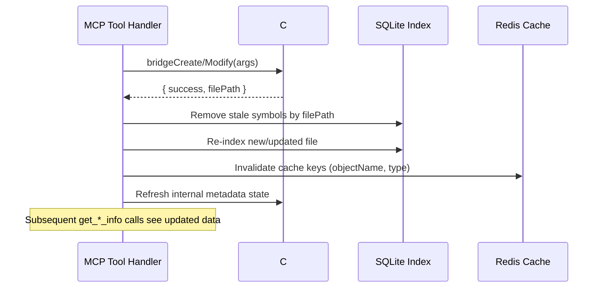

### Data Source Comparison

| Capability | SQLite + FTS5 | XML Parser | C# Bridge |
|-----------|--------------|------------|-----------|
| Available on | All platforms | All platforms | Windows VM only |
| Symbol search (name, type) | ✅ Fast | ❌ | ✅ Live |
| Method signatures | ✅ Static snapshot | ✅ Parse on demand | ✅ Live |
| Method bodies | ✅ `sourceSnippet` (10 lines) | ✅ Full source | ✅ Full source |
| Cross-references (callers) | ✅ FTS approximation | ❌ | ✅ Exact (DYNAMICSXREFDB) |
| Create objects | ❌ | ❌ | ✅ 18 types |
| Modify objects | ❌ | ❌ | ✅ 25 operations |
| Label operations | ✅ Search | ❌ | ✅ Create/Rename |

---

## Deployment Architecture

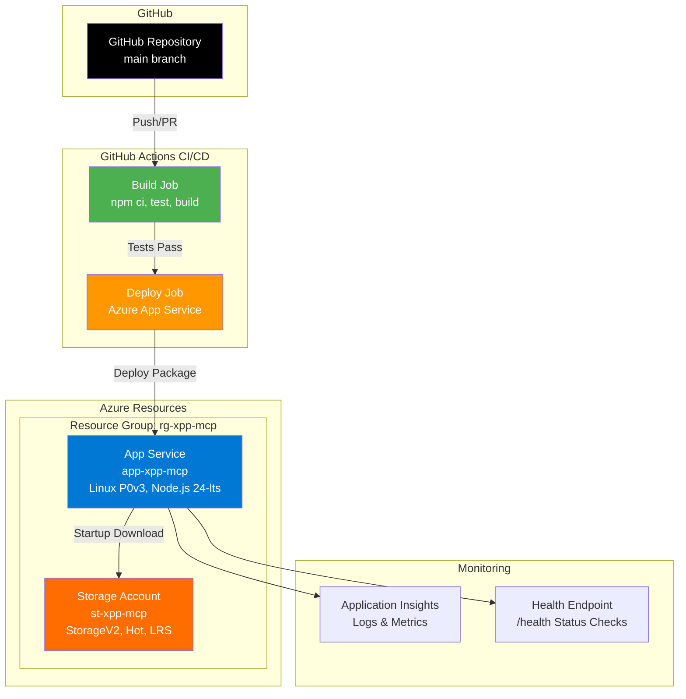

---

## Database Schema

**Dual-Database Architecture** for performance optimization:
- **Symbols Database** (`xpp-metadata.db`, ~2 GB without UnitTest models / ~3 GB with) — Fast symbol searches
- **Labels Database** (`xpp-metadata-labels.db`, ~500 MB for 4 languages, up to 8 GB for all 70 languages) — Isolated label storage

### Symbols Database

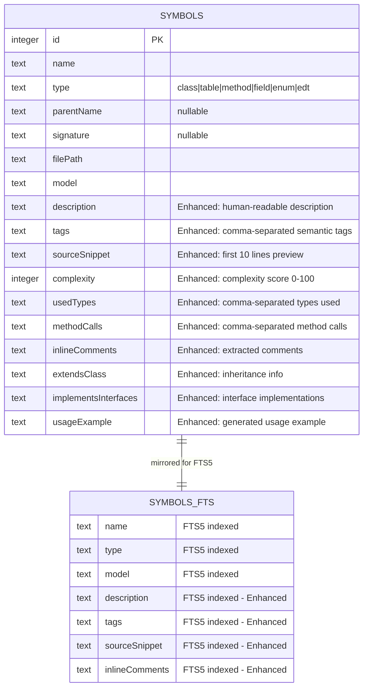

### Labels Database

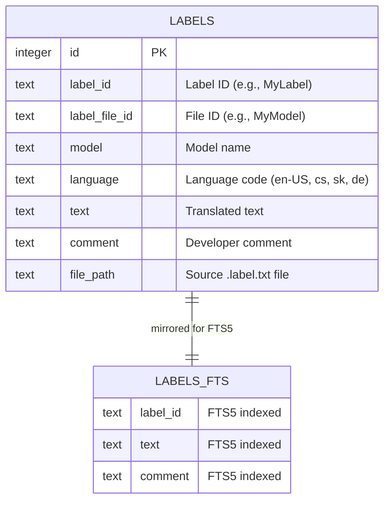

**Why Separate Databases?**
- Symbol searches ignore label rows → **10-30× faster**
- Labels DB size depends on language selection (4 languages = ~500 MB, 70 languages = ~8 GB)
- Each database has its own SQLite cache and optimization settings

### Symbol Types

| Type | Description | Example |
|------|-------------|---------|
| `class` | X++ Class | `SalesFormLetter`, `CustPostInvoice` |
| `table` | AOT Table | `CustTable`, `InventTable` |
| `method` | Class/Table Method | `insert()`, `validateWrite()` |
| `field` | Table Field | `AccountNum`, `Name` |
| `enum` | Enumeration | `NoYes`, `TransactionType` |
| `edt` | Extended Data Type | `CustAccount`, `ItemId` |

Beyond these core fields, each symbol row carries enhanced metadata (description, semantic tags,
source snippet, complexity score, used types, extends chain, and more) to give Copilot richer
context during code generation. See the `symbols` table DDL in `src/database/symbolIndex.ts`
for the full schema.

---

## MCP Protocol Endpoints

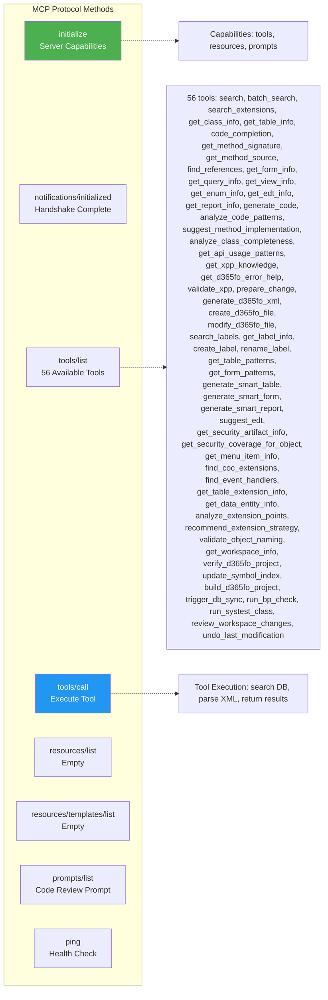

> For detailed tool parameters and example inputs/outputs, see [MCP_TOOLS.md](MCP_TOOLS.md).

### Local SDLC Execution

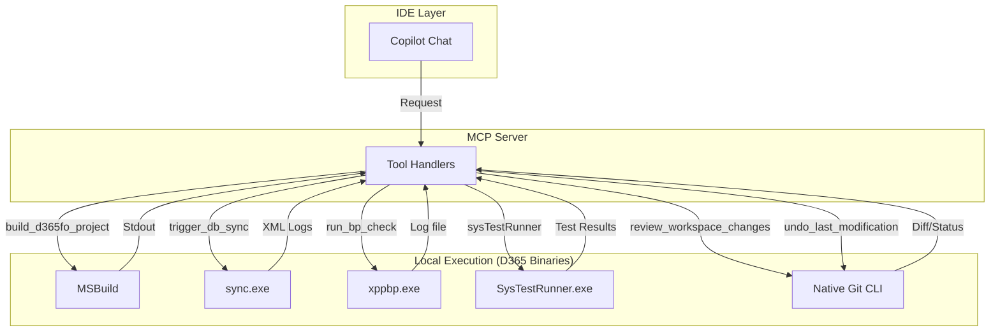

## Performance Optimizations

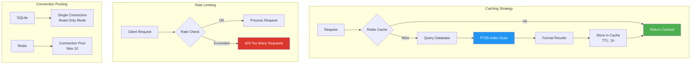

### Caching

- Default TTL: **1 hour** for search results, class/table info; **30 min** for completions
- Redis cache entries are **actively invalidated** on write operations (`create_d365fo_file`,
  `modify_d365fo_file`, `update_symbol_index`, `undo_last_modification`) — no stale data
- Write operations auto-invalidate: Redis keys + SQLite index + C# bridge state

### Rate Limits

| Endpoint | Limit | Window |
|----------|-------|--------|
| `/mcp` | 500 requests | 15 minutes |
| `/health` | 1000 requests | 15 minutes |

---

## Security Architecture

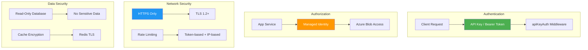

---

## Error Handling Flow

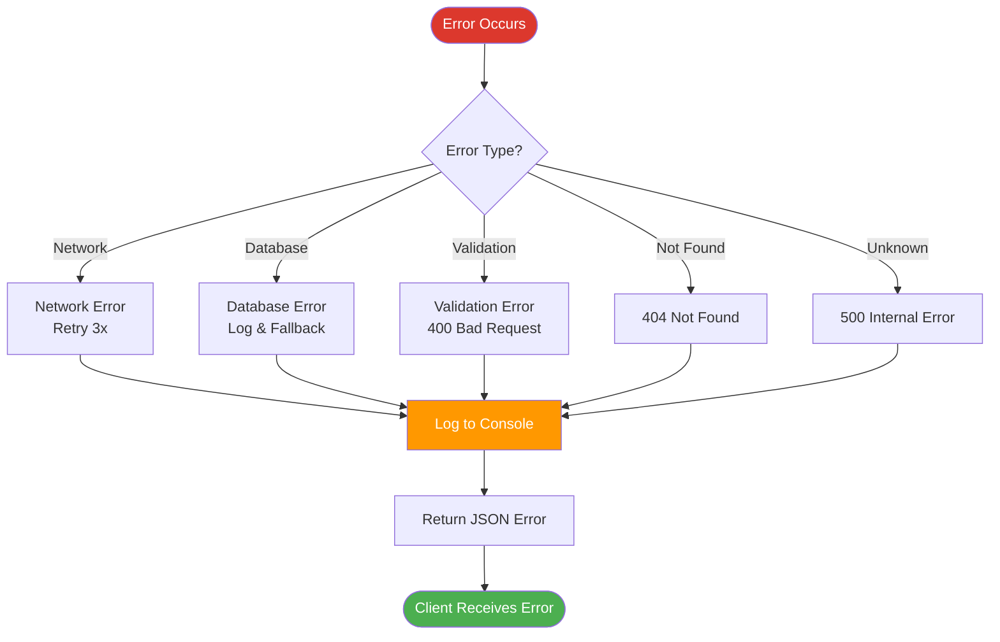

### Error Response Format

```json
{
  "jsonrpc": "2.0",
  "id": 123,
  "error": {
    "code": -32600,
    "message": "Invalid Request",
    "data": {
      "detail": "Missing required parameter: className"
    }
  }
}
```

---

## Scalability Considerations

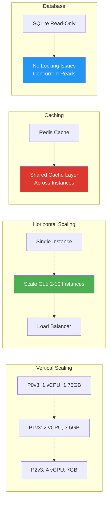

### Current Capacity

- **Storage:** ~2–3 GB symbols database (without/with UnitTest models) + ~500 MB labels database (4 languages) = ~2.5–3.5 GB total
- **Memory:** 1.75GB (P0v3) - ~800MB used
- **Throughput:** 500 req/15min per IP (configurable)
- **Latency:** 
 -  Cache hit: <10ms
 -  Cache miss: 50-200ms
 -  Cold start: 15-30s (database download)

---

## Testing Architecture

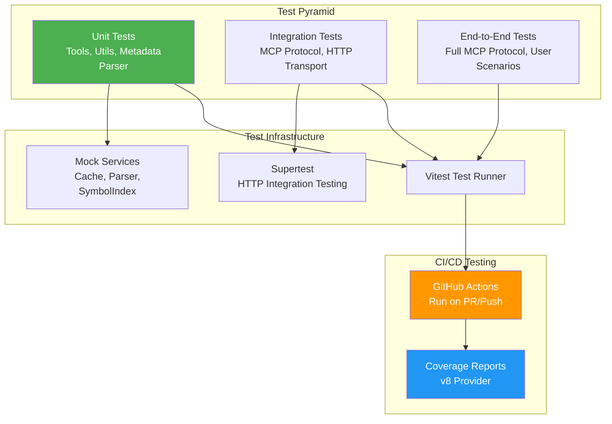

---

## Technology Stack

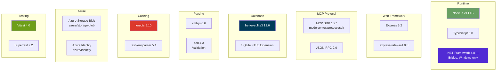

---

## Conclusion

This architecture provides:

✅ **High Performance** - FTS5 full-text search with Redis caching  
✅ **Live Metadata** - C# bridge provides always-fresh data on Windows D365FO VMs (see [BRIDGE.md](BRIDGE.md))  
✅ **Scalability** - Stateless design, horizontal scaling ready  
✅ **Reliability** - Error handling, rate limiting, health checks  
✅ **Security** - API Key auth, HTTPS, rate limiting  
✅ **Maintainability** - TypeScript, comprehensive tests, CI/CD  
✅ **Cost-Effective** - Serverless Azure App Service, efficient caching  

The modular design allows for easy extension and adaptation to different D365 F&O environments while maintaining compatibility with the MCP protocol standard.
