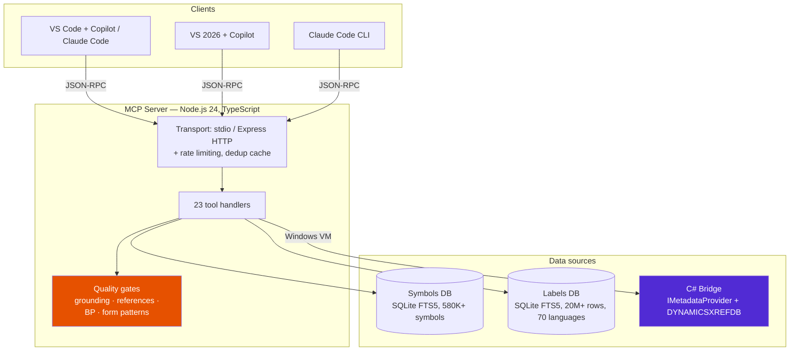
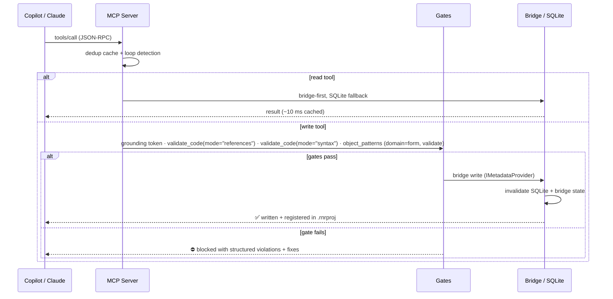
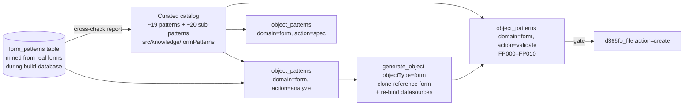
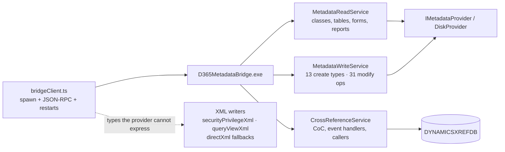
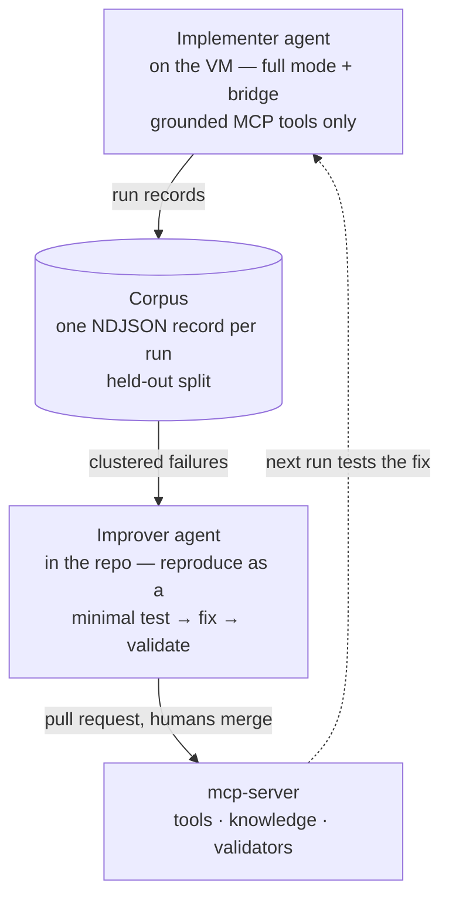
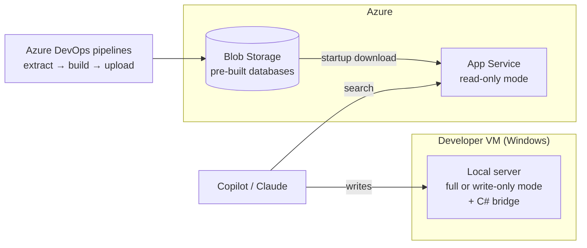

# Architecture

How the server turns a private D365FO codebase into grounded AI context — and keeps generated code honest.

---

## High-level view

```mermaid
graph TB
    subgraph Clients
        VSC[VS Code + Copilot / Claude Code]
        VS[VS 2026 + Copilot]
        CC[Claude Code CLI]
    end

    subgraph "MCP Server — Node.js 24, TypeScript"
        TRANSPORT[Transport: stdio / Express HTTP\n+ rate limiting, dedup cache]
        TOOLS[23 tool handlers]
        GATES[Quality gates\n grounding · references · BP · form patterns]
    end

    subgraph "Data sources"
        DB[(Symbols DB\nSQLite FTS5, 580K+ symbols)]
        LDB[(Labels DB\nSQLite FTS5, 20M+ rows, 70 languages)]
        BRIDGE[C# Bridge\nIMetadataProvider + DYNAMICSXREFDB]
    end

    VSC & VS & CC -->|JSON-RPC| TRANSPORT --> TOOLS
    TOOLS --> GATES
    TOOLS --> DB & LDB
    TOOLS -->|Windows VM| BRIDGE

    style BRIDGE fill:#512BD4,color:#fff
    style GATES fill:#E65100,color:#fff
```

Three complementary data sources, one rule: **bridge-first when live metadata matters, SQLite everywhere else.**

| Capability | SQLite + FTS5 | XML parser | C# bridge |
|-----------|--------------|------------|-----------|
| Available on | all platforms | all platforms | Windows VM only |
| Symbol search | ✅ < 10 ms | — | ✅ live |
| Method signatures / source | ✅ snapshot | ✅ on demand | ✅ live |
| Cross-references (callers) | ~ FTS approximation | — | ✅ exact (`DYNAMICSXREFDB`) |
| Labels (20M+ rows) | ✅ sole source | — | create/rename only |
| Create / modify objects | validated XML writers for types the provider cannot express | — | ✅ 13 create types, 31 modify ops |

SQLite stays essential even with the bridge: it is the **only** data source on Azure/Linux (no bridge), the sole store for 20M+ labels (`IMetadataProvider` has no label API), and the engine for all bulk search, aggregation and pattern mining (the bridge reads one object at a time).

---

## Request flow

```mermaid
sequenceDiagram
    participant IDE as Copilot / Claude
    participant SRV as MCP Server
    participant GATE as Gates
    participant SRC as Bridge / SQLite

    IDE->>SRV: tools/call (JSON-RPC)
    SRV->>SRV: dedup cache + loop detection
    alt read tool
        SRV->>SRC: bridge-first, SQLite fallback
        SRC-->>IDE: result (~10 ms cached)
    else write tool
        SRV->>GATE: grounding token · validate_code(mode="references") · validate_code(mode="syntax") · object_patterns (domain=form, validate)
        alt gates pass
            GATE->>SRC: bridge write (IMetadataProvider)
            SRC->>SRC: invalidate SQLite + bridge state
            SRC-->>IDE: ✅ written + registered in .rnrproj
        else gate fails
            GATE-->>IDE: ⛔ blocked with structured violations + fixes
        end
    end
```

---

## Quality gates — the grounding chain

Generated code must *prove* itself before touching disk. All gates are fail-closed and env-switchable.

| Gate | Tool / mechanism | Blocks when | Switch |
|------|------------------|-------------|--------|
| Provenance | `prepare` (mode=change/create) issues a grounding token (30 min TTL, object-bound). In-memory by default; with `GROUNDING_SECRET` set on both instances the token is HMAC-signed and portable, so the hybrid write-only companion (and scaled-out App Service) can validate it — without the secret, write-only mode bypasses enforcement | write called without a valid token | `GROUNDING_ENFORCE` + `GROUNDING_SECRET` |
| References | `validate_code(mode="references")` — every type, field, method (incl. arity), enum, label checked against the index | any identifier unresolved | `GROUNDING_ENFORCE` |
| Best practices | `validate_code(mode="syntax")` — 11 static rules (BP, COC, SEL, TTS, XML001/006/007) + 4 data-driven XML rules (XML002–XML005) mined from standard models (`property_stats`) | error-severity violations | — (advisory in output) |
| Form patterns | `object_patterns (domain=form, action=validate)` — rules FP000–FP010 against the curated pattern catalog | structural violations (FP001–FP005, FP007) | `FORM_PATTERN_ENFORCE` |

Supporting reliability mechanisms:

| Mechanism | Purpose |
|-----------|---------|
| Duplicate-call dedup cache (60 s TTL) | identical read calls served from cache, agent told to reuse data |
| Agentic-loop detection | ≥3 identical calls in a 15-call window → corrective hint injected |
| Index staleness detector | `get_workspace_info` warns when workspace files are newer than the index |
| Structured xppc diagnostics | `build_d365fo_project` parses compiler output into actionable items with fix hints |

### Form pattern engine

```mermaid
flowchart LR
    CAT["Curated catalog\n~19 patterns + ~20 sub-patterns\nsrc/knowledge/formPatterns"] --> ADV[object_patterns\ndomain=form, action=analyze]
    CAT --> SPEC[object_patterns\ndomain=form, action=spec]
    CAT --> VAL[object_patterns domain=form, action=validate\nFP000–FP010]
    MINE[("form_patterns table\nmined from real forms\nduring build-database")] --> ADV
    MINE -->|cross-check report| CAT
    ADV --> GEN["generate_object objectType=form\nclone reference form\n+ re-bind datasources"]
    GEN --> VAL
    VAL -->|gate| WRITE[d365fo_file action=create]
```

The catalog encodes Microsoft's form patterns as data (required containers, ordering, allowed sub-patterns, versions); mining grounds it in the actual environment and reports drift after every index rebuild.

---

## C# Metadata Bridge

A .NET Framework 4.8 process (`D365MetadataBridge.exe`) spawned by the server, speaking JSON-RPC over stdin/stdout. It is the **primary write path**: whenever `IMetadataProvider` can express the object, the bridge writes it and no string manipulation touches the XML.

It is not the *only* write path. Two cases fall through to purpose-built XML writers, and both are deliberate:

- **Object types outside `BRIDGE_CREATE_TYPES`** (13 of the 39 create types route to the bridge). `security-privilege`/`duty`/`role` and `query`/`view` are excluded on purpose — the bridge's generic `properties: Dictionary<string,string>` channel cannot carry the structured collections they need (EntryPoints, Privileges, Duties, query data sources), so a bridge create would "succeed" and produce a functionally broken object. `securityPrivilegeXml.ts`, `queryViewXml.ts` and friends build these correctly instead.
- **Modify operations with no backing C# op** — `add-delete-action`, `remove-delete-action`, `modify-property` on some types, `add-menu-item-to-menu`, `add-control`, `add-index` and the data-entity-extension field writer fall back to the `directXml*` helpers in `modifyD365File.ts` (see also `dataEntityViewExtensionXml.ts`).

The distinction matters for correctness, not for safety: **every write goes through the same grounding gates and the same path-containment check**, whichever writer commits it. The XML writers are structured builders with ambiguity guards (they refuse to guess when a target tag matches more than once), not blind string replacement.

```mermaid
graph LR
    TS[bridgeClient.ts\nspawn + JSON-RPC + restarts] --> EXE[D365MetadataBridge.exe]
    TS -.->|types the provider cannot express| XMLW[XML writers\nsecurityPrivilegeXml · queryViewXml\ndirectXml fallbacks]
    EXE --> READ[MetadataReadService\nclasses, tables, forms, reports]
    EXE --> WRITE[MetadataWriteService\n13 create types · 31 modify ops]
    EXE --> XREF[CrossReferenceService\nCoC, event handlers, callers]
    READ & WRITE --> PROV[IMetadataProvider / DiskProvider]
    XREF --> SQL[(DYNAMICSXREFDB)]
```

Key implementation points:

- **DiskProvider discovery** — write methods hide behind internal interfaces; the bridge casts to reach `SaveObject()`.
- **ModelSaveInfo** — every write resolves the owning model from its descriptor, so files land in the right model.
- **Auto-invalidation** — after each write: bridge metadata cache + SQLite index are refreshed, so the next read sees the change.
- **Graceful degradation** — bridge missing (Azure/Linux) → read tools fall back to SQLite; `xrefAvailable: false` → xref tools fall back to FTS.

### Bridge protocol & resilience

Newline-delimited JSON-RPC over stdin/stdout. Read calls that time out or hit a dead pipe are retried after a health-checked respawn (`BRIDGE_MAX_RETRIES`, `BRIDGE_MAX_RESTARTS`); **write calls are never retried** — a timed-out write may already have applied. On startup the child sends `{"id":"ready", result:{ metadataAvailable, xrefAvailable }}`.

| Error code | Meaning |
|---|---|
| `-32601` / `-32602` | unknown method / invalid params |
| `-32000` / `-32001` | service not available / object not found |
| `-32603` | internal error |

**Troubleshooting:** `metadataAvailable: false` → D365FO not deployed to the package path, or a DLL version mismatch (check bridge stderr). `xrefAvailable: false` (non-critical, xref falls back to FTS) → SQL Server / `DYNAMICSXREFDB` unreachable; on UDE the server reads `CrossReferencesDbServerName`/`CrossReferencesDatabaseName` from the XPP config automatically. Building on UDE needs the DLL path: `dotnet build -c Release -p:D365BinPath="<FrameworkDirectory>\bin"`.

---

## Databases

Dual-database design — symbol searches never scan label rows (**10–30× faster**).

| Database | Content | Size | Key tables |
|----------|---------|------|-----------|
| `xpp-metadata.db` | symbols + analytics | ~2–3 GB | `symbols` (+FTS5), `form_datasources`, `form_patterns`, `table_relations`, `edt_metadata`, `security_*`, `menu_item_targets`, `property_stats` |
| `xpp-metadata-labels.db` | labels | ~0.5 GB (4 languages) – 8 GB (all 70) | `labels` (+FTS5 for en-US) |

Each `symbols` row carries enhanced metadata beyond name/type/path: description, semantic tags, source snippet, complexity, used types, extends chain, usage statistics — richer context for generation. Statistical tables (`property_stats`, `form_patterns`) power the data-driven validators and advisors.

`property_stats` is a corpus of **Microsoft-authored models only** — it answers "what does the standard platform do", so mining our own or a third-party ISV's objects would feed our own habits back to us as platform convention. The gate is `XppSymbolIndex.isMineableModel()`, fed by the extract manifest (the only source of truth on UDE, where `CUSTOM_MODELS` is empty by design) plus the name-based `isStandardModel()`. Counts are cumulative, so `build-database` also purges rows that fail today's gate; `npm run purge-property-stats [-- --dry-run]` does the same to an existing database without a rebuild.

Read concurrency: WAL mode, read-connection pool with per-connection prepared-statement caches, 256 MB mmap.

---

## Self-improving eval loop

The gates above say whether a *single* write is grounded. The eval loop answers the larger question — is the server getting better at producing X++ that compiles, is BP-clean, and matches the intended metadata shape? Full spec: [AGENT_EVAL_LOOP.md](AGENT_EVAL_LOOP.md).

```mermaid
graph TB
    IMPL["Implementer agent\non the VM — full mode + bridge\ngrounded MCP tools only"] -->|run records| CORP[("Corpus\none NDJSON record per run\nheld-out split")]
    CORP -->|clustered failures| IMPV["Improver agent\nin the repo — reproduce as a\nminimal test → fix → validate"]
    IMPV -->|pull request, humans merge| SRV["mcp-server\ntools · knowledge · validators"]
    SRV -.->|next run tests the fix| IMPL
```

Two agents, one shared store, **no shared in-memory state** — either can run on its own cadence. The split is deliberate: the VM has the platform and the compiler, the repo is where TypeScript edits, golden tests and CI belong. Mixing them couples slow platform builds to fast unit-test iteration.

| Element | What it is |
|---|---|
| Case catalog | 80 cases in `eval/cases/`, tiered L0–L4, each with a JSON spec validated against `schema.json` |
| Primary oracle | **golden metadata** — a diff of produced XML against the case's captured golden, not merely "it compiled" |
| Runtime oracle | `run_systest_class` against `eval/systests/<id>.xml` — a SysTest references only standard objects, so it fails when a CoC wrapper is missing or wrong, which a golden cannot detect |
| Fixtures | shared INPUT objects (e.g. `ConDemoNoteHeader`) live in `eval/fixtures/`, re-provisioned per run and excluded from rollback — case OUTPUTS are never pre-provisioned |
| Isolation | every run works in a throwaway sandbox model and rolls back, so runs never pollute each other or the index |
| Coverage | a taxonomy leaf counts as covered only when **K**nowledge teaches it, an **E**val case with a captured golden proves it, and the **T**ool path can build it — currently core 44/44, total 78/78 ([eval/COVERAGE.md](../eval/COVERAGE.md)) |

The loop is an eval and self-improvement harness, **not** a production code generator and **not** auto-merge — the improver opens PRs that humans review.

---

## Deployment

```mermaid
graph LR
    subgraph "Developer VM (Windows)"
        LOCAL["Local server\nfull or write-only mode\n+ C# bridge"]
    end
    subgraph Azure
        APP["App Service\nread-only mode"]
        BLOB[("Blob Storage\npre-built databases")]
    end
    DEVOPS[Azure DevOps pipelines\nextract → build → upload] --> BLOB
    BLOB -->|startup download| APP
    IDE[Copilot / Claude] -->|search| APP
    IDE -->|writes| LOCAL
```

| Mode | `MCP_SERVER_MODE` | Tools exposed | Typical host |
|------|-------------------|---------------|--------------|
| Full | `full` (default) | all 23 | developer VM |
| Read-only | `read-only` | search/analysis | Azure App Service |
| Write-only | `write-only` | file ops + bridge reads | hybrid local companion |

A second, independent axis controls how many of those tools are worth advertising. `MCP_TOOL_PROFILE=core` publishes only the create-and-build loop (18 tools) instead of all 23, with `MCP_EXTRA_TOOLS` adding individual ones back; `isToolEnabled()` in `serverMode.ts` combines both axes and is the single predicate used by the ListTools filter, the runtime call gate and the startup banner. It exists because hosts stop sending the tool catalogue inline past a limit (VS Code: ~100 tools across all servers) and fall back to a search-based tool surface, which costs a discovery round trip per tool the model needs.

Index refresh is automated via [Azure DevOps pipelines](SETUP_AZURE.md#azure-devops-pipelines); the App Service downloads updated databases from Blob Storage on restart.

---

## Performance & security

| Aspect | Implementation |
|--------|----------------|
| Search latency | FTS5 < 10 ms; active invalidation on writes |
| Rate limits | `/mcp` 500 req / 15 min · `/health` 1000 req / 15 min |
| Auth (HTTP) | API key / Bearer middleware; HTTPS + TLS 1.2+; Blob access via connection string (`AZURE_STORAGE_CONNECTION_STRING`) |
| Path safety | every write target validated against `PackagesLocalDirectory/<Package>/<Model>/Ax<Type>/` containment (no traversal) |
| Error format | JSON-RPC errors with structured `data.detail`; network retries ×3; DB fallbacks logged |

## Technology stack

| Layer | Technology |
|-------|-----------|
| Runtime | Node.js ≥ 24, TypeScript 7 (strict) |
| Transport | MCP SDK — stdio + Express 5 HTTP |
| Storage | node:sqlite (WAL, FTS5) — core module, no native addon |
| Bridge | .NET Framework 4.8, Microsoft.Dynamics.AX.Metadata DLLs |
| Tests | Vitest — ~2,850 tests, golden quality-gate suites |
| CI/CD | GitHub Actions — app CI + `eval-gate` (bridge attestation, golden regression, knowledge audit, coverage matrix); Azure DevOps (metadata pipelines) |
