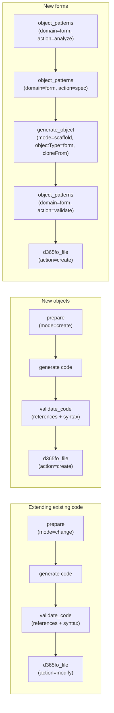

# Tool Reference — 26 tools

Every tool the server exposes, grouped by purpose. The AI agent picks tools automatically — the *example prompts* show what to ask to trigger them; you never name tools yourself.

> Several tools are **unified** behind a discriminator parameter (`action` / `mode` / `domain` / `kind` / `objectType` / `include`) instead of one tool per variant — e.g. `search`, `get_method`, `d365fo_file`, `analyze_code`, `object_patterns`, `prepare`, `security_info`, `extension_info`, `get_knowledge`, `labels`, `get_object_info`, `generate_object`, `validate_code`. Fewer tools to choose from, same coverage.

> **C# bridge first:** on Windows D365FO VMs, the bridge-backed read tools (marked †) query the live `IMetadataProvider` (always-fresh metadata) and `DYNAMICSXREFDB` (compiler-resolved cross-references), falling back to SQLite transparently on Azure/Linux. All write operations go exclusively through the bridge. See [BRIDGE.md](BRIDGE.md) and [SQLITE_DEPENDENCY.md](SQLITE_DEPENDENCY.md).
>
> **Server modes:** `full` = all 26 tools · `read-only` (Azure) = search/analysis only · `write-only` (hybrid companion) = file operations + bridge-backed reads. See [MCP_CONFIG.md](MCP_CONFIG.md).

---

## Recommended workflows

The grounding chain is what makes generated code compile on the first try:

| Workflow | Chain | Gate |
|----------|-------|------|
| CoC / event handler / extension | `prepare(mode="change")` → generate → `validate_code(mode="references")` + `validate_code(mode="syntax")` → `d365fo_file(action="modify")` | grounding token + reference proof |
| New class / table / enum | `prepare(mode="create")` → generate → `validate_code(mode="references")` + `validate_code(mode="syntax")` → `d365fo_file(action="create")` | grounding token + collision check |
| New form | `object_patterns(domain="form", action="analyze", recommend)` → `object_patterns(domain="form", action="spec")` → `generate_object(mode="scaffold", objectType="form", cloneFrom)` → `object_patterns(domain="form", action="validate")` → `d365fo_file(action="create")` | structural pattern gate (FP001–FP010) |

---

## 🔍 Search & Discovery (2)

| Tool | What it does | Example prompt |
|------|--------------|----------------|
| `search` † | Search 580K+ symbols by name or keyword (FTS5, < 10 ms). `queries[]` runs up to 10 searches in parallel; `scope="extensions"` limits to custom/ISV models (filters out Microsoft code) | *"Find classes related to sales order posting"* · *"Look up CustTable, SalesLine and PaymTerm at once"* · *"What extensions do we have on VendTable?"* |
| `batch_get_info` | Detailed info for up to 10 known objects (any type) in one parallel call | *"Get full details of CustTable, SalesLine and CustInvoiceJour"* |

† = bridge-first on Windows D365FO VMs

## 📊 Advanced Object Info (3)

One unified reader covers every object type via `objectType`; type-specific flags go in `options`.

| Tool | What it does | Example prompt |
|------|--------------|----------------|
| `get_object_info` † | Read one object's metadata by `objectType`: `class`, `table`, `form`, `query`, `view`, `enum`, `edt`, `report`, `data-entity`, `menu-item`, `service`, `map`, `config-key`, `security-policy`, `macro`. Options: `{includeRdl}` (report), `{searchControl}` (form), `{compact:false}` (class), `{mode:"hierarchy"}` (edt), `{filter}` (macro). For classes, `{members:"names"}` (optional `{prefix}`) returns a fast IntelliSense-style member-name list. | *"Show the structure of SalesFormLetter"* · *"Methods on SalesTable starting with calc"* · *"Datasets of the SalesInvoice report"* |
| `get_method` † | Method `include="signature"` (exact signature — **mandatory before CoC**), `include="source"` (full X++ body), or `include="both"` (default) | *"Signature of SalesFormLetter.run?"* · *"Show me the body of CustTable.validateWrite"* |
| `find_references` † | Where-used analysis, xref-enriched (reference type, caller class/method) | *"Where is updateInventory called from?"* |

## 🏷️ Label Management (1)

One unified tool covers all label operations via `action` (mirrors the `get_object_info` pattern).

| Tool | What it does | Example prompt |
|------|--------------|----------------|
| `labels` | `action=search` — full-text query across 20M+ label rows, all languages · `action=info` — all translations of a labelId (or list label files when omitted) · `action=create` — add a label to all language files of a model · `action=rename` — rename a label ID across .label.txt, X++ and XML | *"Is there a label for 'payment terms'?"* · *"Show translations of @SYS12345"* · *"Create label 'Priority tier' in en-US, cs, de"* · *"Rename label MyOldId to MyNewId everywhere"* |

## 🧠 Code Intelligence (2)

| Tool | What it does | Example prompt |
|------|--------------|----------------|
| `get_knowledge` | `kind="knowledge"` — queryable X++ rulebook: select grammar, CoC, SysDa, FormRun lifecycle, form patterns, reading Excel/CSV files, parallel batch, direct SQL, AX2012→D365FO migration · `kind="error"` — compiler / runtime / BP errors explained with concrete fixes | *"What are the rules for crossCompany selects?"* · *"How do I read an uploaded Excel file in X++?"* · *"Explain error 'object not initialized' in batch"* |
| `analyze_code` † | `mode="patterns"` — common patterns for a scenario · `mode="implementations"` — real implementations of a similar method · `mode="completeness"` — missing standard methods on a class · `mode="api-usage"` — how an API is initialized and called (compiler-resolved callers) | *"How are number sequences usually implemented here?"* · *"How do other classes implement validateWrite?"* · *"What standard methods is my service class missing?"* |

## 🎨 Code Generation (2)

| Tool | What it does | Example prompt |
|------|--------------|----------------|
| `generate_object` | `mode="pattern"` — named X++ skeleton from a pattern enum (text only): SysOperation, CoC, event handler, business event, custom service, lookup form, … · `mode="scaffold"` — pattern-aware whole-object generation: `objectType=table` (EDT suggestions), `objectType=form` (**clones reference forms** via `cloneFrom` + `tableMapping`, patterns/sub-patterns preserved, optional `includeMethodStubs`), `objectType=report` (complete SSRS stack: TmpTable + Contract + DP + Controller + AxReport/RDL) · `mode="find-methods"` — static `find()`/`findRecId()`/`exists()` for a table, keyed on its primary/unique index · `mode="relation-xpp"` — a table's relations → X++ `select` + `QueryBuildRange` snippets · `mode="fields"` — a field-name list → `AxTableField` XML with auto-resolved EDTs (+ optional field group) · `mode="table-relation"` — EDT-referencing fields → `AxTableRelation` XML (the inverse of `relation-xpp`) | *"Generate a SysOperation skeleton for VendRecalc"* · *"Create an audit log table with SalesId, PostedAt, PostedBy"* · *"Create a SimpleList form for MyRentalGroup by cloning CustGroup"* · *"Add find/exists methods to MyOrderTable"* · *"Generate table relations for the EDT fields on MyOrderLine"* |
| `suggest_edt` | EDT suggestions for a field name (fuzzy, confidence-ranked) | *"Which EDT for a field CustomerAccount?"* |

## 📈 Pattern Analysis (1)

| Tool | What it does | Example prompt |
|------|--------------|----------------|
| `object_patterns` | `domain="table"` — field/index/relation patterns for table groups · `domain="form"` — form-pattern toolkit: `action="analyze"` (pattern advisor via `recommend={entityKind, fieldCount, usageIntent, tableName}` → right pattern + reference forms; also analyzes existing forms), `action="spec"` (full pattern spec: required containers/ordering, sub-patterns, versions, lifecycle), `action="validate"` (structural validation FP001–FP010; errors **block form writes** via `FORM_PATTERN_ENFORCE`), `action="repair"` (auto-fill a form's **missing required controls** from its declared pattern — turns the FP003 report into a fix; existing controls preserved verbatim) | *"What do parameter tables typically look like?"* · *"Which form pattern fits a header+lines order entity?"* · *"Validate this form XML before I create it"* · *"Repair the missing controls on MyInquiryForm"* |

## 📝 File Operations (2)

| Tool | What it does | Example prompt |
|------|--------------|----------------|
| `d365fo_file` | `action=create` — create any of 32 AOT object types in the correct location + register in `.rnrproj` (gated by grounding token and form-pattern validation) · `action=modify` — safe metadata edits via the C# bridge, 25 operations: add-field, add-control, add-method, replace-code, modify-property, …; op-specific parameters go in a single `params` object (flat top-level keys still accepted) and a missing/wrong parameter returns the complete per-op spec (error-driven guidance, source: `d365foFileOpSpecs.ts`) · `action=generate` — XML preview without writing (cloud-friendly) | *"Create the class file in my project"* · *"Add the field to the General tab of the form extension"* · *"Show me the XML for this enum without creating it"* |
| `undo_last_modification` | Revert the last write: checkout HEAD or delete untracked file (also re-syncs the symbol index) | *"Undo that last change"* |

## 🔐 Security & Extensions (5)

| Tool | What it does | Example prompt |
|------|--------------|----------------|
| `security_info` | `mode="artifact"` — privilege / duty / role details + full hierarchy · `mode="coverage"` — which roles reach a form/table/menu item (Role → Duty → Privilege → Entry Point) + OLS policies | *"What does the duty VendPaymentTermsMaintain contain?"* · *"Who has access to the VendPaymTerms form?"* |
| `extension_info` † | Unified extensibility analyzer. `mode="coc"` — existing CoC wrappers of a method (**check before writing a new one**) · `mode="events"` — all `[SubscribesTo]` handlers for an event · `mode="table-merge"` — all extensions of a table (fields, indexes, methods) + effective merged schema · `mode="points"` — CoC-eligible methods, delegates, events on an object · `mode="strategy"` — best extensibility mechanism for a goal | *"Is SalesFormLetter.run already wrapped by CoC?"* · *"What subscribes to CustTable onInserted?"* · *"What fields have we added to CustTable?"* · *"What can I extend on SalesFormLetter?"* · *"How should I customize sales confirmation posting?"* |
| `validate_object_naming` | Naming conventions + symbol-index collision check | *"Is MY_VendPaymTermsMaintain a valid name?"* |
| `get_workspace_info` | Detected paths, model, project, server mode + **index staleness warning** — call first in every session | *"Check my workspace configuration"* |
| `verify_d365fo_project` | Objects exist on disk and in the `.rnrproj` | *"Verify everything we created is in the project"* |

## 🏗️ SDLC & Build (5)

> Local-only — require a Windows D365FO VM; excluded from the Azure `read-only` mode.

| Tool | What it does | Example prompt |
|------|--------------|----------------|
| `build_d365fo_project` | MSBuild compilation with structured xppc diagnostics (severity, object, line, fix hints for the first errors) | *"Build the project and show the errors"* |
| `trigger_db_sync` | Database sync for the current model | *"Sync the database"* |
| `run_bp_check` | Microsoft Best Practices (xppbp.exe) analysis | *"Run a BP check on my model"* |
| `run_systest_class` | Execute SysTest unit tests via SysTestConsole.exe (requires an interactive console session) | *"Run the MyServiceTest class"* |
| `update_symbol_index` | Re-index a single changed file without restart | *"Refresh the index for the table I just created"* |

## ✅ Quality & Grounding (3)

| Tool | What it does | When it runs |
|------|--------------|--------------|
| `prepare` | `mode="change"` — one call before extending: signature + existing CoC wrappers + eligibility + strategy + **grounding token** · `mode="create"` — one call before creating: collision check + naming + EDT/label suggestions + property defaults + **grounding token** | automatically, before modifications / new objects |
| `validate_code` | `mode="references"` — proves every type/field/method/label in generated code against the index (anti-hallucination gate) · `mode="syntax"` — offline BP validator, < 50 ms: deprecated APIs, CoC correctness, select anti-patterns, data-driven XML property rules mined from standard models | automatically, after generation |
| `review_workspace_changes` | AI code review of uncommitted X++ changes (git diff) | on request: *"Review my changes"* |

> **Grounding enforcement:** `prepare` issues a SHA-256 provenance token (30-min TTL) **bound to the object it was issued for**. When `GROUNDING_ENFORCE=true` is set in `.env`:
> - extension patterns in `generate_object(mode="pattern")` and extension objectTypes in `d365fo_file(action="create"/"modify")` require a valid token for the target object, and
> - X++ source passed to `d365fo_file(action="create"/"modify")` is run through `validate_code(mode="references")` — the write is rejected while any identifier cannot be proven against the index.
>
> This ensures generated code is grounded in your actual codebase, not AI training data.
>
> **Hybrid deployment note:** grounding tokens live in the issuing process's memory by default. In `write-only` mode (local companion) `prepare` is not exposed and in-memory tokens issued by the read-only/Azure instance cannot be validated locally, so `GROUNDING_ENFORCE=true` is **ignored** there (with a startup warning) — otherwise the agent would loop forever between the two servers. To enforce grounding end-to-end in a hybrid deployment, set the same `GROUNDING_SECRET` on **both** instances: tokens are then HMAC-signed and the companion validates them statelessly.

---

## Tips
- **Describe goals, not tools.** The instruction files route requests automatically — *"add a priority field to CustTable and show it on the form"* triggers the whole chain.
- **Let the gates work.** `GROUNDING_ENFORCE` and `FORM_PATTERN_ENFORCE` (both default on) reject ungrounded or structurally invalid writes — that's the feature, not friction.
- **Verify after writing.** `verify_d365fo_project` confirms disk + project registration in one call.
- **Full conversations:** [USAGE_EXAMPLES.md](USAGE_EXAMPLES.md) shows five real multi-tool scenarios end to end.
