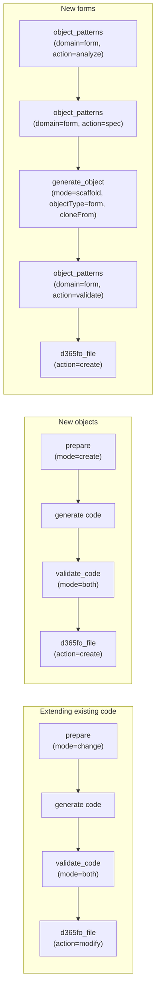

# Tool Reference — 20 tools

Every tool the server exposes, grouped by purpose. The AI agent picks tools automatically — the *example prompts* show what to ask to trigger them; you never name tools yourself.

> Several tools are **unified** behind a discriminator parameter (`action` / `mode` / `domain` / `kind` / `objectType` / `include`) instead of one tool per variant — e.g. `search`, `d365fo_file`, `analyze_code`, `object_patterns`, `prepare`, `security_info`, `extension_info`, `get_knowledge`, `labels`, `get_object_info`, `generate_object`, `validate_code`. Fewer tools to choose from, same coverage.

> **C# bridge first:** on Windows D365FO VMs, the bridge-backed read tools (marked †) query the live `IMetadataProvider` (always-fresh metadata) and `DYNAMICSXREFDB` (compiler-resolved cross-references), falling back to SQLite transparently on Azure/Linux. All write operations go exclusively through the bridge. See [ARCHITECTURE.md](ARCHITECTURE.md).
>
> **Server modes:** `full` = all 20 tools · `read-only` (Azure) = everything except the six local build/verify tools · `write-only` (hybrid companion) = those six local tools plus the three always-on ones (`get_object_info`, `labels`, `d365fo_file`). Independently, **`MCP_TOOL_PROFILE=core`** publishes only the 15-tool create-and-build loop, for workspaces that already run other MCP servers. See [MCP_CONFIG.md](MCP_CONFIG.md).

---

## Recommended workflows

The grounding chain is what makes generated code compile on the first try:

```mermaid
flowchart LR
    subgraph Extend["Extending existing code"]
        A1["prepare<br/>(mode=change)"] --> A2[generate code]
        A2 --> A3["validate_code<br/>(mode=both)"]
        A3 --> A4["d365fo_file<br/>(action=modify)"]
    end
    subgraph Create["New objects"]
        B1["prepare<br/>(mode=create)"] --> B2[generate code]
        B2 --> B3["validate_code<br/>(mode=both)"]
        B3 --> B4["d365fo_file<br/>(action=create)"]
    end
    subgraph Forms["New forms"]
        C1["object_patterns<br/>(domain=form, action=analyze)"] --> C2["object_patterns<br/>(domain=form, action=spec)"]
        C2 --> C3["generate_object<br/>(mode=scaffold, objectType=form, cloneFrom)"]
        C3 --> C4["object_patterns<br/>(domain=form, action=validate)"]
        C4 --> C5["d365fo_file<br/>(action=create)"]
    end
```

| Workflow | Chain | Gate |
|----------|-------|------|
| CoC / event handler / extension | `prepare(mode="change")` → generate → `validate_code(mode="both")` → `d365fo_file(action="modify")` | grounding token + reference proof |
| New class / table / enum | `prepare(mode="create")` → generate → `validate_code(mode="both")` → `d365fo_file(action="create")` | grounding token + collision check |
| New form | `object_patterns(domain="form", action="analyze", recommend)` → `object_patterns(domain="form", action="spec")` → `generate_object(mode="scaffold", objectType="form", cloneFrom)` → `object_patterns(domain="form", action="validate")` → `d365fo_file(action="create")` | structural pattern gate (FP001–FP010) |

---

## 🔍 Search & Discovery (1)

| Tool | What it does | Example prompt |
|------|--------------|----------------|
| `search` † | Search 580K+ symbols by name or keyword (FTS5, < 10 ms). `queries[]` runs up to 10 searches in parallel; `scope="extensions"` limits to custom/ISV models (filters out Microsoft code) | *"Find classes related to sales order posting"* · *"Look up CustTable, SalesLine and PaymTerm at once"* · *"What extensions do we have on VendTable?"* |

† = bridge-first on Windows D365FO VMs

## 📊 Advanced Object Info (2)

One unified reader covers every object type via `objectType`; type-specific flags go in `options`.

| Tool | What it does | Example prompt |
|------|--------------|----------------|
| `get_object_info` † | One unified reader for every AOT type — structure, fields, methods, properties; reads up to 10 objects in one call | *"Show the structure of SalesFormLetter"* · *"Get full details of CustTable, SalesLine and CustInvoiceJour"* · *"Methods on SalesTable starting with calc"* |
| `find_references` † | Where-used analysis, xref-enriched (reference type, caller class/method). Also does **label where-used** — `targetType="label"` or an `@…` id (e.g. `@WAX2194`, `@ApplicationPlatform:AbortButtonText`) — returning every referencing object type (tables, forms, EDTs, enums, reports, menu items, …), grouped by source type | *"Where is updateInventory called from?"* · *"What references label @SYS9694?"* |

`get_object_info` in detail:

- **`objectType`** — `class`, `table`, `form`, `query`, `view`, `enum`, `edt`, `report`, `data-entity`, `menu-item`, `service`, `map`, `config-key`, `security-policy`, `macro`, plus the extension variants (`table-extension`, `class-extension`, `form-extension`, `enum-extension`, `edt-extension`, `data-entity-extension`).
- **Batch** — for 2+ objects pass `objects: [{objectType, objectName}, …]` (max 10): one call, all lookups in parallel, per-object sections back (absorbs the former `batch_get_info`). A top-level `options` applies to every entry.
- **Type-specific `options`** — `{includeRdl}` (report), `{searchControl}` (form), `{compact: false}` (class), `{mode: "hierarchy"}` (edt), `{filter}` (macro).
- **Class members** — `{members: "names"}` (optional `{prefix}`) returns a fast IntelliSense-style member-name list; `{method: "validateWrite", include: "signature"}` returns ONE method, where `include` is `signature` (exact signature, **mandatory before CoC**), `source` (full X++ body) or `both` (default). Absorbs the former `get_method`.

## 🏷️ Label Management (1)

One unified tool covers all label operations via `action` (mirrors the `get_object_info` pattern).

| Tool | What it does | Example prompt |
|------|--------------|----------------|
| `labels` | `action=search` — full-text query across 20M+ label rows, all languages · `action=info` — all translations of a labelId (or list label files when omitted) · `action=create` — add a label to all language files of a model · `action=update` — overwrite the text of an existing label (same arguments as create, with the corrected translations) · `action=rename` — rename a label ID across .label.txt, X++ and XML | *"Is there a label for 'payment terms'?"* · *"Show translations of @SYS12345"* · *"Create label 'Priority tier' in en-US, cs, de"* · *"Fix the typo in @MyModel:PriorityTier"* · *"Rename label MyOldId to MyNewId everywhere"* |

> **Label where-used** (which objects reference a label) is not a `labels` action — use `find_references` with `targetType="label"` or an `@…` id. See Advanced Object Info above.

## 🧠 Code Intelligence (2)

| Tool | What it does | Example prompt |
|------|--------------|----------------|
| `get_knowledge` | `kind="knowledge"` — queryable X++ rulebook: the language core (data types, declarations, operator precedence, switch/loops, attributes, intrinsic functions, date-effective tables), select grammar, CoC, SysDa, FormRun lifecycle, form patterns, SSRS contracts / RDP pre-process / UI builder, reading Excel/CSV files, parallel batch, direct SQL, AX2012→D365FO migration · `kind="error"` — compiler / runtime / BP errors explained with concrete fixes · `kind="op-spec"` — the parameter contract for one `d365fo_file` operation/objectType or one `generate_object` mode (`topic="add-index"`, `"table"`, `"scaffold:form"`, …); those two tools keep their parameters out of the wire schema, so this is where they come from · `kind="bp-moniker"` — validate an exact BP-check moniker, search monikers by scenario, or render a `_BPSuppressions.xml` `<Diagnostic>` block, backed by names extracted from a real D365FO install (never invents a moniker). `topics: ["add-index", "add-field"]` answers SEVERAL lookups in one call (max 10) — a run typically needs 4-8 contracts and used to spend a round trip on each | *"What are the rules for crossCompany selects?"* · *"How do I read an uploaded Excel file in X++?"* · *"Explain error 'object not initialized' in batch"* · *"Is BPErrorPrivilegeNotCoveredByDuty a real moniker?"* |
| `analyze_code` † | `mode="patterns"` — common patterns for a scenario · `mode="implementations"` — real implementations of a similar method · `mode="completeness"` — missing standard methods on a class · `mode="api-usage"` — how an API is initialized and called (compiler-resolved callers) | *"How are number sequences usually implemented here?"* · *"How do other classes implement validateWrite?"* · *"What standard methods is my service class missing?"* |

## 🎨 Code Generation (1)

| Tool | What it does | Example prompt |
|------|--------------|----------------|
| `generate_object` | Grounded code generation, from single-pattern skeletons to whole objects — pick a `mode` | *"Generate a SysOperation skeleton for VendRecalc"* · *"Create an audit log table with SalesId, PostedAt, PostedBy"* · *"Create a SimpleList form for MyRentalGroup by cloning CustGroup"* · *"Add find/exists methods to MyOrderTable"* · *"Generate table relations for the EDT fields on MyOrderLine"* |

`generate_object` modes:

- **`pattern`** — named X++ skeleton from a pattern enum (text only): SysOperation, CoC, event handler, business event, custom service, lookup form, `systest` (a `SysTestCase` subclass whose methods end in `this.fail(...)`, so the first run is red on purpose), …
- **`scaffold`** — pattern-aware whole-object generation: `objectType=table` (EDT suggestions), `objectType=form` (**clones reference forms** via `cloneFrom` + `tableMapping`, patterns/sub-patterns preserved, optional `includeMethodStubs`), `objectType=report` (complete SSRS stack: TmpTable + Contract + DP + Controller + AxReport/RDL; `uiBuilder=true` adds a `SrsReportDataContractUIBuilder` subclass bound on the contract, and `aotQuery` / `callerTableName` / `preProcess` / `controllerType` pick the report shape).
- **`find-methods`** — static `find()`/`findRecId()`/`exists()` for a table, keyed on its primary/unique index.
- **`relation-xpp`** — a table's relations → X++ `select` + `QueryBuildRange` snippets.
- **`fields`** — a field-name list → `AxTableField` XML with auto-resolved EDTs (+ optional field group).
- **`table-relation`** — EDT-referencing fields → `AxTableRelation` XML (the inverse of `relation-xpp`).

Mode-specific parameters go in a single `params` object (flat top-level keys still accepted) and come from `get_knowledge(kind="op-spec", topic="<mode>")`; a missing required one returns the complete per-mode spec (source: `generateObjectOpSpecs.ts`).

> `suggest_edt` was retired: EDT suggestions come from `prepare(mode="create", fieldsHint=[...])`, which returns them alongside the collision check, naming and mined property defaults in the same call. Its handler stays routable under the old name.

## 📈 Pattern Analysis (1)

| Tool | What it does | Example prompt |
|------|--------------|----------------|
| `object_patterns` | Mined + curated structure patterns: `domain="table"` for table shapes, `domain="form"` for the full form-pattern toolkit, `domain="report"` for SSRS implementation recipes, `domain="mobile-app"` for warehouse-app screens (which of the two frameworks owns the flow, then create or modify one screen) | *"What do parameter tables typically look like?"* · *"Which form pattern fits a header+lines order entity?"* · *"Validate this form XML before I create it"* · *"Repair the missing controls on MyInquiryForm"* · *"What objects does a pre-processed SSRS report need?"* · *"Add a field to a warehouse mobile app screen"* |

`object_patterns` in detail:

- **`domain="table"`** — field/index/relation patterns for table groups.
- **`domain="form"`, `action="analyze"`** — pattern advisor: pass `recommend={entityKind, fieldCount, usageIntent, tableName}` to get the right pattern + reference forms to clone; also analyzes existing forms.
- **`domain="form"`, `action="spec"`** — full pattern spec: required containers/ordering, sub-patterns, versions, lifecycle.
- **`domain="form"`, `action="validate"`** — structural validation FP001–FP010; errors **block form writes** via `FORM_PATTERN_ENFORCE`.
- **`domain="form"`, `action="repair"`** — auto-fill a form's **missing required controls** from its declared pattern (turns the FP003 report into a fix; existing controls preserved verbatim).
- **`domain="report"`** — SSRS implementation recipes (7 patterns: SimpleList, GroupedWithTotals, HeaderDetail, PreProcess, PrintMgmtFormLetter, QueryBased, UIBuilderDialog). Unlike a form pattern there is no pattern XML to validate, so each is a *recipe*: the object roster with its base classes, the one `generate_object` scaffold call that produces it, method guidance, and the checks to run afterwards. `pattern=<id>` returns a single recipe.
- **`domain="mobile-app"`** — warehouse-app (mobile device / scanner) screen recipes. The list view leads with the decision the platform forces on you: the SAME screens are built by **two frameworks** — `ProcessGuide` (current: controller → step → page builder → data processor → navigation agent → action, every one an extension point) and the legacy `WHSWorkExecuteDisplay` hierarchy (one `displayForm()` per mode doing all of it) — and picking the wrong one is a rewrite. 7 recipes: `processguide-flow` (create a flow), `processguide-page-control` (add a control to a standard screen), `processguide-page-replace`, `processguide-step-insert`, `app-step-identity` (the step ID, icon and title the app shows), `legacy-workexecutedisplay`, `gs1-scan-input` (scanning is configuration, not a hand-written parser). Each ships copy-ready X++ that is gated by the offline BP validator in CI.

## 📝 File Operations (1)

| Tool | What it does | Example prompt |
|------|--------------|----------------|
| `d365fo_file` | The single write tool — create / modify / delete / undo AOT objects, or preview the XML without writing | *"Create the class file in my project"* · *"Add the field to the General tab of the form extension"* · *"Show me the XML for this enum without creating it"* · *"Undo that last change"* |

`d365fo_file` actions:

- **`create`** — create any of 39 AOT object types in the correct location + register in `.rnrproj` (gated by grounding token and form-pattern validation).
- **`modify`** — safe metadata edits via the C# bridge, 38 operations: add-field, add-control, remove-control, add-entry-point, add-method, replace-code, modify-property, …
- **`delete`** — remove an object's XML and un-register it from every `.rnrproj` of the model that lists it (irreversible; guarded against standard-model and cross-model targets).
- **`undo`** — roll `filePath` back: git-tracked → `git checkout HEAD`, which discards ALL uncommitted changes to that file, not just the last edit; untracked → deleted; the symbol/label index is re-synced either way.
- **`generate`** — XML preview without writing (cloud-friendly).

Two things shared by `create` and `modify`:

- **Parameters are fetched, not inlined.** Op-specific parameters go in a single `params` object (flat top-level keys still accepted) and come from `get_knowledge(kind="op-spec", topic="<operation>")` — for `action=create`, the per-objectType `properties` contract from `topic="<objectType>"`. A missing/wrong parameter returns that same complete per-op spec (error-driven guidance, source: `d365foFileOpSpecs.ts`).
- **Batching.** `operations: [{operation, …}]` (max 20) applies SEVERAL edits to the same object in ONE call — on `action=modify` and on `action=create`, where they run against the object just created under the name it ACTUALLY got. Applied in order, stopped at the first failure, and each section of the report is capped so one call cannot return a context window.

## 🔐 Security & Extensions (5)

| Tool | What it does | Example prompt |
|------|--------------|----------------|
| `security_info` | `mode="artifact"` — privilege / duty / role details + full hierarchy · `mode="coverage"` — which roles reach a form/table/menu item (Role → Duty → Privilege → Entry Point) + OLS policies | *"What does the duty VendPaymentTermsMaintain contain?"* · *"Who has access to the VendPaymTerms form?"* |
| `extension_info` † | Unified extensibility analyzer. `mode="coc"` — existing CoC wrappers of a method (**check before writing a new one**) · `mode="events"` — all `[SubscribesTo]` handlers for an event · `mode="table-merge"` — all extensions of a table (fields, indexes, methods) + effective merged schema · `mode="points"` — CoC-eligible methods, delegates, events on an object · `mode="strategy"` — best extensibility mechanism for a goal | *"Is SalesFormLetter.run already wrapped by CoC?"* · *"What subscribes to CustTable onInserted?"* · *"What fields have we added to CustTable?"* · *"What can I extend on SalesFormLetter?"* · *"How should I customize sales confirmation posting?"* |
| `validate_object_naming` | Naming conventions + symbol-index collision check. For `objectType="report"` it also warns when the AxReport name carries a companion-class suffix (DP/Contract/Controller/UIBuilder/Tmp) and hands back the full companion roster | *"Is MY_VendPaymTermsMaintain a valid name?"* · *"Is MyAgingReportDP a good name for the report itself?"* |
| `get_workspace_info` | Detected paths, model, project, server mode + **index staleness warning** — call first in every session · `changes: true` returns the uncommitted X++ diff (`git diff HEAD`) plus per-file rollback hints instead of the configuration, and says so plainly when the workspace is not a git work tree | *"Check my workspace configuration"* · *"Review my changes"* |
| `verify_d365fo_project` | Objects exist on disk and in the `.rnrproj` | *"Verify everything we created is in the project"* |

## 🏗️ SDLC & Build (4)

> Local-only — require a Windows D365FO VM; excluded from the Azure `read-only` mode.

| Tool | What it does | Example prompt |
|------|--------------|----------------|
| `build_d365fo_project` | MSBuild compilation with structured xppc diagnostics (severity, object, line, fix hints for the first errors). `bpCheck: true` appends the best-practice report to a GREEN build, saving the usual follow-up `run_bp_check`; advisory, never fails the build. `dbSync: true` runs the database sync (SyncEngine.exe) on a GREEN build — partial over the project's syncable objects, full-model when it has none; `dbSync: ["CustTable"]` syncs exactly those. Also advisory. A green build returns its diagnostics and summary rather than the raw phase-timing table | *"Build the project and show the errors"* · *"Build and sync the database"* |
| `run_bp_check` | Microsoft Best Practices (xppbp.exe) analysis — `objects: [{objectType, objectName}]` checks several objects in one call (shared preamble once, findings grouped per object) | *"Run a BP check on my model"* · *"BP check the table, its extension class and the enum"* |
| `run_systest_class` | Execute SysTest unit tests via SysTestConsole.exe, run with `/unattended` and reported per method. When the runner cannot start at all, it names the assembly-binding fault behind it instead of blaming the test model | *"Run the MyServiceTest class"* |
| `update_symbol_index` | Re-index file(s) changed **outside** this server, without a restart — `d365fo_file` create/modify already refresh the index themselves, so no follow-up call is needed after a write | *"I edited that table in Visual Studio — re-index it"* |

## ✅ Quality & Grounding (2)

| Tool | What it does | When it runs |
|------|--------------|--------------|
| `prepare` | `mode="change"` — one call before extending: signature + existing CoC wrappers + eligibility + strategy + **grounding token** · `mode="create"` — one call before creating: collision check + naming + EDT/label suggestions + property defaults + **grounding token** · `mode="test"` — one call before writing a SysTest: the target's methods worth covering with their real signatures, the test classes that already cover it, whether the model references `TestEssentials`, the ready-made scaffold call and the red-first order + **grounding token** | automatically, before modifications / new objects / a test |
| `validate_code` | `mode="both"` — runs both checks below in ONE call and merges them; prefer it, since both are wanted before every write · `mode="references"` — proves every type/field/method/label in generated code against the index (anti-hallucination gate) · `mode="syntax"` — offline BP validator, < 50 ms: 40 static rules (deprecated APIs, CoC correctness, select and transaction anti-patterns, C#-isms that cannot compile in X++, SSRS report wiring) plus 4 XML property rules mined from standard models. `codeType` picks the dialect: `xpp` (default), `xml-table`, `xml-report`, `xml-any` | automatically, after generation |

> **Grounding enforcement:** `prepare` issues a SHA-256 provenance token (30-min TTL) **bound to the object it was issued for**. When enforcement is on (`behavior.groundingEnforce` in the config, env `GROUNDING_ENFORCE=true`):
> - extension patterns in `generate_object(mode="pattern")` and extension objectTypes in `d365fo_file(action="create"/"modify")` require a valid token for the target object, and
> - X++ source passed to `d365fo_file(action="create"/"modify")` is run through `validate_code(mode="references")` — the write is rejected while any identifier cannot be proven against the index.
>
> This ensures generated code is grounded in your actual codebase, not AI training data.
>
> **Hybrid deployment note:** grounding tokens live in the issuing process's memory by default. In `write-only` mode (local companion) `prepare` is not exposed and in-memory tokens issued by the read-only/Azure instance cannot be validated locally, so `GROUNDING_ENFORCE=true` is **ignored** there (with a startup warning) — otherwise the agent would loop forever between the two servers. To enforce grounding end-to-end in a hybrid deployment, set the same `GROUNDING_SECRET` on **both** instances: tokens are then HMAC-signed and the companion validates them statelessly.

---

## Beyond tools: MCP prompts & resources

The server also publishes **8 MCP prompts** (invoked manually from the client's prompt picker — they are *not* loaded automatically, which is why the instruction file is mandatory): `xpp_system_instructions` (full workflow rules), `xpp_create_file`, `xpp_code_review`, `xpp_explain_class`, `xpp_extension_guide`, `xpp_security_guide`, `xpp_sysoperation_guide`, `xpp_data_entity_guide`.

And **5 workspace resources** (read-only JSON for clients that consume MCP resources): `workspace://context` (model/project snapshot + index freshness), `workspace://active` (most recently modified X++ object), `workspace://stats`, `workspace://files`, `workspace://recent-changes` — plus the `xpp://class/{className}` template serving X++ source.

---

## Tips
- **Describe goals, not tools.** The instruction files route requests automatically — *"add a priority field to CustTable and show it on the form"* triggers the whole chain.
- **Let the gates work.** `FORM_PATTERN_ENFORCE` (default on) rejects structurally invalid form writes, and `GROUNDING_ENFORCE` (default **off** — see [CONFIGURATION.md](CONFIGURATION.md)) rejects writes that were never grounded in a `prepare` call. Turn grounding enforcement on once your workflow reliably calls `prepare` first; that's the feature, not friction.
- **Verify after writing.** `verify_d365fo_project` confirms disk + project registration in one call.
- **Full conversations:** [USAGE_EXAMPLES.md](USAGE_EXAMPLES.md) shows five real multi-tool scenarios end to end.
