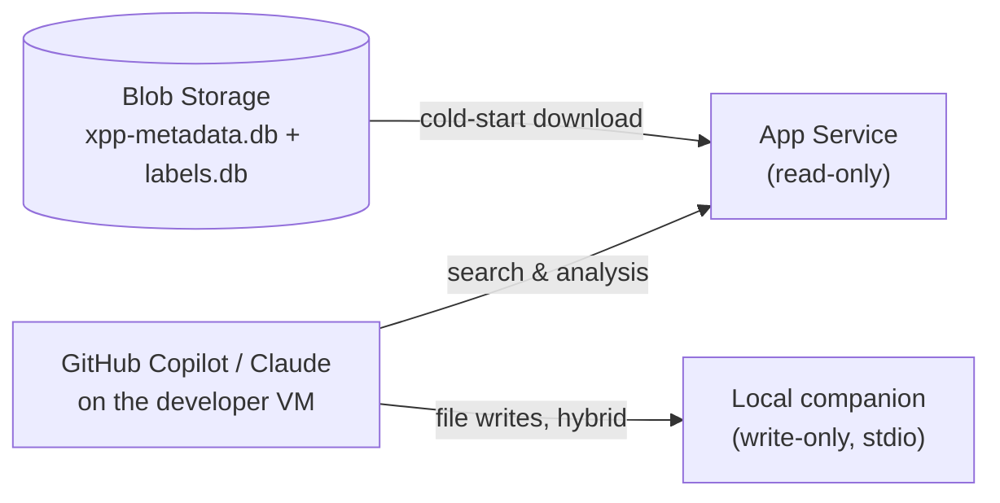

# Setup Guide — Azure Deployment

This guide covers deploying the D365 F&O MCP Server to Azure App Service.

If you are a developer who only wants to **use** an existing server, see [SETUP.md](SETUP.md) instead.

---

## Table of Contents

- [What You Need](#what-you-need)
- [Architecture Overview](#architecture-overview)
- [Step 1 — Create Azure Resources](#step-1--create-azure-resources)
- [Step 2 — Configure App Settings](#step-2--configure-app-settings)
- [Step 3 — Deploy the Application](#step-3--deploy-the-application)
- [Step 4 — Build and Upload the Metadata Database](#step-4--build-and-upload-the-metadata-database)
- [Step 5 — Verify](#step-5--verify)
- [Azure DevOps Pipelines](#azure-devops-pipelines)

---

## What You Need

- **Node.js** 24.x LTS (for building the application and metadata on your Windows VM)
- **Python** 3.x (required by `node-gyp` during `npm install`)
- **Git**
- An Azure subscription with permissions to create App Service and Storage Account

---

## Architecture Overview



**Azure resources:**

| Resource | Purpose | Minimum SKU |
|----------|---------|------------|
| Azure Blob Storage | Stores `xpp-metadata.db` (~2–3 GB depending on UnitTest models) and labels database (~500 MB) | Standard LRS |
| Azure App Service Plan | Hosts the Node.js server | B3 (dev/test), P0v3 (production) |
| Azure App Service (Web App) | Runs the MCP server | Linux, Node 24 LTS |

---

## Step 1 — Create Azure Resources

In the **Azure Portal**:

1. Create a **Resource Group** in your chosen region.

2. Create a **Storage Account** (Standard LRS, StorageV2):
   - Inside the storage account, create two **Blob Containers**:
     - `xpp-metadata` — receives the built metadata databases
     - `packages` — receives the raw `PackagesLocalDirectory.zip` used by CI pipelines

3. Create an **App Service Plan**:
   - OS: Linux
   - SKU: **P0v3** (production) or **B3** (dev/test)

4. Create a **Web App (App Service)** on that plan:
   - Runtime stack: **Node 24 LTS**
   - Enable **HTTPS only**

5. Enable **System-assigned managed identity** on the Web App
   (Web App → Settings → Identity → System assigned → On)

For a one-click deployment that also includes the app settings and startup command from step 2, use this Azure Deploy button.

[](https://portal.azure.com/#create/Microsoft.Template/uri/https%3A%2F%2Fraw.githubusercontent.com%2Fdynamics365ninja%2Fd365fo-mcp-server%2Frefs%2Fheads%2Fmain%2Finfrastructure%2Fazuredeploy.json)

---

## Step 2 — Configure App Settings

In the Azure Portal, go to the App Service → **Settings** → **Environment variables** and add:

| Setting | Value | Notes |
|---------|-------|-------|
| `AZURE_STORAGE_CONNECTION_STRING` | Connection string | Storage Account → Access keys → Connection string |
| `BLOB_CONTAINER_NAME` | `xpp-metadata` | Container that holds the uploaded databases |
| `BLOB_DATABASE_NAME` | `databases/xpp-metadata-latest.db` | Blob path within the container |
| `DB_PATH` | `/tmp/xpp-metadata.db` | Local path where the database is downloaded |
| `LABELS_DB_PATH` | `/tmp/xpp-metadata-labels.db` | Local path for the labels database |
| `LABEL_LANGUAGES` | e.g. `en-US,cs,de` | Comma-separated; each language adds ~125 MB |
| `MCP_SERVER_MODE` | `read-only` | Hides file-creation tools; use local companion for writes |
| `NODE_ENV` | `production` | |
| `SCM_DO_BUILD_DURING_DEPLOYMENT` | `false` | Pre-built `node_modules` are shipped in the deploy zip — Oryx must NOT run `npm ci` (no gcc/make on App Service Linux) |
| `WEBSITE_NODE_DEFAULT_VERSION` | `~24` | |

**Optional — Authentication (recommended for private projects):**

| Setting | Value | Notes |
|---------|-------|-------|
| `API_KEY` | e.g. `my-secret-key-here` | When set, all `/mcp` requests must include `X-Api-Key` header. `/health` is always public. Generate a strong random key (e.g. `openssl rand -hex 32`). Leave empty to disable. |

Set the **Startup Command** under **Settings → Configuration**:

```
bash startup.sh
```

---

## Step 3 — Deploy the Application

Use the **Azure DevOps pipeline** `d365fo-mcp-app-deploy` (recommended — ships pre-compiled native binaries for Linux).

For a **manual one-time deploy** (from your Windows machine):

1. Clone the repository, build, and package:

   ```powershell
   git clone https://github.com/dynamics365ninja/d365fo-mcp-server.git
   cd d365fo-mcp-server
   npm install
   npm run build
   # Include node_modules — must be compiled for Linux (native better-sqlite3 addon)
   # If building on Windows, use WSL2 or a Linux Docker container for npm install
   Compress-Archive -Path dist, node_modules, package.json, package-lock.json, startup.sh `
     -DestinationPath deploy.zip
   ```

2. Upload via the Portal: Web App → **Deployment Center** → **Deploy** → upload `deploy.zip`.

> **Important:** `better-sqlite3` is a native module that must be compiled for Linux. `node_modules` built on Windows will crash the server.
> Use the **Azure DevOps pipeline** (recommended) — it builds on `ubuntu-latest`, which shares the same glibc as App Service Linux, so the compiled binaries are compatible.
> `SCM_DO_BUILD_DURING_DEPLOYMENT` is set to `false` because App Service Linux has no gcc/make to rebuild native addons.

---

## Step 4 — Build and Upload the Metadata Database

### Option A — Azure DevOps Pipelines (recommended)

See [Azure DevOps Pipelines](#azure-devops-pipelines). Pipelines handle extraction, build, and upload automatically.

### Option B — Manual (from your Windows VM)

1. Configure `.env` on your VM — set `PACKAGES_PATH`, `CUSTOM_MODELS`, `AZURE_STORAGE_CONNECTION_STRING`, `BLOB_CONTAINER_NAME`.

2. Extract and build:

   ```powershell
   npm run extract-metadata
   npm run build-database
   ```

3. Upload `data/xpp-metadata.db` and `data/xpp-metadata-labels.db` to the `xpp-metadata` container using **Azure Storage Explorer** or the portal.

The App Service downloads the databases automatically on the next cold start or restart.

---

## Step 5 — Verify

Open the Web App URL in a browser or call:

```
https://<your-app>.azurewebsites.net/health
```

Expected response:

```json
{"status":"ok","mode":"read-only", ...}
```

Confirm the tool count matches `read-only` mode (all tools except `create_d365fo_file`, `modify_d365fo_file`, `create_label`).

---

## Azure DevOps Pipelines

Four ready-to-use pipelines are in `.azure-pipelines/`:

| Pipeline | When to use | Duration |
|----------|-------------|----------|
| `d365fo-mcp-app-deploy.yml` | After any change to server code (auto-triggers on push to `main`) | ~5 min |
| `d365fo-mcp-data-extract-and-build-custom.yml` | After any change to your custom models | ~15–30 min |
| `d365fo-mcp-data-extract-and-build-platform.yml` | After a D365FO version upgrade or hotfix | ~60–120 min |
| `d365fo-mcp-data-platform-upgrade.yml` | Full rebuild: standard + custom + labels | ~90–120 min |

### Required Variable Group

Create a variable group named **`xpp-mcp-server-config`** in Azure DevOps Library:

| Variable | Secret | Example value |
|----------|--------|--------------|
| `AZURE_STORAGE_CONNECTION_STRING` | Yes | Connection string from Azure Portal |
| `BLOB_CONTAINER_NAME` | No | `xpp-metadata` |
| `CUSTOM_MODELS` | No | `MyPackage` |
| `AZURE_SUBSCRIPTION` | No | Name of your Azure DevOps service connection |
| `AZURE_APP_SERVICE_NAME` | No | `xpp-mcp-server` |

### Uploading Standard Packages

The `d365fo-mcp-data-extract-and-build-platform.yml` pipeline needs the raw `PackagesLocalDirectory` from your D365FO VM as a zip in the `packages` container.

On your D365FO VM, compress `K:\AosService\PackagesLocalDirectory` and upload the resulting zip as `PackagesLocalDirectory.zip` to the `packages` container using **Azure Storage Explorer**.

This only needs to be re-uploaded after a D365FO version upgrade or hotfix rollup.