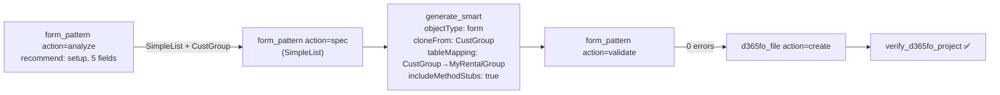
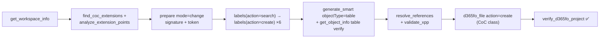
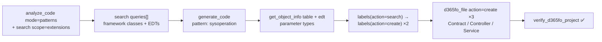
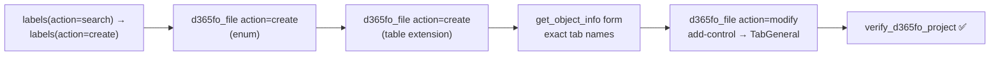
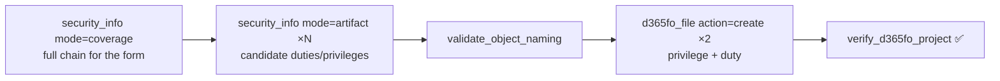
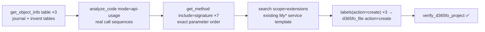
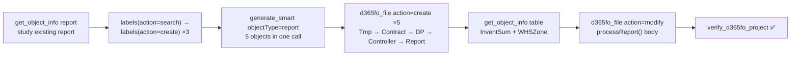

# Usage Examples

Seven real-world scenarios showing how the AI agent chains MCP tools to complete complex D365FO tasks in a single conversation. Each diagram shows the actual tool flow; you only write the prompt.

---

## 1 — Pattern-grounded form creation

**Goal:** Create a maintenance form for a new setup table — correct pattern, correct structure, validated before write.

```
Create a form for my MyRentalGroup table (setup table, ~5 fields users maintain in a grid).
Pick the right form pattern, base it on a standard form, and add lifecycle method stubs.
```



**Key takeaways**
- The advisor implements Microsoft's pattern decision tree and backs it with mined usage from your own environment.
- Cloning `CustGroup` preserves the full pattern structure (ActionPane → filters → grid, sub-patterns included); fields missing on the target table are dropped and reported.
- Structural violations (wrong order, missing container) would **block** `d365fo_file` (action=create) — the form opens clean in Visual Studio on the first try.

---

## 2 — Safe Chain of Command extension

**Goal:** Extend `SalesFormLetter.run()` with an audit record — without duplicating an existing wrapper or breaking ISV extensions.

```
Extend SalesFormLetter.run() in MyModel: check existing CoC wrappers first,
get the exact signature, create an audit table MySalesAuditLog
(SalesId, PostingType, PostedAt, PostedBy, Success) with proper EDTs and labels,
then generate the CoC class that inserts an audit record after the base call.
```



**Key takeaways**
- `find_coc_extensions` before writing prevents silent duplicate wrappers — the #1 CoC mistake.
- `get_object_info(objectType="table")` right after generation verifies what was *actually* written (EDTs may differ from the request).
- The grounding token from `prepare` (mode=change) is required by the write tools — ungrounded code never reaches disk.

---

## 3 — Complete SysOperation batch job

**Goal:** Nightly batch job following the exact patterns already used in the codebase.

```
Create a SysOperation batch job that recalculates vendor payment terms for active vendors.
Recurring nightly, progress to infolog, labelled DataContract parameters.
Follow the patterns of existing batch jobs in this codebase.
```



**Key takeaways**
- An existing `My*` DataContract from the same model is the best structural template — `search(scope="extensions")` finds it.
- Exhaustive `labels(action="search")` before `labels(action="create")` prevents duplicate label IDs across thousands of SYS labels.

---

## 4 — Field + enum + table extension + form extension

**Goal:** Add a "Customer priority tier" enum field to CustTable and surface it on the standard form.

```
Add a "Customer priority tier" field (enum: Standard, Silver, Gold, Platinum) to CustTable:
label it in en-US, cs, de; create the enum; create the table extension;
then add the field to the General tab of the CustTable form.
```



**Key takeaways**
- `get_object_info(objectType="form", options={searchControl})` resolves the *exact* parent control name before `add-control` — no guessed names, no corrupted XML.
- `add-control` checks the new control's type against the parent container's sub-pattern (e.g. FieldsFieldGroups rejects static text).

---

## 5 — Security audit + minimal-privilege extension

**Goal:** Understand existing access before creating a correctly scoped privilege.

```
I'm adding a Vendor Payment Terms maintenance page. Show me how VendPaymTerms
is secured today (roles, duties), check whether a maintenance privilege already exists,
validate the name MY_VendPaymTermsMaintain, then create the privilege and duty.
```



**Key takeaways**
- The coverage check often reveals an existing privilege already grants the right access — no new object needed.
- `validate_object_naming` confirms conventions *and* checks the symbol index for collisions.

---

## 6 — Understand and port a financial process

**Goal:** Learn how ledger journal posting works, then build a custom adjustment service on the same pattern.

```
Create a service that posts inventory revaluation adjustment journal entries.
Show me LedgerJournalTable/Trans structure, how LedgerJournalCheckPost is called
in this codebase, dimension defaulting from InventTable — then generate
MyLedgerInventAdjustmentService with create-header, add-lines, and post methods.
```



**Key takeaways**
- Seven signature lookups before one line of code: guessing `JournalTransData.create(...)` parameters produces uncompilable X++.
- `analyze_code(mode="api-usage")` returns compiler-resolved real callers — better than any documentation.

---

## 7 — Complete SSRS report in one call

**Goal:** Full report stack — TmpTable, Contract, DP, Controller, AxReport/RDL — from one prompt.

```
Create an SSRS report "InventByZones": ItemId, ItemName, InventLocationId, WHSZoneId,
OnHandQty, ReservedQty, AvailableQty. Dialog: InventLocationId (mandatory), FromDate, ToDate.
Include a Controller so we can attach a menu item.
```



**Key takeaways**
- `generate_smart(objectType="report")` replaces 15+ manual calls; creation order matters (TmpTable before DP for `tableStr` resolution).
- `processReport()` is intentionally a TODO skeleton — query logic is added after studying the source tables, not guessed.
- On a Windows VM the files are written directly; the per-file `d365fo_file` (action=create) step is the Azure/Linux path.

---

## See also

- [MCP_TOOLS.md](MCP_TOOLS.md) — what each tool does
- [QUICK_START.md](QUICK_START.md) — get connected first
- [MCP_CONFIG.md](MCP_CONFIG.md) — configuration reference
