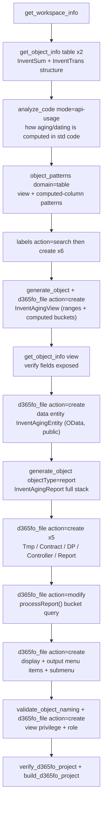

```mermaid
flowchart TB
    A["get_workspace_info"] --> B["extension_info mode=coc<br/>SalesFormLetter.run already wrapped?"]
    B --> C["extension_info mode=points<br/>CoC-eligible methods + delegates"]
    C --> D["prepare mode=change<br/>signature + grounding token"]
    D --> E["labels action=search then action=create x7"]
    E --> F["suggest_edt + d365fo_file action=create<br/>audit EDTs"]
    F --> G["generate_object objectType=table<br/>SalesPostingAuditLog"]
    G --> H["d365fo_file action=create table<br/>then action=modify CustTable extension"]
    H --> I["get_object_info table SalesPostingAuditLog<br/>verify what was actually written"]
    I --> J["analyze_code mode=api-usage<br/>how SalesFormLetter_Confirm is invoked"]
    J --> K["validate_code mode=references then mode=syntax"]
    K --> L["d365fo_file action=create<br/>CoC class"]
    L --> M["object_patterns domain=form action=analyze<br/>SimpleList inquiry"]
    M --> N["generate_object objectType=form cloneFrom + validate"]
    N --> O["d365fo_file action=create<br/>form + display menu item"]
    O --> P["security_info mode=coverage<br/>AR clerk reach to the inquiry"]
    P --> Q["d365fo_file action=create<br/>privilege + duty extension"]
    Q --> R["verify_d365fo_project"]
```

```mermaid
flowchart TB
    A["get_workspace_info"] --> B["object_patterns domain=table<br/>compliance/transaction pattern"]
    B --> C["labels action=search then create x9 (3 langs)"]
    C --> D["suggest_edt + d365fo_file action=create<br/>CertNumber EDT + 2 enums"]
    D --> E["generate_object objectType=table<br/>VendCertificate + VendAccount relation"]
    E --> F["d365fo_file action=create table"]
    F --> G["object_patterns domain=form action=analyze<br/>SimpleListDetails"]
    G --> H["generate_object objectType=form cloneFrom + validate + create"]
    H --> I["analyze_code mode=patterns scope=extensions<br/>existing SysOperation in this model"]
    I --> J["generate_object mode=pattern pattern=sysoperation"]
    J --> K["get_object_info edt + enum<br/>contract parameter types"]
    K --> L["validate_code references + syntax"]
    L --> M["d365fo_file action=create x3<br/>Contract / Controller / Service"]
    M --> N["generate_object objectType=report<br/>VendCertComplianceReport full stack"]
    N --> O["d365fo_file action=create x5<br/>Tmp / Contract / DP / Controller / Report"]
    O --> P["d365fo_file action=modify<br/>processReport() query body"]
    P --> Q["d365fo_file action=create<br/>3 menu items + submenu"]
    Q --> R["d365fo_file action=create<br/>privilege + role; verify_d365fo_project"]
```

```mermaid
flowchart LR
    A["labels action=search then create x4"] --> B["d365fo_file action=create<br/>enum CustPriorityTier"]
    B --> C["d365fo_file action=modify<br/>CustTable extension + field"]
    C --> D["get_object_info form<br/>exact TabGeneral control name"]
    D --> E["d365fo_file action=modify x2<br/>CustTable form + CustTableListPage"]
    E --> F["generate_object objectType=table<br/>CustTierDiscount"]
    F --> G["object_patterns domain=form action=analyze<br/>SimpleList + create + menu item"]
    G --> H["extension_info mode=coc + mode=points<br/>sales price/disc method"]
    H --> I["prepare mode=change + validate_code"]
    I --> J["d365fo_file action=create<br/>CoC class"]
    J --> K["security_info mode=coverage<br/>AR setup duty"]
    K --> L["d365fo_file action=create<br/>privilege + duty extension; verify"]
```

# Usage Examples

Five **end-to-end, full-stack** scenarios — each a complete feature you would actually ship in a D365FO project, not a happy-path snippet. Every scenario spans the whole AOT stack: **EDTs / enums → tables → forms → business logic → menu items → menu → security**, with labels in three languages. The diagrams show the real MCP tool chain the AI agent runs; you only write the prompt in the grey box.

Each scenario ends with an **indicative cost & model box** so you can plan token budget and pick the right model before you start. The numbers are *ballpark ranges measured on a mid-size CU-level environment* (≈580K symbols, 20M label rows) — treat them as a starting point and verify against your own metadata, which is exactly what these scenarios are designed to let you do.

> **Reading the cost boxes**
> - **Tool calls** — number of MCP round-trips the agent makes.
> - **New context** — fresh tokens the tools pour into the conversation (metadata, generated XML/X++). Tool results dominate input cost.
> - **Output** — assistant reasoning + generated code.
> - **Billed total (cached)** — realistic end-to-end input+output *with* prompt caching on. Without caching, multiply input by 2–4× because each agent turn re-sends the growing transcript.
> - **Model** — the tier that gives the best quality-per-token for that scenario (see the matrix at the bottom).

---

## Model selection at a glance

| Work shape | Recommended | Why |
|------------|-------------|-----|
| Pure discovery — `search`, `get_object_info`, `labels` lookups, "where is X used" | **Haiku 4.5** | Lookups need recall, not reasoning. 5–10× cheaper, sub-second. |
| Standard generation — one table, a cloned form, a single CoC class, an SSRS report | **Sonnet 4.6** | Best value. Handles the grounding chain and pattern validation reliably. **Default.** |
| Architecture-heavy — greenfield modules, financial posting logic, cross-cutting CoC, anything where one wrong type cascades | **Opus 4.8** | Multi-object reasoning, signature juggling, and "what breaks downstream" thinking pay for themselves in fewer compile-fix loops. |

Rule of thumb: **discover on Haiku, build on Sonnet, architect on Opus.** Switching mid-conversation is fine — do the noisy lookups cheaply, then upgrade for the generation turns.

---

## 1 — Greenfield module: Equipment Rental

**The most demanding shape: building a functional area from nothing.** A new `EquipRental` model with a master, a header/lines document, posting logic, number sequences, navigation, and a security role — the kind of slice an ISV ships as v1.0.

```
Build the foundation of an Equipment Rental module in model EquipRental.
I need an equipment master and a rental agreement (header + lines).

Equipment: RentEquipmentId (number-sequence keyed), Name, Category enum
(Vehicle, PowerTool, Scaffolding, Generator, Other), Status enum
(Available, Reserved, OnRent, Maintenance, Retired), DailyRate, AcquiredDate.

Agreement header: RentAgreementId (number sequence), CustAccount, FromDate, ToDate,
Status (Open, Confirmed, Returned, Cancelled). Lines: RentEquipmentId, Qty,
DailyRate (default from equipment), LineAmount.

Use the right form patterns, wire number sequences the way this codebase does it,
add display menu items + a submenu, and a maintenance + a view security role.
Label everything in en-US, cs and de.
```

The diagram below is the **actual tool chain from a recorded run** of this prompt (object names normalized to the generic `EquipRental` model / `Rent` prefix used above). It is busier than an idealized plan because real metadata pushes back: the number-sequence delegate had to be reverse-engineered from the platform, and a couple of form generations were retried. See the cost box for the measured numbers.

```mermaid
flowchart TB
    A["get_workspace_info<br/>model EquipRental, paths, staleness"] --> B["get_knowledge x4<br/>number sequences / form patterns / security / object patterns"]
    B --> C["object_patterns domain=form action=analyze x2<br/>master + header/lines transaction"]
    C --> D["analyze_code mode=patterns + search x2<br/>how this codebase wires NumberSeqModule"]
    D --> E["generate_object mode=pattern<br/>pattern=number-seq-handler (Rent)"]
    E --> F["verify_d365fo_project<br/>early scaffold sanity check"]
    F --> G["list_dir + run_in_terminal<br/>locate label-file shape in metadata"]
    G --> H["labels action=create<br/>Rent label file, 42 entries (en-US/cs/de)"]
    H --> I["d365fo_file action=create<br/>2 EDTs + 3 enums + NumberSeqModule enum-extension"]
    I --> J["d365fo_file action=create x4<br/>tables: Equipment / AgreementHeader / Line / Parameters"]
    J --> K["d365fo_file action=modify<br/>add-index x4 + add-relation x3"]
    K --> L["d365fo_file action=modify<br/>table methods: numRef* + numberSeqModule()"]
    L --> M["d365fo_file action=create<br/>NumberSeqModuleRent class + NumberSeqGlobal class-extension"]
    M --> N["search + run_in_terminal x~10<br/>find NumberSeqGlobal buildModulesMapDelegate pattern"]
    N --> O["d365fo_file action=modify class-extension<br/>SubscribesTo buildModulesMapDelegate"]
    O --> P["update_symbol_index"]
    P --> Q["generate_object objectType=form cloneFrom (+retries)<br/>Equipment←PaymTerm, Agreement←SalesTable"]
    Q --> R["d365fo_file action=modify form<br/>add lines data source + number-seq form handler methods"]
    R --> S["generate_object form Parameters TableOfContents<br/>(retried) + update_symbol_index"]
    S --> T["d365fo_file action=create<br/>3 display menu items + menu RentModule + add items"]
    T --> U["d365fo_file action=create<br/>4 privileges + 2 duties + 2 roles"]
    U --> V["verify_d365fo_project<br/>final, full object list"]
```



**What gets created (≈22 objects)**

| Layer | Objects |
|-------|---------|
| EDTs | `RentEquipmentId` (Num), `RentRate` (extends `AmountMST`), `RentAgreementId` (Num) |
| Enums | `RentEquipmentCategory` (5 values), `RentEquipmentStatus` (5), `RentAgreementStatus` (4) |
| Tables | `RentEquipmentTable`, `RentAgreementHeader`, `RentAgreementLine`, `RentParameters` |
| Number seq | `RentParameters.numberSeqModule()`, `NumberSeqModuleRent` class, 2 references |
| Forms | `RentEquipmentTable` (Details Master w/ Standard Tabs), `RentAgreement` (Details Master + lines grid) |
| Navigation | `RentEquipmentTable` + `RentAgreement` display menu items, submenu under **Inventory management** |
| Security | `RentEquipmentMaintain` / `RentAgreementMaintain` privileges, `RentManagement` duty, `RentClerk` + `RentViewer` roles |
| Labels | 14 label IDs × 3 languages = 42 entries |

**Key takeaways / gotchas**
- **Creation order is enforced by dependencies, not preference.** EDTs and enums must exist before the tables that reference them; tables before forms (the clone re-binds the datasource); menu items before the menu that points at them. The agent sequences this for you — but if you split it across sessions, follow the same order.
- **Number sequences are codebase-specific.** `analyze_code(mode=patterns)` finds how *your* model wires `NumberSeqModule` (the AX2012-style module class vs. a parameters-only approach) instead of pasting a generic snippet that won't load data.
- **`RentRate extends AmountMST`** inherits currency formatting and the right `extendedDataType` size — `suggest_edt` proposes it; never type `Real`.
- Run `build_d365fo_project` at the end: a greenfield slice is where a single missing `tableStr` reference surfaces, and the structured xppc diagnostics point at the exact object.

> **Measured cost & model** *(one recorded end-to-end run — not an estimate)*
> **Models actually used:** **Claude Sonnet 4.6** as the agent (`panel/editAgent`, 76 turns — all reasoning and every tool call) + **GPT-4o-mini** as a background helper (`backgroundTodoAgent`, 8 calls — todo-list upkeep only, ~$0.006). No Opus, no Haiku.
> Tool calls **126** (78 MCP + 48 host: terminal / list_dir / todo) · New context **~182K** · Output **~38K** · Total input incl. cached prefix **~5.33M** (cached **~5.15M**) · **Billed ≈ 280 AI credits ≈ $2.80**
> **Model used: Sonnet 4.6** — it completed the full greenfield slice without an Opus upgrade. The run came in mid-range of the original Opus estimate (200–450 credits) *on the cheaper tier*, the upside being offset by retries: the `NumberSeqGlobal` delegate pattern took ~10 terminal probes to pin down and two form generations were retried. Opus is still the safer pick when the number-sequence/posting reasoning has to land first-try; do the opening `get_workspace_info` / `get_knowledge` / label-discovery turns on Haiku to trim either way.

---

## 2 — Extending standard posting: sales credit review + audit

**The most common real-world shape: safely changing Microsoft code.** Add a mandatory credit-review gate to sales confirmation and write a tamper-proof audit trail — without breaking ISV layers or duplicating an existing CoC wrapper.

```
Before SalesFormLetter_Confirm posts, enforce a credit-review check and log every
attempt. First check whether SalesFormLetter.run is already wrapped by CoC and get
the exact signature. Add CreditReviewDate + CreditReviewedBy to CustTable (table
extension). Create audit table SalesPostingAuditLog (SalesId, PostingType, Attempted,
Posted, FailReason, PostedBy, PostedAt) with proper EDTs. Generate the CoC class that
blocks posting when the customer needs review and inserts an audit row either way.
Add an audit inquiry form + menu item under Accounts receivable > Inquiries, and a
duty extension so the AR clerk role sees it.
```



**What gets created**

| Layer | Objects |
|-------|---------|
| Extensions | `CustTable.Extension` (+`CreditReviewDate`, `CreditReviewedBy`), `SalesFormLetter` CoC class |
| EDTs | `SalesAuditFailReason` (extends `Description255`) |
| Tables | `SalesPostingAuditLog` (7 fields, index on `SalesId`+`PostedAt`) |
| Forms | `SalesPostingAuditLog` inquiry (SimpleList) |
| Navigation | display menu item under **Accounts receivable → Inquiries and reports** |
| Security | `SalesPostingAuditView` privilege + extension of the AR clerk duty |

**Key takeaways / gotchas**
- **`extension_info(mode=coc)` first, always.** Silently adding a second wrapper around `SalesFormLetter.run` is the #1 CoC defect — two `next` calls, double posting side-effects. The check is < 50 ms and shows you the existing wrappers before you write.
- **The grounding token from `prepare(mode=change)` is bound to the method.** You can't reuse a token issued for a different object; the write tools reject it. That's the gate that stops the AI from confidently wrapping a method that doesn't exist with that signature.
- **`get_object_info(table)` *after* generation** verifies the audit table as actually written — the agent may have picked a different EDT than you pictured (e.g. `SalesIdBase` vs `SalesId`); catch it before the form binds to it.
- **A table extension (`action=modify`) is not a new table.** Adding `CreditReviewDate` to `CustTable` goes through the bridge's `IMetadataProvider`, producing a clean `CustTable.YourModelExtension` delta — no risk of corrupting the 200-field standard table.

> **Indicative cost & model**
> Tool calls **~30–42** · New context **~70–110K** · Output **~18–28K** · Billed total (cached) **~140–230K**
> **Model: Opus 4.8** (Sonnet 4.6 is viable if the posting logic is simple). Anything touching financial posting order and `next` semantics rewards the stronger reasoner.

---

## 3 — Operational feature: vendor certificate compliance

**Setup + automation + reporting in one slice.** Track vendor certifications, auto-flag expiring ones with a nightly batch, and produce a compliance report — the classic "table + SysOperation batch + SSRS" trio.

```
Create vendor certificate compliance in model VendCompliance. Table VendCertificate:
VendAccount, CertType enum (ISO9001, ISO14001, ISO45001, IATF16949, Other), CertNumber,
IssuingBody, IssueDate, ExpiryDate, Status enum (Valid, ExpiringSoon, Expired, Revoked).
SimpleListDetails form. A SysOperation nightly batch VendCertExpiryCheck that sets
Status to ExpiringSoon within 30 days and Expired past ExpiryDate, with a labelled
DataContract threshold parameter and infolog progress. An SSRS report
VendCertComplianceReport grouped by CertType. Menu items for the form, the batch and
the report under Procurement > Inquiries. A maintenance privilege + role.
```



**What gets created**

| Layer | Objects |
|-------|---------|
| EDT / enums | `VendCertNumber`, `VendCertType` (5), `VendCertStatus` (4) |
| Table | `VendCertificate` (8 fields, `VendAccount` FK relation) |
| Form | `VendCertificate` (SimpleListDetails) |
| Logic | `VendCertExpiryContract` / `Controller` / `Service` (SysOperation, recurring) |
| Report | `VendCertComplianceReport` + TmpTable + DP + Controller |
| Navigation | display + action + output menu items under **Procurement → Inquiries** |
| Security | `VendCertMaintain` privilege, `VendComplianceOfficer` role |

**Key takeaways / gotchas**
- **Clone the SysOperation shape from your own model.** `analyze_code(mode=patterns, scope=extensions)` finds an existing `My*Controller`/`Service` so the new batch matches your conventions (how the controller registers the menu item, whether `RunOn` is set) — not a textbook skeleton.
- **Report creation order is load-bearing.** `generate_object(objectType=report)` emits TmpTable → Contract → DP → Controller → AxReport; the TmpTable must land first so the DP's `tableStr` resolves. The single call replaces 15+ manual steps.
- **`processReport()` is intentionally a TODO.** The agent fills the query body *after* `get_object_info` on the source tables — the alternative is a guessed `select` that compiles but returns the wrong grouping.
- **One enum value drives two things.** `Status` is set by the batch *and* grouped in the report — keep the enum the single source of truth; don't let the report hardcode "ExpiringSoon".

> **Indicative cost & model**
> Tool calls **~35–48** · New context **~80–120K** · Output **~22–32K** · Billed total (cached) **~150–260K**
> **Model: Sonnet 4.6.** The report scaffold + SysOperation pattern are well-trodden; Sonnet handles them at a fraction of Opus cost. Upgrade only if the batch logic gets genuinely intricate.

---

## 4 — Cross-stack enhancement: customer priority-tier discounts

**The lightweight full-stack path — small surface, every layer touched.** A four-tier loyalty scheme that drives an automatic line discount. Shows that "small" features still cross enum → extension → setup table → CoC → security, and where you can run cheaper.

```
Add a customer priority tier discount in model CustLoyalty. Enum CustPriorityTier
(Standard, Silver, Gold, Platinum). Add the tier field to CustTable and surface it on
the General tab of the CustTable form and on CustTableListPage. Setup table
CustTierDiscount mapping tier to a discount percent, with its own SimpleList form and a
menu item under Accounts receivable > Setup. Then a CoC extension on the sales line
price/discount calc that applies the tier percent. Security: a setup-maintenance
privilege wired into the AR setup duty. Labels in en-US, cs, de.
```



**What gets created**

| Layer | Objects |
|-------|---------|
| Enum | `CustPriorityTier` (4 values) |
| Extensions | `CustTable.Extension` (+`PriorityTier`), `CustTable` form ext, `CustTableListPage` ext, sales price/disc CoC class |
| Table | `CustTierDiscount` (`PriorityTier`, `DiscPercent`) + SimpleList form |
| Navigation | setup display menu item under **Accounts receivable → Setup** |
| Security | `CustTierDiscountMaintain` privilege + AR setup duty extension |

**Key takeaways / gotchas**
- **`get_object_info(form, {searchControl})` resolves the *exact* parent control** before `add-control`. Guessing `TabGeneral` vs `Tab_General` is how form XML gets corrupted; the tool gives you the real name from the live form.
- **`add-control` is pattern-aware.** Dropping the tier field into a `FieldsAndFieldGroups` sub-pattern is allowed; dropping static text there is rejected — the form stays valid by construction.
- **This is the scenario to mix models.** The opening label/enum/extension turns are mechanical → **Haiku**. Switch to **Sonnet** for the CoC turn, where price/discount `next` ordering actually matters.
- **One CoC class, two readers.** The discount logic reads `CustTierDiscount` keyed by `CustTable.PriorityTier` — keep the lookup in the CoC, not duplicated in the form, so the percent lives in one place.

> **Indicative cost & model**
> Tool calls **~22–32** · New context **~45–75K** · Output **~12–20K** · Billed total (cached) **~90–160K**
> **Model: Sonnet 4.6** for the build, **Haiku 4.5** for the discovery/extension turns. The cheapest full-stack scenario here — a good first one to run when you're calibrating your own token numbers.

---

## 5 — Integration & analytics: inventory aging entity + report

**The data-out shape: surface existing data for OData, Excel and SSRS.** No new business entity — a view, an OData data entity, a report, and a workspace tile over standard inventory data. Shows the read/aggregate side of the toolset.

```
Build inventory aging analytics in model InventAnalytics. A view InventAgingView over
InventSum / InventTrans bucketing on-hand value into 0-30 / 31-60 / 61-90 / 90+ day
buckets by ItemId + InventLocationId. A data entity InventAgingEntity (public
collection, OData) over that view. An SSRS report InventAgingReport with a dialog
(InventLocationId mandatory, AsOfDate). Display + output menu items under Inventory
management > Inquiries and a view-only security role InventAnalyticsViewer. Walk me
through InventSum/InventTrans structure first so the buckets are correct.
```



**What gets created**

| Layer | Objects |
|-------|---------|
| View | `InventAgingView` (4 computed bucket columns over `InventSum`/`InventTrans`) |
| Data entity | `InventAgingEntity` (public, OData-enabled, staging off) |
| Report | `InventAgingReport` + TmpTable + Contract + DP + Controller |
| Navigation | display + output menu items under **Inventory management → Inquiries** |
| Security | `InventAgingView` privilege (read), `InventAnalyticsViewer` role |
| Labels | 6 IDs × 3 languages |

**Key takeaways / gotchas**
- **Understand the source before bucketing.** `get_object_info(table)` on `InventSum`/`InventTrans` plus `analyze_code(mode=api-usage)` shows how standard code computes financial vs physical dates — get that wrong and every bucket is off by the posting lag.
- **A data entity over a view, not over tables.** Pointing the entity at `InventAgingView` keeps the bucket logic in one place and exposed identically to OData *and* the report.
- **Public collection + OData = integration surface.** The agent sets `IsPublic` and the public collection name; verify it with `get_object_info(data-entity)` before consumers bind to it — renaming a public entity later is a breaking change.
- **Read-only role.** `InventAnalyticsViewer` grants only the view privilege — no maintain entry points — so analytics users can't mutate inventory.

> **Indicative cost & model**
> Tool calls **~28–40** · New context **~60–100K** · Output **~16–26K** · Billed total (cached) **~120–210K**
> **Model: Sonnet 4.6.** Lots of metadata reading (cheap on Haiku if you split the discovery turns), modest generation. Bump to Opus only if the bucket SQL/computed-column logic gets hairy.

---

## Cost & model summary

| # | Scenario | Shape | Tool calls | Billed total (cached) | Model | Est. cost* |
|---|----------|-------|-----------:|----------------------:|-------|-----------:|
| 1 | Equipment Rental | Greenfield module | **126**‡ | **~220K**‡ | **Sonnet 4.6**‡ | **~$2.80**‡ |
| 2 | Sales credit review + audit | Extend standard posting | 30–42 | 140–230K | **Opus 4.8** | ~$1.3–3.0 |
| 3 | Vendor certificate compliance | Setup + batch + report | 35–48 | 150–260K | **Sonnet 4.6** | ~$0.9–2.0 |
| 4 | Customer priority tiers | Lightweight cross-stack | 22–32 | 90–160K | **Sonnet 4.6** / Haiku | ~$0.5–1.1 |
| 5 | Inventory aging analytics | Data-out / integration | 28–40 | 120–210K | **Sonnet 4.6** | ~$0.7–1.5 |

<sub>* End-to-end token cost at the recommended model, prompt caching on (see [What it costs on GitHub Copilot](#what-it-costs-on-github-copilot-pro--business) for the per-model rates and the Copilot AI-Credits breakdown). Ranges are indicative — verify on your own metadata.</sub>
<sub>‡ Scenario 1 is **measured from one recorded run** (Sonnet 4.6, 126 tool calls, ~182K new + ~38K output context over ~5.15M cached prefix, ≈280 AI credits ≈ $2.80). "~220K" is new context + output for apples-to-apples with the estimate rows. All other rows remain estimates.</sub>

**How to drive these numbers down**
- **Turn on prompt caching** (default in Copilot/Claude Code). It is the single biggest lever — the indexed metadata and instruction files get cached across turns.
- **Discover cheap, build strong.** Run the opening `get_workspace_info` / `search` / `labels` turns on Haiku, then switch the model for the generation turns.
- **Let the gates fail closed.** `GROUNDING_ENFORCE` and `FORM_PATTERN_ENFORCE` rejecting a bad write costs a few hundred tokens; a corrupted form that compiles wrong costs a debugging session.
- **Verify in one call.** `verify_d365fo_project` + `build_d365fo_project` at the end catch dependency-order mistakes far cheaper than re-reading everything.

> These are estimates by design — measuring your *actual* tokens and model fit on your own metadata is the point. Run scenario 4 first (cheapest), record the numbers your client reports, and extrapolate.

---

## What it costs on GitHub Copilot (Pro / Business)

Since **1 June 2026, GitHub Copilot bills on usage-based [AI Credits](https://github.com/features/copilot/plans)** — credits are consumed by **actual token usage** (input + output + cached tokens) at each model's published API rate. **1 credit = $0.01**, so a credit balance is effectively a dollar balance. The older "premium request" counting (1 request per prompt × a model multiplier) is now legacy.

Each paid plan includes a monthly credit allowance; usage beyond it is billed as additional credits.

| Plan | Price | Included AI Credits / mo | Notes |
|------|------:|------------------------:|-------|
| **Pro** | $10 / user | **$15** (1 500 credits) | Unlimited base-model completions + chat; credits cover premium models |
| **Pro+** | $39 / user | **$70** (7 000 credits) | Adds the **Opus-class** models |
| **Business** | $19 / user | **$19** (1 900 credits) | Org-pooled credits · promo **$30/user** through Aug 2026 |
| **Enterprise** | $39 / user | **$39** (3 900 credits) | promo **$70/user** through Aug 2026 |

> ⚠️ **Model availability is gated by plan.** Opus-class models (scenarios 1 & 2's recommendation) are exposed on **Pro+ / Max / Enterprise**, *not* base Pro. On **Pro** and many **Business** policies you'll have Sonnet-class + included base models only. Check your plan's model picker before assuming Opus is available — if it isn't, run scenarios 1 & 2 on **Sonnet 4.6** (roughly the cheaper column below; quality is still good, you just trade some first-try accuracy on the heavy architecture/posting logic).

### Per-model token rates (published API rates Copilot bills against)

| Model | Input /1M | Output /1M | Cache write /1M (5-min) | Cache read /1M |
|-------|----------:|-----------:|------------------------:|---------------:|
| **Opus 4.8** | $5.00 | $25.00 | $6.25 | $0.50 |
| **Sonnet 4.6** | $3.00 | $15.00 | $3.75 | $0.30 |
| **Haiku 4.5** | $1.00 | $5.00 | $1.25 | $0.10 |

Output tokens dominate the bill; cached input (the re-sent conversation prefix every turn) is ~10× cheaper than fresh input, which is why caching matters so much.

### Cost per scenario, in dollars and credits

| # | Scenario | Model | Est. cost | ≈ Credits | Pro $15 budget covers | Business $19 budget covers |
|---|----------|-------|----------:|----------:|----------------------:|---------------------------:|
| 1 | Equipment Rental | Sonnet 4.6‡ | **~$2.80**‡ | **~280**‡ | **~5×/mo** | **~7×/mo** |
| 2 | Sales credit review | Opus 4.8† | ~$1.3–3.0 | 130–300 | ~5–11×/mo | ~6–14×/mo |
| 3 | Vendor certificate compliance | Sonnet 4.6 | ~$0.9–2.0 | 90–200 | ~7–16×/mo | ~9–21×/mo |
| 4 | Customer priority tiers | Sonnet 4.6 | ~$0.5–1.1 | 50–110 | ~13–30×/mo | ~17–38×/mo |
| 5 | Inventory aging analytics | Sonnet 4.6 | ~$0.7–1.5 | 70–150 | ~10–21×/mo | ~12–27×/mo |

<sub>† Opus needs **Pro+** ($70 credits/mo) or higher — not base Pro. On Pro/Business run these on Sonnet instead (≈ 0.55× the cost; recompute against the Sonnet rate). "Budget covers" = included monthly credits ÷ midpoint scenario cost, one developer.</sub>
<sub>‡ Scenario 1 row is **measured from one recorded Sonnet 4.6 run** (≈280 AI credits): "Budget covers" = $15 Pro ÷ 280 ≈ 5×/mo, $19 Business ÷ 280 ≈ 7×/mo. Running it on Opus would land in the original ~200–450-credit band.</sub>

**What this means in practice**
- A **base Pro** seat ($10, $15 credits) comfortably handles **~10–25 Sonnet-class full-stack features a month** before any overage — plenty for one developer's steady custom-dev work.
- A **Business** seat ($19, $19 credits, $30 promo) gives a bit more headroom per developer, pooled across the org so heavy and light users average out.
- **Opus-heavy months** (greenfield modules, posting logic) burn credits ~2× faster *and* require **Pro+** — budget those scenarios on the $70 Pro+ allowance, or do the discovery turns on Haiku/Sonnet and reserve Opus for the final generation turns.
- Overage past the included credits is billed as usage — predictable, since you can read live consumption in the Copilot billing dashboard. **Measure your first few features there and recalibrate** these estimates against your own prompts and metadata size.

---

## See also

- [MCP_TOOLS.md](MCP_TOOLS.md) — what each of the 26 tools does
- [QUICK_START.md](QUICK_START.md) — get connected first
- [MCP_CONFIG.md](MCP_CONFIG.md) — configuration & server modes
- [CUSTOM_EXTENSIONS.md](CUSTOM_EXTENSIONS.md) — indexing your ISV / custom models
