# Usage Examples

Five **end-to-end, full-stack** scenarios — each a complete feature you would actually ship in a D365FO project, not a happy-path snippet. Every scenario spans the whole AOT stack: **EDTs / enums → tables → forms → business logic → menu items → menu → security**, with labels in three languages. The diagrams show the real MCP tool chain the AI agent runs; you only write the prompt in the grey box.

Each scenario ends with an **indicative cost & model box** so you can plan token budget and pick the right model before you start. The numbers are *ballpark ranges measured on a mid-size CU-level environment* (≈580K symbols, 20M label rows) — treat them as a starting point and verify against your own metadata, which is exactly what these scenarios are designed to let you do.

> **Reading the cost boxes**
> - **Tool calls** — number of MCP round-trips the agent makes.
> - **New context** — fresh tokens the tools pour into the conversation (metadata, generated XML/X++). Tool results dominate input cost.
> - **Output** — assistant reasoning + generated code.
> - **Billed total (cached)** — realistic end-to-end input+output *with* prompt caching on. Without caching, multiply input by 2–4× because each agent turn re-sends the growing transcript.
> - **Model** — the tier that gives the best quality-per-token for that scenario (see the matrix at the bottom).

---

## Model selection at a glance

| Work shape | Recommended | Why |
|------------|-------------|-----|
| Pure discovery — `search`, `get_object_info`, `labels` lookups, "where is X used" | **Haiku 4.5** | Lookups need recall, not reasoning. 5–10× cheaper, sub-second. |
| Standard generation — one table, a cloned form, a single CoC class, an SSRS report | **Sonnet 4.6** | Best value. Handles the grounding chain and pattern validation reliably. **Default.** |
| Architecture-heavy — greenfield modules, financial posting logic, cross-cutting CoC, anything where one wrong type cascades | **Opus 4.8** | Multi-object reasoning, signature juggling, and "what breaks downstream" thinking pay for themselves in fewer compile-fix loops. |

Rule of thumb: **discover on Haiku, build on Sonnet, architect on Opus.** Switching mid-conversation is fine — do the noisy lookups cheaply, then upgrade for the generation turns.

---

## 1 — Greenfield module: Equipment Rental

**The most demanding shape: building a functional area from nothing.** A new `EquipRental` model with a master, a header/lines document, posting logic, number sequences, navigation, and a security role — the kind of slice an ISV ships as v1.0.

```
Build the foundation of an Equipment Rental module in model EquipRental.
I need an equipment master and a rental agreement (header + lines).

Equipment: RentEquipmentId (number-sequence keyed), Name, Category enum
(Vehicle, PowerTool, Scaffolding, Generator, Other), Status enum
(Available, Reserved, OnRent, Maintenance, Retired), DailyRate, AcquiredDate.

Agreement header: RentAgreementId (number sequence), CustAccount, FromDate, ToDate,
Status (Open, Confirmed, Returned, Cancelled). Lines: RentEquipmentId, Qty,
DailyRate (default from equipment), LineAmount.

Use the right form patterns, wire number sequences the way this codebase does it,
add display menu items + a submenu, and a maintenance + a view security role.
Label everything in en-US, cs and de.
```

The diagram below is the **actual tool chain from the latest recorded run** of this prompt (object names normalized to the generic `EquipRental` model / `Rent` prefix used above). This run is kept as the canonical record **because it did not fully succeed** — it hit a severe, unresolved tool defect partway through and the sandbox was rolled back to empty. That outcome is exactly the kind of signal the eval loop exists to surface, so the doc reports it honestly rather than substituting an easier earlier run.

```mermaid
flowchart TB
    A["get_workspace_info + search x8<br/>phantom-leftover sweep — reported ~15 stray objects, all confirmed index-only (nothing on disk)"] --> B["get_knowledge x3 + object_patterns analyze x2<br/>number-seq / form-pattern / security knowledge"]
    B --> C["prepare + d365fo_file create x5<br/>2 EDTs + 3 enums"]
    C --> D["labels action=create (bulk)<br/>47 label IDs x en-US/cs/de, one call"]
    D --> E["prepare + d365fo_file create x4<br/>tables: Equipment / AgreementHeader / Line / Parameters"]
    E --> F["d365fo_file action=modify x~20<br/>add-index / add-relation / add-method (symlink containment error → retried with explicit filePath)"]
    F --> G["generate_object pattern=number-seq-handler + validate_code<br/>module class + event handler"]
    G --> H["d365fo_file action=create<br/>NumberSeqModule enum-extension + 2 classes"]
    H --> I["update_symbol_index + build_d365fo_project<br/>BUILD #1 FAIL — NumberSeqModule::Rent unresolved"]
    I --> J["get_object_info + Read<br/>found the enum-extension write silently produced EMPTY EnumValues"]
    J --> K["d365fo_file create overwrite=true xmlContent<br/>hand-fix: populate the dropped enum value"]
    K --> L["build_d365fo_project → BUILD #2 SUCCESS, 0 errors"]
    L --> M["object_patterns analyze x2 + generate_object scaffold x2<br/>Equipment DetailsMaster, Agreement DetailsTransaction"]
    M --> N["d365fo_file modify add-data-source (lines) + add-control x6<br/>ALL FAIL — add-control non-functional on this form in this session"]
    N --> O["hand-authored lines grid + detail columns from validated pattern spec<br/>object_patterns validate → conforms"]
    O --> P["build_d365fo_project → BUILD #3 SUCCESS, 0 errors"]
    P --> Q["generate_object scaffold Parameters (TableOfContents)<br/>+ 3 display menu items + menu + add-to-menu x3"]
    Q --> R["d365fo_file create x7<br/>5 security privileges + 2 duties + 2 roles"]
    R --> S["build_d365fo_project x~10<br/>BUILDS #4-#13 ALL FAIL — identical 58 errors: form datasource refers to table '' which does not exist"]
    S --> T["Extensive triage: cache wipe, fullBuild, force+fullBuild, targeted re-index,<br/>field-name fixes, full Fields-list rewrite matching a known-good reference form — none resolved it"]
    T --> U["verify_d365fo_project + delete all 28 objects + labels + cache/bin artifacts<br/>full rollback to a clean sandbox"]
    U --> V["build_d365fo_project (fullBuild+force) → FINAL SUCCESS, 0 errors<br/>sandbox healthy, module NOT delivered"]
```



**What was built this run, before the blocker (28 objects + 47 labels — all rolled back)**

| Layer | Objects |
|-------|---------|
| EDTs | `RentEquipmentId`, `RentAgreementId` |
| Enums | `RentEquipmentCategory` (5 values), `RentEquipmentStatus` (5), `RentAgreementStatus` (4) |
| Number seq | `NumberSeqModule` enum-extension (+`Rent`), `RentNumberSeqModule` class, `RentNumberSeqModuleEventHandler` (`[SubscribesTo] buildModulesMapDelegate`) |
| Tables | `RentEquipment`, `RentAgreementTable`, `RentAgreementLine`, `RentParameters` |
| Forms | `RentEquipment` (DetailsMaster), `RentAgreement` (DetailsTransaction, header+lines), `RentParameters` (TableOfContents) |
| Navigation | 3 display menu items + `RentModule` menu |
| Security | 5 privileges, 2 duties, 2 roles |
| Labels | 47 label IDs × 3 languages = 141 entries |

**Outcome: blocked, not delivered.** Two builds passed clean (0 errors) after the EDT/enum/number-seq and master/transaction-form layers landed. Adding the third form (`RentParameters`) plus the menu/security layer pushed the object graph past some threshold, and **all three already-passing forms simultaneously started failing** with `datasource refers to table '' which does not exist` — `get_object_info` showed the live `Table:` property genuinely blank through the bridge, not a stale cache. ~10 remediation attempts (full re-index, cache wipe, `fullBuild`+`force`, field-name fixes, matching a known-good reference form's `Fields` list) did not fix it, so the run rolled everything back to a clean, empty, build-verified sandbox rather than leave a half-broken module in place.

**Key takeaways / gotchas**
- **Creation order is enforced by dependencies, not preference.** EDTs and enums must exist before the tables that reference them; tables before forms (the clone re-binds the datasource); menu items before the menu that points at them.
- **Number sequences are codebase-specific.** `analyze_code(mode=patterns)` / `generate_object(pattern=number-seq-handler)` finds how *your* model wires `NumberSeqModule` instead of pasting a generic snippet that won't load data.
- **`d365fo_file(create, objectType="enum-extension")` can silently drop the enum value being added** — the write reports success but `<EnumValues />` comes back empty, and the resulting error surfaces two calls later as an unrelated-looking "qualifier is not valid for field" compile error. Verify with `get_object_info` right after creating an enum-extension.
- **`add-control` on a form's grid datasource was completely non-functional in this run** — every control type failed against every parent container, including one that already had a working control of the same kind. When this happens, hand-author the grid section from a validated `object_patterns` spec rather than retrying.
- **Watch for a form losing its datasource `Table` binding as the object count grows.** This run's biggest open finding: three forms that had each built clean individually all failed identically once a fourth form + menu + security objects were added, and no re-index/rebuild/field-fix combination recovered it. Treat a sudden identical failure across previously-working forms as a signal to roll back and retry in smaller increments, not to keep patching forward.
- Run `build_d365fo_project` after *every* new object during a greenfield slice, not just at the end — this is the run where waiting cost the most, since the failure only became visible after several objects had already landed on top of it.

> **Measured cost & model** *(latest recorded end-to-end run on the eval sandbox — supersedes the earlier successful run; non-token metrics only)*
> **Claude Sonnet 5** as the agent. Tool calls **~230** (~195 MCP + ~35 host: Read/Write/Edit/Bash/Glob) · **28 objects + 47 labels created, ultimately 0 delivered** (full rollback) · **~15 builds**: #1 fail → #2 pass → #3 pass → #4–#13 fail (identical defect) → final pass post-rollback · Sub-agent context **~411K tokens** for this one scenario. This is markedly more expensive than the model/tool-count estimate below because the run kept investigating a genuine defect instead of failing fast — a useful lesson in its own right: cap remediation attempts (e.g. 2–3 tries) before rolling back, rather than iterating ~10 times against the same symptom.

---

## 2 — Extending standard posting: sales credit review + audit

**The most common real-world shape: safely changing Microsoft code.** Add a mandatory credit-review gate to sales confirmation and write a tamper-proof audit trail — without breaking ISV layers or duplicating an existing CoC wrapper.

```
Before SalesFormLetter_Confirm posts, enforce a credit-review check and log every
attempt. First check whether SalesFormLetter.run is already wrapped by CoC and get
the exact signature. Add CreditReviewDate + CreditReviewedBy to CustTable (table
extension). Create audit table SalesPostingAuditLog (SalesId, PostingType, Attempted,
Posted, FailReason, PostedBy, PostedAt) with proper EDTs. Generate the CoC class that
blocks posting when the customer needs review and inserts an audit row either way.
Add an audit inquiry form + menu item under Accounts receivable > Inquiries, and a
duty extension so the AR clerk role sees it.
```

The diagram below is the **actual tool chain from the latest recorded run** of this prompt (object names normalized to the generic `FabSalesPostingAuditLog` / `Fab` prefix used above). It hit real friction, but **cleaner than the prior recorded run**: `SalesFormLetter.run` was still already CoC'd by Microsoft, but the `security-duty-extension` write path that previously needed hand-crafted XML now works cleanly through the tool, and the one genuine build blocker (a scaffold `Methods` block in the wrong XML location) was root-caused and fixed in a single pass. See the cost box for the measured numbers.

```mermaid
flowchart TB
    A["get_workspace_info — model EvalSandbox, prefix Fab"] --> B["extension_info coc/points — SalesFormLetter.run wrapped by Foundation;<br/>SalesFormLetter_Confirm.run clean/unwrapped"]
    B --> C["search x2 + verify_d365fo_project — leftover sweep,<br/>confirms prior-run objects/labels are phantom index-only (0 on disk)"]
    C --> D["get_object_info + get_method — SalesFormLetter.run signature"]
    D --> E["prepare(change) SalesFormLetter_Confirm.run — grounding token"]
    E --> F["suggest_edt x9 + search batches<br/>resolve SysUserId / TransDateTime / NoYes / Notes EDTs"]
    F --> G["labels create x15 (en-US/cs/de), existing Sat label file"]
    G --> H["d365fo_file create enum FabSalesPostingType (4 values)<br/>+ create edt x3 (BUG: edtType=Enum wrote AxEdtString → fixed via overwrite=true xmlContent)"]
    H --> I["d365fo_file create table FabSalesPostingAuditLog (7 fields) + add-index + add-relation<br/>+ create table-extension CustTable.FabExtension"]
    I --> J["generate_object pattern class-extension → validate_code<br/>d365fo_file create SalesFormLetter_ConfirmFab_Extension (credit gate + audit insert)"]
    J --> K["object_patterns form analyze/spec → generate_object scaffold FAILS loudly (0/13 overlap)<br/>scaffolded from the pattern template instead"]
    K --> L["d365fo_file create menu-item-display + security-privilege + security-duty-extension<br/>(all clean first try — previously-hand-crafted objectType now works)"]
    L --> M["d365fo_file create menu-extension → add-menu-item-to-menu unsupported for this objectType<br/>hand-authored MenuElementModifications XML (no pattern spec exists for menus)"]
    M --> N["build_d365fo_project x2 FAIL — datasource refers to table which does not exist<br/>trigger_db_sync (455s, no effect, red herring)"]
    N --> O["Root-caused via diff vs Microsoft CustGroup/ACOJournalTable_BR:<br/>scaffold put Methods in an invalid AxFormDataSource location — fixed via overwrite=true xmlContent"]
    O --> P["build_d365fo_project PASS — 0 errors, 0 warnings<br/>verify_d365fo_project 12/12 + run_bp_check (minor nags only)"]
    P --> Q["undo_last_modification x12 — ALL FAIL<br/>'Refusing operation outside repository root' (sandbox model symlinks to a separate git repo)"]
```



**What gets created (12 objects, build-clean — left in the sandbox, see cleanup note below)**

| Layer | Objects |
|-------|---------|
| Enum | `FabSalesPostingType` (4 values) |
| EDTs | `FabPostingType`, `FabAttempted`, `FabFailReason` |
| Table | `FabSalesPostingAuditLog` (7 fields, 1 index, 1 relation, 1 field group) |
| Table extension | `CustTable.FabExtension` (+`CreditReviewDate`, `CreditReviewedBy`) |
| Class extension | `SalesFormLetter_ConfirmFab_Extension` (credit gate + audit insert CoC) |
| Form | `FabSalesPostingAuditLog` inquiry (SimpleList, 7 columns) |
| Navigation | display menu item + `AccountsReceivable.FabExtension` menu-extension, nested under **Inquiries and reports** |
| Security | `FabSalesPostingAuditLogView` privilege + `SalesOrderProgressInquire.FabExtension` duty-extension |

**Key takeaways / gotchas**
- **`extension_info(mode=coc)` first, always.** Silently adding a second wrapper around `SalesFormLetter.run` is the #1 CoC defect — two `next` calls, double posting side-effects. The check is < 50 ms and shows you the existing wrappers before you write.
- **The grounding token from `prepare(mode=change)` is bound to the method.** You can't reuse a token issued for a different object; the write tools reject it.
- **`d365fo_file(create edt, edtType="Enum")` can write the wrong base XML type** — it produced `AxEdtString` instead of `AxEdtEnum`, silently accepting an enum-backed EDT as a plain string. Verify with `get_object_info(edt)` right after creating one, same class of "silent wrong write" as the number-sequence enum-extension bug in scenario 1.
- **`add-menu-item-to-menu` doesn't support nesting under a `menu-extension` objectType**, and there's no `object_patterns` spec for menus to scaffold from — this is the one place hand-authoring XML is still the only path; validate by building, not by pattern-check.
- **A table extension (`action=modify`) is not a new table.** Adding `CreditReviewDate` to `CustTable` goes through the bridge's `IMetadataProvider`, producing a clean `CustTable.YourModelExtension` delta — no risk of corrupting the 200-field standard table.
- **`security-duty-extension` now works through the normal tool path** — the earlier documented objectType gap is fixed; no hand-crafted XML needed this run.

> **Indicative cost & model**
> Tool calls **~30–42** · New context **~70–110K** · Output **~18–28K** · Billed total (cached) **~140–230K**
> **Model: Opus 4.8** (Sonnet 4.6 is viable if the posting logic is simple). Anything touching financial posting order and `next` semantics rewards the stronger reasoner.
>
> **Measured run** *(latest recorded end-to-end run on the eval sandbox — supersedes the earlier run; non-token metrics only)* — **Claude Sonnet 5** as the agent. Tool calls **~150** (~112 MCP + ~38 host, mostly read-only reference lookups) · Objects **12, build-clean** (`xppc` 0 errors, 0 warnings) · 4 builds (3 fail → pass; one fail was a 455s `trigger_db_sync` red herring with no effect). `SalesFormLetter.run` was again already CoC-wrapped by Microsoft's own extension, confirming the doc's #1 gotcha before a line was written; the fix was retargeting to the unwrapped `SalesFormLetter_Confirm.run`, same as before. The one real build blocker was a `generate_object(scaffold)` form whose `<Methods>` block landed in an invalid `AxFormDataSource` location, silently blanking the datasource's `Table` binding — root-caused by diffing against Microsoft's `CustGroup.xml` and fixed with a targeted XML rewrite. **Cleanup could not complete**: `undo_last_modification` rejects all 12 delete calls with "Refusing operation outside repository root" because the sandbox model directory is a symlink into a separate git repository outside the metadata root, and the tool's realpath-containment check treats that as outside its root — the same class of bug as the previously-fixed write-path symlink issue, but the fix was never applied to the undo/delete path, and `d365fo_file` has no delete action to fall back on. The 12 objects remain in the sandbox, build-clean; they don't collide with any other scenario's naming.

---

## 3 — Operational feature: vendor certificate compliance

**Setup + automation + reporting in one slice.** Track vendor certifications, auto-flag expiring ones with a nightly batch, and produce a compliance report — the classic "table + SysOperation batch + SSRS" trio.

```
Create vendor certificate compliance in model VendCompliance. Table VendCertificate:
VendAccount, CertType enum (ISO9001, ISO14001, ISO45001, IATF16949, Other), CertNumber,
IssuingBody, IssueDate, ExpiryDate, Status enum (Valid, ExpiringSoon, Expired, Revoked).
SimpleListDetails form. A SysOperation nightly batch VendCertExpiryCheck that sets
Status to ExpiringSoon within 30 days and Expired past ExpiryDate, with a labelled
DataContract threshold parameter and infolog progress. An SSRS report
VendCertComplianceReport grouped by CertType. Menu items for the form, the batch and
the report under Procurement > Inquiries. A maintenance privilege + role.
```

The diagram below is the **actual tool chain from the latest recorded run** of this prompt (object names normalized to the generic `VendCompliance` model / `VendCert` prefix used above). Unlike the earlier "cleanest run" recorded here, this run hit **7 real build failures in a row** before landing clean — a useful reminder that first-try success isn't guaranteed even for a well-trodden shape.

```mermaid
flowchart TB
    A["get_workspace_info + get_knowledge x3<br/>sysoperation/security/SSRS conventions"] --> B["search x2 + verify_d365fo_project<br/>phantom-index check: 14 ghost hits from an interrupted prior attempt, 0 on disk"]
    B --> C["suggest_edt x5 + batch_get_info<br/>reuse VendAccount/TransDate/EndDate/Name EDTs"]
    C --> D["labels action=create x2<br/>23 label IDs x 3 langs"]
    D --> E["d365fo_file create x3<br/>EDT FabVendCertNumber + enums FabVendCertType / FabVendCertStatus"]
    E --> F["d365fo_file create table FabVendCertificate<br/>modify x4: relation, index, initValue, find()"]
    F --> G["object_patterns recommend+spec + generate_object scaffold form<br/>cloneFrom target unreadable → formPattern fallback"]
    G --> H["analyze_code patterns + generate_object pattern=sysoperation<br/>d365fo_file create x3: Contract / Service / Controller"]
    H --> I["generate_object scaffold report (6 objects)<br/>modify: widen Tmp index, processReport() query"]
    I --> J["search/get_object_info menu x3 FAIL — add-menu-item-to-menu unsupported for menu-extension<br/>hand-authored AxMenuElementModification from a proven-clean sibling extension"]
    J --> K["d365fo_file create x2 (privilege, role)<br/>hand-extended privilege to 3 entry points (no multi-entry-point op)"]
    K --> L["build_d365fo_project x13 raw calls, 7 distinct failures:<br/>select-as-expr syntax → enum dup-values (0-default bug) → form Methods misplacement →<br/>phantom field-group error (unresolved) → RDL wrong grouping field → 2 more fixes"]
    L --> M["build PASS — 0 errors, 0 warnings → verify_d365fo_project 18/18<br/>cleanup: undo blocked (symlink) → file-delete fallback → reindex → rebuild PASS 0/0"]
```



**What gets created (19 objects, build-clean — fully cleaned up)**

| Layer | Objects |
|-------|---------|
| EDT / enums | `VendCertNumber`, `VendCertType` (5), `VendCertStatus` (4) |
| Table | `VendCertificate` (7 fields, `VendAccount` FK relation, unique `VendAccount+CertNumber` index) |
| Form | `VendCertificate` (SimpleListDetails) |
| Logic | `VendCertExpiryCheckContract` (labelled `thresholdDays` param) / `Service` (set-based `update_recordset`) / `Controller` (SysOperation, scheduled-batch) |
| Report | `VendCertComplianceReport` + TmpTable + Contract + DP + Controller |
| Navigation | display + action + output menu items under **Procurement → Inquiries and reports** |
| Security | `VendCertMaintain` privilege (3 entry points), `VendComplianceOfficer` role |

**Key takeaways / gotchas**
- **Clone the SysOperation shape from your own model.** `analyze_code(mode=patterns, scope=extensions)` finds an existing `My*Controller`/`Service` so the new batch matches your conventions — not a textbook skeleton.
- **Explicit enum values, always.** Creating an enum with no explicit `value` per member silently defaults every member to `0`, producing a duplicate-value compile error that cascades into unrelated-looking "field/table does not exist" errors on any form bound to that table. Set ordinals explicitly; don't rely on the tool to auto-number.
- **Report creation order is load-bearing.** `generate_object(objectType=report)` emits TmpTable → Contract → DP → Controller → AxReport; the TmpTable must land first so the DP's `tableStr` resolves.
- **"Grouped by X" isn't automatic.** The report scaffold's `GroupedWithTotals` style groups the Tablix by the *first* hint field, not whichever field the prompt says to group by — check and patch the RDL `GroupExpression` if they differ.
- **`processReport()` is intentionally a TODO**, filled after `get_object_info` on the source tables — a guessed `select` compiles but returns the wrong grouping.
- **Menu-extension nesting still has no dedicated tool op** (same gap as scenario 2) — hand-author `AxMenuElementModification` from a real sibling extension file, then validate by building.

> **Indicative cost & model**
> Tool calls **~35–48** · New context **~80–120K** · Output **~22–32K** · Billed total (cached) **~150–260K**
> **Model: Sonnet 4.6.** The report scaffold + SysOperation pattern are well-trodden; Sonnet handles them at a fraction of Opus cost. Upgrade only if the batch logic gets genuinely intricate.
>
> **Measured run** *(latest recorded end-to-end run on the eval sandbox — supersedes the earlier "cleanest run"; non-token metrics only)* — **Claude Sonnet 5** as the agent. Tool calls **~164** (~113 MCP + ~51 host) · Objects **19, build-clean** (`xppc` 0 errors, 0 warnings) · **13 raw build calls covering ~10 logical attempts, 7 failed** before the final pass (~10-19s each). This run replaced the earlier "cleanest of the five" narrative: real friction showed up at almost every layer. A `totalCount = select count(...) from ...;` MODEL_ERROR (select isn't an assignable expression) was an easy first fix. The bigger issues were tool defects: an enum-create call with no explicit member values silently assigned `0` to every member, and a `generate_object(scaffold, form)` call placed the `<Methods>` stub as a direct child of `<AxFormDataSource>` instead of nested under `SourceCode/DataSources/DataSource/Methods`, silently blanking the `Table` binding — both root-caused by diffing against a proven-clean sibling object from an earlier scenario in this same run series. One failure was never resolved: a custom `Overview` field group, byte-identical to a working sibling table's field group, was reported "does not exist" by the form-pattern validator across three rebuilds and a cache refresh; worked around by dropping the form's `DataGroup` binding since the grid already binds fields explicitly (flagged as an open item, not closed). The report's Tablix also grouped by the wrong field (first hint field, not `CertType`) and needed a 2-line RDL patch. Cleanup used the file-deletion fallback (`undo_last_modification` still blocked by the symlink-containment bug) and left the sandbox at a clean, verified 0-error build.

---

## 4 — Cross-stack enhancement: customer priority-tier discounts

**The lightweight full-stack path — small surface, every layer touched.** A four-tier loyalty scheme that drives an automatic line discount. Shows that "small" features still cross enum → extension → setup table → CoC → security, and where you can run cheaper.

```
Add a customer priority tier discount in model CustLoyalty. Enum CustPriorityTier
(Standard, Silver, Gold, Platinum). Add the tier field to CustTable and surface it on
the General tab of the CustTable form and on CustTableListPage. Setup table
CustTierDiscount mapping tier to a discount percent, with its own SimpleList form and a
menu item under Accounts receivable > Setup. Then a CoC extension on the sales line
price/discount calc that applies the tier percent. Security: a setup-maintenance
privilege wired into the AR setup duty. Labels in en-US, cs, de.
```

The diagram below is the **actual tool chain from the latest recorded run** of this prompt (object names normalized to the generic `CustLoyalty` model / `Cust` prefix used above). It re-confirms both of the earlier run's environment findings (pricing-engine CoC block, `CustTableListPage` = `CustTable` grid view) and surfaces new ones: a form-scaffold that silently invented two fields that don't exist on the table, and a table-CoC `next` syntax gotcha undocumented in the knowledge base. See the cost box for the measured numbers.

```mermaid
flowchart TB
    A["get_workspace_info + Grep/Glob leftover sweep<br/>clean slate; later prepare() collisions confirmed phantom index-only"] --> B["labels(info) x2 + Grep/Read<br/>confirm Sat is the live label file"]
    B --> C["labels create (bulk, 9 IDs x 3 langs)<br/>d365fo_file create enum FabCustPriorityTier"]
    C --> D["prepare + d365fo_file modify add-field into EXISTING CustTable.FabExtension<br/>enum field wired wrong (no EnumType) → modify-field + replace-code fix"]
    D --> E["get_object_info(form) + Grep<br/>resolve Classification group under TabGeneral"]
    E --> F["d365fo_file create form-extension + add-control ComboBox<br/>search reconfirms CustTableListPage = CustTable grid view, no second extension needed"]
    F --> G["suggest_edt + prepare + d365fo_file create table FabCustTierDiscount<br/>add-index + add-table-method(find) → fixed param-type bug via replace-code"]
    G --> H["object_patterns recommend + generate_object scaffold (clone rejected, 0% overlap)<br/>SimpleList template scaffold — invented 2 phantom fields not on the table"]
    H --> I["object_patterns validate (falsely passed) + hand-fix XML (last resort)<br/>d365fo_file create menu-item-display"]
    I --> J["Glob/Grep AccountsReceivable.xml for real Setup submenu<br/>add-menu-item-to-menu unsupported for menu-extension → hand-authored XML mirroring an on-disk pattern"]
    J --> K["~20x search/security_info hunting for the AR setup duty<br/>found via security_info(artifact, privilege) reverse-lookup → CustAutomationSetupMaintain"]
    K --> L["d365fo_file create security-privilege + security-duty-extension (clean first try)"]
    L --> M["extension_info strategy/points/coc + get_method x6<br/>re-confirms PriceDisc.parmPrice / SalesLine.calcLineAmount are [Hookable(false)] → retarget SalesLine.modifiedField"]
    M --> N["validate_code references (false-positive gaps on same-session symbols, confirmed real via get_object_info)<br/>d365fo_file create class-extension"]
    N --> O["build_d365fo_project FAIL — 2 errors, invalid next(_fieldId) syntax for table CoC<br/>grep a real example → fix to next modifiedField(_fieldId)"]
    O --> P["build_d365fo_project x2 PASS — 0 errors → verify_d365fo_project 10/10"]
    P --> Q["undo_last_modification x8 FAIL (symlink containment) → file-delete fallback<br/>+ surgical revert of shared CustTable/menu-extension files, pre-existing content untouched"]
```



**What gets created (9 objects, build-clean — fully cleaned up)**

| Layer | Objects |
|-------|---------|
| Enum | `CustPriorityTier` (4 values, Standard/Silver/Gold/Platinum) |
| Extensions | `CustTable.Extension` (+`PriorityTier`, added into the existing extension), `CustTable` form-extension (covers list page too), sales-line CoC class |
| Table | `CustTierDiscount` (`Tier`, `DiscountPercent`) + SimpleList form |
| Navigation | setup display menu item + menu-extension entry under **Accounts receivable → Setup** |
| Security | `CustTierDiscountMaintain` privilege + duty-extension on `CustAutomationSetupMaintain` (the real AR-setup duty) |

**Key takeaways / gotchas**
- **`get_object_info(form, {searchControl})` resolves the *exact* parent control** before `add-control`. Guessing `TabGeneral` vs `Tab_General` is how form XML gets corrupted; the tool gives you the real name from the live form.
- **A table extension is additive, not exclusive.** If `CustTable.Extension` already exists (e.g. from another feature touching the same table), add your field into it rather than creating a second one — the bridge won't stop you from creating a conflicting duplicate.
- **A form scaffold can silently invent fields that don't exist on the table.** The `SimpleList` template added two datasource/grid/quick-filter bindings for fields never defined on `CustTierDiscount`, and `object_patterns(validate)` still reported it pattern-conformant — validate against the *table*, not just the pattern shape, before trusting a scaffold.
- **Table CoC `next` syntax isn't the same as class CoC.** For `[ExtensionOf(tableStr(...))]` extensions, `next(_fieldId)` is invalid — it must repeat the method name: `next modifiedField(_fieldId)`. Not currently documented in the knowledge base.
- **Finding the right duty by name often fails; search by privilege instead.** ~20 calls guessing duty names came up empty — `security_info(artifact, privilege=...)`'s reverse "Used in Duties" lookup found the real owning duty in one call.
- **Pricing engine CoC block re-confirmed.** `PriceDisc.parmPrice` and `SalesLine.calcLineAmount` are `[Hookable(false)]`/`[Wrappable(false)]` in this environment — go straight to `SalesLine.modifiedField` rather than discovering this via a failed build.
- **`CustTableListPage` is still not a separate form** — it's `CustTable` in grid view, so the two form-extension asks collapse into one.

> **Indicative cost & model**
> Tool calls **~22–32** · New context **~45–75K** · Output **~12–20K** · Billed total (cached) **~90–160K**
> **Model: Sonnet 4.6** for the build, **Haiku 4.5** for the discovery/extension turns. The cheapest full-stack scenario here — a good first one to run when you're calibrating your own token numbers.
>
> **Measured run** *(latest recorded end-to-end run on the eval sandbox — supersedes the earlier run; non-token metrics only)* — **Claude Sonnet 5** as the agent. Tool calls **~150** (~95 MCP + ~55 host) · Objects **9, build-clean** (`xppc` 0 errors, 0 warnings) · 2 builds (1 fail → pass, ~12–18s each). Both of the prior run's environment findings held: the pricing-engine CoC block (retarget to `SalesLine.modifiedField`) and `CustTableListPage` being `CustTable`'s grid view, not a separate form. New this run: a form scaffold silently added two fields that don't exist on `CustTierDiscount` into the grid/quick-filter bindings, passing pattern validation anyway — fixed with a direct XML edit since `replace-code` only reaches X++ method bodies, not form Design/Controls XML. The build's one failure was table-CoC's `next` syntax requiring the method name to be repeated (`next modifiedField(_fieldId)`, not `next(_fieldId)`) — undocumented in the knowledge base, found by grepping a real Microsoft table extension. Cleanup used the file-deletion fallback plus surgical reverts of the two files shared with the earlier scenario (`CustTable.FabExtension`, the AR menu-extension), confirmed via a final clean build that the earlier scenario's own fields/entries were untouched.

---

## 5 — Integration & analytics: inventory aging entity + report

**The data-out shape: surface existing data for OData, Excel and SSRS.** No new business entity — a view, an OData data entity, a report, and a workspace tile over standard inventory data. Shows the read/aggregate side of the toolset.

```
Build inventory aging analytics in model InventAnalytics. A view InventAgingView over
InventSum / InventTrans bucketing on-hand value into 0-30 / 31-60 / 61-90 / 90+ day
buckets by ItemId + InventLocationId. A data entity InventAgingEntity (public
collection, OData) over that view. An SSRS report InventAgingReport with a dialog
(InventLocationId mandatory, AsOfDate). Display + output menu items under Inventory
management > Inquiries and a view-only security role InventAnalyticsViewer. Walk me
through InventSum/InventTrans structure first so the buckets are correct.
```

The diagram below is the **actual tool chain from the latest re-validation run** of this prompt (object names normalized to the generic `InventAnalytics` model / `InventAging` prefix used above). That run found the scenario's objects **already present in the sandbox** from an earlier session — so instead of a from-scratch build, it turned into an inspect-and-repair pass: confirm what's really on disk, re-check the four previously-documented gaps against live XML, and fix what had actually regressed. That's a realistic day-two shape too (an agent picking up someone else's half-finished work), so it's documented as-is rather than re-staged as a clean build. See the cost box for the measured numbers.

```mermaid
flowchart TB
    A["get_workspace_info + search InventAging<br/>discover objects already exist from a prior session"] --> B["batch_get_info x10 + search (menu items/privileges/duty)<br/>inspect the full existing chain"]
    B --> C["get_method Contract.parmInventLocationId<br/>check for SysOperationMandatoryAttribute (finding #3)"]
    C --> D["search FabInventAgingEntityStaging<br/>check DMF staging table existence (finding #2)"]
    D --> E["build_d365fo_project (baseline, polled)<br/>PASS — 0 errors, 0 warnings, 52s"]
    E --> F["get_object_info table InventSum + InventTrans<br/>walk the source structure per the prompt's explicit ask"]
    F --> G["d365fo_file modify-property data-entity → FAILS (bridge unsupported)<br/>fallback: d365fo_file create overwrite=true, DataManagementEnabled=No"]
    G --> H["d365fo_file create menu-extension overwrite=true<br/>fix: nest menu items under InquiriesAndReports submenu"]
    H --> I["generate_object scaffold form dataSource=view<br/>FAIL — 'table not found', reconfirms finding #1 (no form needed by this prompt anyway)"]
    I --> J["run_bp_check x2 with different targetFilter<br/>byte-identical output — targetFilter is silently ignored"]
    J --> K["labels create + d365fo_file modify-property Label<br/>fix missing Tmp-table label"]
    K --> L["build_d365fo_project (final)<br/>PASS — 0 errors, 0 warnings, 26s"]
    L --> M["security_info coverage + artifact duty<br/>reports 0 privileges/duties/roles for a correctly-wired chain — false negative"]
```



**What gets created**

| Layer | Objects |
|-------|---------|
| View | `InventAgingView` (flat passthrough of `InventSum` fields — no computed bucket columns) |
| Query | `InventAgingQuery` |
| Data entity | `InventAgingEntity` (public, OData-enabled; DMF staging turned off this run — was pointing at a non-existent staging table) |
| Report | `InventAgingReport` + Tmp table + Contract + DP + Controller (bucketing logic lives in the DP, off `InventSum.LastUpdDatePhysical`) |
| Form | `InventAging` (pre-existing from the earlier session; not requested by this prompt, left in place rather than deleted) |
| Navigation | display + output menu items, re-nested under **Inventory management → Inquiries and reports** this run |
| Security | 3 privileges, 1 duty (`InventAgingInquire`), 1 role `InventAnalyticsViewer` |
| Labels | 11 IDs × 3 languages (1 new this run) |

**Key takeaways / gotchas**
- **Understand the source before bucketing.** `get_object_info(table)` on `InventSum`/`InventTrans` is the right first move the prompt explicitly asks for — skip it and the bucket dates end up wrong.
- **A view's computed columns are static SQL — runtime parameters can't reach them.** Confirmed again: `AsOfDate` bucketing has to live in the report's DP class, not the view. In this build the DP buckets off `InventSum.LastUpdDatePhysical` as a proxy, not a live `InventTrans`/`InventDim` join — a reasonable simplification, but note it's not literally "bucket InventTrans by AsOfDate."
- **`generate_object(objectType=form)` still cannot target a view** (only tables) — "table not found" every time. Not a blocker here since this prompt doesn't ask for a form, but plan around it if a future ask does.
- **`d365fo_file(modify, operation=modify-property)` doesn't support `objectType=data-entity`.** Falls back to full-XML `create overwrite=true`. Same "some object types can't be property-patched, only whole-file-replaced" pattern seen elsewhere.
- **Menu-extension submenu targeting has no dedicated operation.** `add-menu-item-to-menu` can't place an item inside a specific submenu (e.g. `InquiriesAndReports`) — same gap documented in scenarios 2–4; fixed here via full-XML overwrite matching a known-good sibling extension.
- **`run_bp_check`'s `targetFilter`/`targetElementType` are silently ignored.** Two calls with different filters returned byte-identical output including unrelated standard objects — don't rely on it to scope a check to just your objects.
- **`security_info(coverage)` and the duty/role artifact walker can false-negative on correctly-wired security chains** that weren't created via the bridge in the current session — reported "0 privileges/duties/roles" for a privilege→duty→role chain confirmed correct by direct XML read, and `run_bp_check` independently raised matching false-positive `BPErrorDutyNotCoveredByRole`-class warnings for the same objects. Don't trust either signal without a raw-XML sanity check when the chain predates the session.

> **Indicative cost & model**
> Tool calls **~28–40** · New context **~60–100K** · Output **~16–26K** · Billed total (cached) **~120–210K**
> **Model: Sonnet 4.6.** Lots of metadata reading (cheap on Haiku if you split the discovery turns), modest generation. Bump to Opus only if the bucket SQL/computed-column logic gets hairy.
>
> **Measured run** *(latest recorded run on the eval sandbox; non-token metrics only)* — agent found the scenario's ~17 objects **already built** from an earlier session and pivoted to inspect+repair rather than fresh creation. Tool calls **~52** (~32 MCP + ~20 host, host-heavy because of raw-XML reads used to cross-check tool output) · 3 `build_d365fo_project` calls, all **0 errors / 0 warnings** (baseline 52 s, final 26 s — no failing build this run, unlike the very first recorded pass) · 1 new label added, 33 label entries total. Of the four previously-documented gaps: **#1 (form can't target a view) reconfirmed**; **#2 (DMF staging pointing at a non-existent table) reconfirmed as a live regression** and fixed again (the doc's earlier claim that this was already resolved did not hold up against the live XML); **#3 (bogus `SysOperationMandatoryAttribute`) confirmed still fixed**, matches the doc; **#4 (view can't hold runtime buckets) confirmed, with a nuance** — the DP buckets off a proxy date field, not a direct `InventTrans`/`InventDim` join as previously described. New findings this run: `modify-property` unsupported for `data-entity`, no submenu-targeting operation for menu extensions, `run_bp_check` target filters are ignored, and `security_info` coverage/artifact lookups can false-negative on pre-existing (non-session) security chains. Net: the underlying objects are healthy and build-clean, but the sandbox's "already done" state going into this run — undisclosed at the start — is itself worth flagging as an eval-harness bookkeeping gap. Token/credit cost not captured on this run.

---

## Cost & model summary

All five rows below were re-run in a fresh full-loop validation pass (see the per-scenario "Measured run" boxes above for the detailed findings). Tool-call counts are **measured** from those runs; token/credit figures were **not captured** this pass (the runs tracked object/build outcomes and tool sequences, not per-turn token accounting), so the "Billed total" and "Est. cost" columns remain the original indicative estimates — treat them as directional, not measured, until a run captures actual token usage.

| # | Scenario | Shape | Tool calls (measured) | Billed total (cached, est.) | Model | Est. cost* |
|---|----------|-------|-----------:|----------------------:|-------|-----------:|
| 1 | Equipment Rental | Greenfield module | **~230**‡ (blocked — rolled back, not delivered) | n/a‡ | Sonnet 4.6 | **not delivered**‡ |
| 2 | Sales credit review + audit | Extend standard posting | **~150** (112 MCP + 38 host) | 140–230K | **Opus 4.8** | ~$1.3–3.0 |
| 3 | Vendor certificate compliance | Setup + batch + report | **~164** (113 MCP + 51 host) | 150–260K | **Sonnet 4.6** | ~$0.9–2.0 |
| 4 | Customer priority tiers | Lightweight cross-stack | **~150** (95 MCP + 55 host) | 90–160K | **Sonnet 4.6** / Haiku | ~$0.5–1.1 |
| 5 | Inventory aging analytics | Data-out / integration (inspect + repair) | **~52** (32 MCP + 20 host) | 120–210K | **Sonnet 4.6** | ~$0.7–1.5 |

<sub>* End-to-end token cost at the recommended model, prompt caching on (see [What it costs on GitHub Copilot](#what-it-costs-on-github-copilot-pro--business) for the per-model rates and the Copilot AI-Credits breakdown). Cost/credit figures are indicative estimates, not measured this pass — verify on your own metadata.</sub>
<sub>‡ Scenario 1's fresh run **hit a blocking tool defect** (`generate_object`/`d365fo_file` scaffolding a form repeatedly misplaces the `<Methods>` block, silently dropping the datasource's `<Table>` binding) that ~10 remediation attempts could not work around. The agent rolled back all 28 objects + 47 labels rather than leave broken state, so there is no finished deliverable to price — the row is left as a documented failure rather than backfilled with an estimate. Note the measured tool-call counts across all five re-run scenarios (52–230) run noticeably higher than the original pre-measurement estimate ranges (22–48) in this table's earlier version — real agentic runs involve more discovery/fix/verify round-trips than a first-pass guess suggests.</sub>

**How to drive these numbers down**
- **Turn on prompt caching** (default in Copilot/Claude Code). It is the single biggest lever — the indexed metadata and instruction files get cached across turns.
- **Discover cheap, build strong.** Run the opening `get_workspace_info` / `search` / `labels` turns on Haiku, then switch the model for the generation turns.
- **Let the gates fail closed.** `GROUNDING_ENFORCE` and `FORM_PATTERN_ENFORCE` rejecting a bad write costs a few hundred tokens; a corrupted form that compiles wrong costs a debugging session.
- **Verify in one call.** `verify_d365fo_project` + `build_d365fo_project` at the end catch dependency-order mistakes far cheaper than re-reading everything.

> These are estimates by design — measuring your *actual* tokens and model fit on your own metadata is the point. Run scenario 4 first (cheapest), record the numbers your client reports, and extrapolate.

---

## What it costs on GitHub Copilot (Pro / Business)

Since **1 June 2026, GitHub Copilot bills on usage-based [AI Credits](https://github.com/features/copilot/plans)** — credits are consumed by **actual token usage** (input + output + cached tokens) at each model's published API rate. **1 credit = $0.01**, so a credit balance is effectively a dollar balance. The older "premium request" counting (1 request per prompt × a model multiplier) is now legacy.

Each paid plan includes a monthly credit allowance; usage beyond it is billed as additional credits.

| Plan | Price | Included AI Credits / mo | Notes |
|------|------:|------------------------:|-------|
| **Pro** | $10 / user | **$15** (1 500 credits) | Unlimited base-model completions + chat; credits cover premium models |
| **Pro+** | $39 / user | **$70** (7 000 credits) | Adds the **Opus-class** models |
| **Business** | $19 / user | **$19** (1 900 credits) | Org-pooled credits · promo **$30/user** through Aug 2026 |
| **Enterprise** | $39 / user | **$39** (3 900 credits) | promo **$70/user** through Aug 2026 |

> ⚠️ **Model availability is gated by plan.** Opus-class models (scenarios 1 & 2's recommendation) are exposed on **Pro+ / Max / Enterprise**, *not* base Pro. On **Pro** and many **Business** policies you'll have Sonnet-class + included base models only. Check your plan's model picker before assuming Opus is available — if it isn't, run scenarios 1 & 2 on **Sonnet 4.6** (roughly the cheaper column below; quality is still good, you just trade some first-try accuracy on the heavy architecture/posting logic).

### Per-model token rates (published API rates Copilot bills against)

| Model | Input /1M | Output /1M | Cache write /1M (5-min) | Cache read /1M |
|-------|----------:|-----------:|------------------------:|---------------:|
| **Opus 4.8** | $5.00 | $25.00 | $6.25 | $0.50 |
| **Sonnet 4.6** | $3.00 | $15.00 | $3.75 | $0.30 |
| **Haiku 4.5** | $1.00 | $5.00 | $1.25 | $0.10 |

Output tokens dominate the bill; cached input (the re-sent conversation prefix every turn) is ~10× cheaper than fresh input, which is why caching matters so much.

### Cost per scenario, in dollars and credits

| # | Scenario | Model | Est. cost | ≈ Credits | Pro $15 budget covers | Business $19 budget covers |
|---|----------|-------|----------:|----------:|----------------------:|---------------------------:|
| 1 | Equipment Rental | Sonnet 4.6‡ | **not delivered**‡ | n/a‡ | n/a‡ | n/a‡ |
| 2 | Sales credit review | Opus 4.8† | ~$1.3–3.0 | 130–300 | ~5–11×/mo | ~6–14×/mo |
| 3 | Vendor certificate compliance | Sonnet 4.6 | ~$0.9–2.0 | 90–200 | ~7–16×/mo | ~9–21×/mo |
| 4 | Customer priority tiers | Sonnet 4.6 | ~$0.5–1.1 | 50–110 | ~13–30×/mo | ~17–38×/mo |
| 5 | Inventory aging analytics | Sonnet 4.6 | ~$0.7–1.5 | 70–150 | ~10–21×/mo | ~12–27×/mo |

<sub>† Opus needs **Pro+** ($70 credits/mo) or higher — not base Pro. On Pro/Business run these on Sonnet instead (≈ 0.55× the cost; recompute against the Sonnet rate). "Budget covers" = included monthly credits ÷ midpoint scenario cost, one developer.</sub>
<sub>‡ Scenario 1's latest re-run hit a blocking tool defect (see the Cost & model summary table above) and rolled back all created objects — there is no finished run to price, so credit/budget figures don't apply. A prior successful pass before this defect was introduced had priced out around ≈280 AI credits (≈$2.80) on Sonnet 4.6; that number is retained in history only and should not be treated as current.</sub>

**What this means in practice**
- A **base Pro** seat ($10, $15 credits) comfortably handles **~10–25 Sonnet-class full-stack features a month** before any overage — plenty for one developer's steady custom-dev work.
- A **Business** seat ($19, $19 credits, $30 promo) gives a bit more headroom per developer, pooled across the org so heavy and light users average out.
- **Opus-heavy months** (greenfield modules, posting logic) burn credits ~2× faster *and* require **Pro+** — budget those scenarios on the $70 Pro+ allowance, or do the discovery turns on Haiku/Sonnet and reserve Opus for the final generation turns.
- Overage past the included credits is billed as usage — predictable, since you can read live consumption in the Copilot billing dashboard. **Measure your first few features there and recalibrate** these estimates against your own prompts and metadata size.

---

## See also

- [MCP_TOOLS.md](MCP_TOOLS.md) — what each of the 26 tools does
- [QUICK_START.md](QUICK_START.md) — get connected first
- [MCP_CONFIG.md](MCP_CONFIG.md) — configuration & server modes
- [CUSTOM_EXTENSIONS.md](CUSTOM_EXTENSIONS.md) — indexing your ISV / custom models
