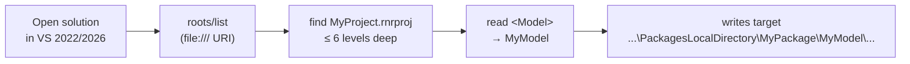

# Automatic Workspace Detection

When you open a D365FO project in Visual Studio 2022 or 2026, the MCP server automatically
figures out which model you are working in — **no manual configuration required**.

---

## How It Works

### stdio transport (recommended — VS 2022 + VS 2026)

When the server is launched as a stdio subprocess via `command:` in `.mcp.json`:

1. After the MCP handshake, the client sends a `roots/list` response with the open workspace folder URI.
2. The server converts the URI to a local path and searches for any `.rnrproj` file (up to 6 levels deep).
3. It reads the `<Model>` element from the project file to get your model name.
4. All file operations (create, modify) use that model automatically.

Fallback chain when `roots/list` is not available:
- `VSCODE_WORKSPACE_FOLDER_PATHS` environment variable (VS Code / VS 2026 set this)
- `process.cwd()` — used only when it is **not** a Node.js project directory



### HTTP transport (Azure-hosted server)

When connected to a remote Azure server via `url:`, the HTTP transport reads the
`x-workspace-path` request header. VS 2022 does not send this header — configure
`D365FO_SOLUTIONS_PATH` or explicit `D365FO_PROJECT_PATH` env var instead.

---

## What You Need to Do

**For stdio (local server):** Set `D365FO_SOLUTIONS_PATH` in the `env` block of `.mcp.json`
pointing to the folder that contains your D365FO solution(s). The server scans it on startup
and picks up all projects automatically.

```json
{
  "servers": {
    "d365fo-mcp-tools": {
      "command": "node",
      "args": ["C:\\path\\to\\d365fo-mcp-server\\dist\\index.js"],
      "env": {
        "DB_PATH": "C:\\path\\to\\d365fo-mcp-server\\data\\xpp-metadata.db",
        "LABELS_DB_PATH": "C:\\path\\to\\d365fo-mcp-server\\data\\xpp-metadata-labels.db",
        "D365FO_SOLUTIONS_PATH": "K:\\repos\\MySolution\\projects"
      }
    }
  }
}
```

**For HTTP (Azure server):** Use the two-level `D365FO_WORKSPACE_PATH` env var:

```
K:\AosService\PackagesLocalDirectory\YourPackageName\YourModelName
```

This lets the server derive `packagePath`, `packageName`, and `modelName` automatically.

---

## D365FO_SOLUTIONS_PATH — Multi-Solution Support

Set this env var to a folder that contains one or more D365FO Visual Studio projects.
The server scans it on every startup and lists all found projects.

When multiple projects are found, `get_workspace_info` shows the full list with an active
marker (`▶`):

```
## Available Projects (D365FO_SOLUTIONS_PATH)

▶ ContosoBank                             K:\repos\Contoso\src\...\ContosoBank.rnrproj
  ContosoEDS                              K:\repos\Contoso\src\...\ContosoEDS.rnrproj
  ContosoWMS                              K:\repos\Contoso\src\...\ContosoWMS.rnrproj

To switch project: call get_workspace_info with projectName = "<ModelName>"
```

### Switching projects

**Preferred — by name** (Copilot resolves the path automatically):

```
"switch to ContosoEDS project"
```
→ Copilot calls `get_workspace_info` with `projectName = "ContosoEDS"`

You can also use a partial name — the server picks the first match:
- `"Conto"` → matches `ContosoEDS`
- `"Bank"` → matches `ContosoBank`

**Fallback — by full path** (when name is ambiguous or D365FO_SOLUTIONS_PATH is not set):

```
get_workspace_info with projectPath = "K:\repos\MySolution\MyProject\MyProject.rnrproj"
```

The server switches context immediately. No restart required. The switched project
persists for all subsequent tool calls in the same session.

---

## When to Add Manual Configuration

| Situation | What to add |
|-----------|------------|
| Single developer, local stdio server | `D365FO_SOLUTIONS_PATH` env var in `.mcp.json` |
| Azure server, multiple solutions | `D365FO_PROJECT_PATH` env var pointing to the right `.rnrproj` |
| Non-standard PackagesLocalDirectory | `D365FO_WORKSPACE_PATH` with full `PackagesLocalDirectory\Package\Model` path |
| Running without a VS workspace open | `D365FO_SOLUTIONS_PATH` or explicit `D365FO_PROJECT_PATH` |

---

## Priority Order (Model Name Resolution)

| Priority | Source | Notes |
|----------|--------|-------|
| 1st | Explicit `D365FO_MODEL_NAME` env var | Always wins |
| 2nd | Last segment of `D365FO_WORKSPACE_PATH` | Only used when path contains `PackagesLocalDirectory` — avoids returning repo folder names like `MyMetadataRepo` |
| 3rd | Auto-detected from `.rnrproj` scan | Triggered by roots protocol, `D365FO_SOLUTIONS_PATH`, or workspace seed |

Each value's detection source is shown in `get_workspace_info` output:
```
Model name   : ContosoBank  (source: auto-detected from .rnrproj)
Package path : K:\AosService\PackagesLocalDirectory  (source: auto-detected from .rnrproj)
Project path : K:\repos\Contoso\src\...\MyProject.rnrproj  (source: auto-detected from .rnrproj)
```

---

## Troubleshooting

**Server picks up wrong model (e.g. the MCP server's own package name)**
The server's working directory (`process.cwd()`) is the MCP server repo — it is automatically
skipped when it contains a `package.json`. Set `D365FO_SOLUTIONS_PATH` to point at your D365FO
solution folder.

**Files end up in a Microsoft standard model**
None of the detection methods found a `.rnrproj`. Add `D365FO_SOLUTIONS_PATH` to the `env`
block in `.mcp.json`, or set `D365FO_PROJECT_PATH` env var explicitly.

**"modelName appears to be a placeholder" warning**
The server detected a suspicious model name like `"auto"` or `"YourModel"`.
This means auto-detection did not find a `.rnrproj`. Check that:
- `D365FO_SOLUTIONS_PATH` points to a folder containing `.rnrproj` files
- Your solution is open in Visual Studio with the correct project loaded
- The `.mcp.json` is in the solution root (next to the `.sln` file)
